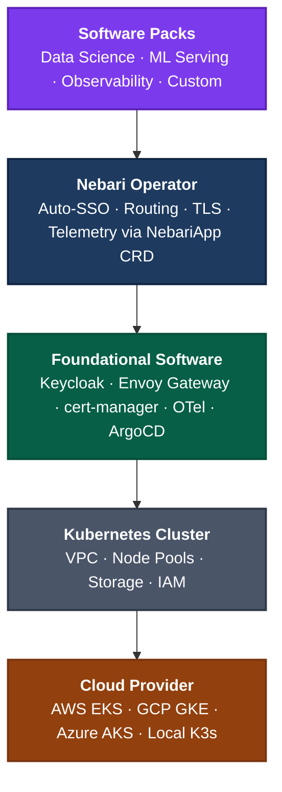

# Nebari Infrastructure Core (NIC)

> **Warning**: This project is under heavy active development. APIs, configuration formats, and behavior may change without notice. Do not rely on this for production workloads.

Nebari Infrastructure Core is a standalone CLI tool that manages cloud infrastructure for [Nebari](https://nebari.dev) using OpenTofu modules orchestrated via the [terraform-exec](https://github.com/hashicorp/terraform-exec) library.

## Why NIC?

[Nebari](https://github.com/nebari-dev/nebari) is an open source data science platform that deploys JupyterHub, Dask, and other tools on Kubernetes. Its infrastructure layer is embedded within a Python codebase, making it difficult to extend, test, and maintain independently.

NIC extracts infrastructure management into a dedicated tool with a clear separation of concerns: cloud provisioning via OpenTofu, foundational service deployment via ArgoCD and Helm, and GitOps-driven configuration. The goal is a faster, more reliable infrastructure layer that can evolve independently from the platform layer above it.

## Features

- **Declarative Infrastructure**: Define your desired state in a config file, NIC reconciles actual state to match using OpenTofu
- **Multi-Cloud Support**: AWS (fully implemented), GCP, Azure, and local K3s providers
- **GitOps Integration**: Bootstraps ArgoCD with foundational services (Keycloak, Envoy Gateway, cert-manager, OpenTelemetry Collector)
- **DNS Automation**: Optional Cloudflare DNS provider for automatic record management
- **OpenTelemetry Instrumented**: Full distributed tracing support
- **Structured Logging**: JSON structured logging via slog

## Quick Start

### Prerequisites

- Go 1.25+
- Cloud provider credentials (AWS, GCP, or Azure) configured via environment variables

NIC automatically downloads and manages its own OpenTofu binary — no manual installation required.

### Build

```bash
make build
```

### Usage

```bash
# Show version and registered providers
./nic version

# Validate configuration file
./nic validate -f config.yaml

# Deploy infrastructure
./nic deploy -f config.yaml

# Destroy infrastructure
./nic destroy -f config.yaml

# Generate kubeconfig for deployed cluster
./nic kubeconfig -f config.yaml -o kubeconfig.yaml
```

## Commands

### `nic deploy`

Deploy infrastructure and foundational services based on a configuration file.

```bash
./nic deploy -f <config-file> [flags]
```

Options:

- `-f, --file`: Path to config.yaml file (required)
- `--dry-run`: Preview changes without applying them
- `--timeout`: Override default timeout (e.g., '45m', '1h')
- `--regen-apps`: Regenerate ArgoCD application manifests even if already bootstrapped

The deploy command:
1. Provisions cloud infrastructure via the selected provider (OpenTofu)
2. Bootstraps a GitOps repository with ArgoCD application manifests (if configured)
3. Installs ArgoCD and foundational services (Keycloak, Envoy Gateway, cert-manager)
4. Configures DNS records (if a DNS provider is configured)

### `nic validate`

Validate a configuration file without deploying any infrastructure.

```bash
./nic validate -f <config-file>
```

Options:

- `-f, --file`: Path to config.yaml file (required)

### `nic destroy`

Destroy all infrastructure resources.

```bash
./nic destroy -f <config-file> [flags]
```

Options:

- `-f, --file`: Path to config.yaml file (required)
- `--auto-approve`: Skip confirmation prompt and destroy immediately
- `--dry-run`: Show what would be destroyed without actually deleting
- `--force`: Continue destruction even if some resources fail to delete
- `--timeout`: Override default timeout (e.g., '45m', '1h')

**WARNING**: This operation is destructive and cannot be undone.

### `nic kubeconfig`

Generate a kubeconfig for the deployed Kubernetes cluster.

```bash
./nic kubeconfig -f <config-file> [-o output-file]
```

Options:

- `-f, --file`: Path to config.yaml file (required)
- `-o, --output`: Path to output kubeconfig file (defaults to stdout)

### `nic version`

Show version information and registered providers.

```bash
./nic version
```

## Configuration

NIC uses a YAML configuration file. See the `examples/` directory for sample configurations:

- `examples/aws-config.yaml` - AWS/EKS configuration
- `examples/aws-config-with-dns.yaml` - AWS with Cloudflare DNS automation
- `examples/aws-existing.yaml` - Deploy to an existing EKS cluster
- `examples/gcp-config.yaml` - GCP/GKE configuration
- `examples/azure-config.yaml` - Azure/AKS configuration
- `examples/local-config.yaml` - Local Kind/K3s configuration

### Environment Variables

Secrets are never stored in configuration files. Use environment variables or a `.env` file (see `.env.example`):

```bash
# Copy the example and fill in your values
cp .env.example .env
```

## OpenTelemetry Configuration

NIC supports OpenTelemetry tracing with configurable exporters:

- `OTEL_EXPORTER`: Exporter type — `none` (default), `console`, `otlp`, or `both`
- `OTEL_ENDPOINT`: OTLP endpoint (default: `localhost:4317`)

```bash
# Console traces (debugging)
OTEL_EXPORTER=console ./nic deploy -f config.yaml

# OTLP traces
OTEL_EXPORTER=otlp OTEL_ENDPOINT=localhost:4317 ./nic deploy -f config.yaml
```

## Development

### Local Cluster Testing with Kind

For local development, you can deploy a Kind cluster with foundational services:

```bash
make localkind-up    # Create Kind cluster and deploy
make localkind-down  # Tear down
```

A GitHub repo URL must be set in your `local-config.yaml`, and a valid private SSH key must be set as the `GIT_SSH_PRIVATE_KEY` environment variable.

### Running Tests

```bash
# Run all tests
go test ./... -v

# Run with coverage
go test ./... -cover -coverprofile=coverage.out
go tool cover -html=coverage.out
```

### Code Quality

```bash
# Format, vet, lint, and test
make check

# Or individually:
make fmt
make vet
make lint
make test
```

### Pre-commit Hooks

```bash
# Install hooks (one-time setup)
pre-commit install

# Run all hooks manually
pre-commit run --all-files
```

## Architecture



### Project Structure

```
cmd/nic/              # CLI entry point and commands
pkg/
  ├── argocd/         # ArgoCD installation, Helm charts, app manifests
  ├── config/         # Configuration parsing and validation
  ├── dnsprovider/    # DNS provider interface and registry
  │   └── cloudflare/ # Cloudflare DNS provider
  ├── git/            # Git client for GitOps repository management
  ├── kubeconfig/     # Kubeconfig generation
  ├── provider/       # Cloud provider interface and registry
  │   ├── aws/        # AWS provider (EKS, VPC, EFS, IAM)
  │   ├── gcp/        # GCP provider (stub)
  │   ├── azure/      # Azure provider (stub)
  │   └── local/      # Local Kind/K3s provider
  ├── status/         # Deployment status handler
  ├── telemetry/      # OpenTelemetry setup
  └── tofu/           # OpenTofu binary management and execution
```

### How It Works

```
User → NIC CLI → Provider → OpenTofu (terraform-exec) → Cloud API
                          → ArgoCD (Helm) → Foundational Services
                          → Git Client → GitOps Repository
```

1. User runs `nic deploy -f config.yaml`
2. Go CLI parses config, selects the provider, and calls `provider.Deploy()`
3. The provider uses terraform-exec to run `tofu init`, `tofu plan`, `tofu apply`
4. After infrastructure is provisioned, ArgoCD is installed via Helm
5. Foundational services (Keycloak, Envoy Gateway, cert-manager) are deployed as ArgoCD Applications
6. If a GitOps repo is configured, application manifests are committed and pushed

### Provider Status

| Provider | Status | Description |
|----------|--------|-------------|
| AWS | Fully implemented | EKS, VPC, EFS, IAM via OpenTofu |
| GCP | Stub | Prints config, returns success |
| Azure | Stub | Prints config, returns success |
| Local | Implemented | Kind cluster with foundational services |

## Contributing

Contributions are welcome! Please see the [development section](#development) for setup instructions.

## License

Apache License 2.0. See [LICENSE](LICENSE) for details.
