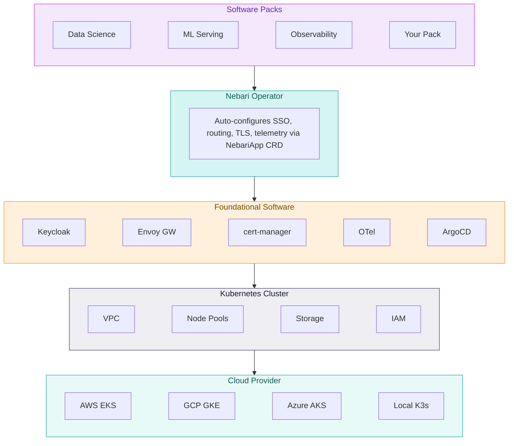

<p align="center">
  <a href="https://nebari.dev">
    
  </a>
</p>

<h1 align="center">Nebari Infrastructure Core</h1>

<p align="center">
  <strong>An opinionated Kubernetes distribution built for AI/ML workflows.</strong>
  <br />
  One config file. Production-ready platform. Any cloud.
</p>

<p align="center">
  <a href="https://github.com/nebari-dev/nebari-infrastructure-core/actions/workflows/ci.yml"></a>
  <a href="https://github.com/nebari-dev/nebari-infrastructure-core/blob/main/LICENSE"></a>
  <a href="https://golang.org"></a>
</p>

<p align="center">
  <a href="#quick-start">Quick Start</a> &middot;
  <a href="docs/cli-reference.md">CLI Reference</a> &middot;
  <a href="#architecture">Architecture</a> &middot;
  <a href="#roadmap">Roadmap</a> &middot;
  <a href="docs/design-doc/README.md">Documentation</a>
</p>

---

> **Status**: Under heavy development and very unstable. APIs, configuration formats, and behavior will change without notice. Not yet suitable for production use.

## What is Nebari Infrastructure Core?

Nebari Infrastructure Core (NIC) is an opinionated Kubernetes distribution that ships with sane defaults (that are fully configurable) and a suite of foundational software. A single YAML config file gives you a production-grade Kubernetes cluster with SSO, GitOps, API gateway, TLS certificates, and an OpenTelemetry exporter that plugs into whatever observability system you already run — all wired together and working out of the box.

NIC's composable architecture means you get exactly the platform you need — nothing more, nothing less. Our initial focus is AI/ML workflows (notebook environments, model serving, experiment tracking), but the foundation is general-purpose. Software Packs let you tailor the platform to your workload without carrying software you don't use.

NIC is the successor to [Nebari](https://github.com/nebari-dev/nebari), rebuilt from the ground up in Go based on seven years of lessons learned deploying data science platforms in production.

### The Problem

Getting from a managed Kubernetes cluster to a platform teams can actually use requires assembling and integrating dozens of components: identity providers, certificate management, ingress controllers, telemetry pipelines, GitOps tooling. This takes months of engineering time, and keeping it all working across environments takes even more.

### The Solution

NIC deploys a **complete platform stack** — not just a cluster. You declare what you want, NIC provisions the infrastructure and deploys foundational services that are pre-integrated and production-hardened.

On top of this foundation, **Software Packs** let you compose your platform. Software Packs are curated collections of open-source tools packaged as ArgoCD applications with a `NebariApp` Custom Resource. When installed, they automatically register with the platform — picking up SSO, routing, TLS, and telemetry with zero manual configuration.

Want JupyterHub and conda-store? Install the Data Science Pack. Need model serving? Add the ML Pack (MLflow, KServe, Envoy AI Gateway). Want dashboards and log aggregation? Add the Observability Pack (Grafana LGTM stack). Each pack is independent, so you deploy only what you need.

## Architecture



### How It Works

```
nic deploy -f config.yaml
```

1. **Provisions infrastructure** — VPC, managed Kubernetes, node pools, storage, IAM via OpenTofu
2. **Deploys foundational software** — ArgoCD installs Keycloak, Envoy Gateway, cert-manager, OpenTelemetry Collector
3. **Activates the Nebari Operator** — watches for `NebariApp` resources, auto-configures SSO, routing, TLS, and telemetry
4. **Configures DNS** — optional Cloudflare integration for automatic record management

## Launchpad

Every NIC deployment includes a landing page where users discover and access all deployed services.

<p align="center">
  <picture>
    <source media="(prefers-color-scheme: dark)" srcset="docs/assets/launchpad-dark.png">
    <source media="(prefers-color-scheme: light)" srcset="docs/assets/launchpad-light.png">
    
  </picture>
</p>

## Key Features

| Feature                       | Description                                                                                                  |
| ----------------------------- | ------------------------------------------------------------------------------------------------------------ |
| **Opinionated Defaults**      | Production-ready configuration out of the box — multi-AZ, autoscaling, security best practices               |
| **Composable Software Packs** | Install only what you need. Each pack auto-integrates with SSO, telemetry, and routing                       |
| **Multi-Cloud**               | AWS (EKS), GCP (GKE), Azure (AKS), and local (K3s) from the same config format                               |
| **GitOps Native**             | ArgoCD manages all foundational software with dependency ordering and health checks                          |
| **OpenTelemetry Native**      | Built-in OTel Collector exports metrics, logs, and traces — plugs into whatever observability system you run |
| **SSO Everywhere**            | Keycloak provides centralized auth. The Nebari Operator creates OAuth clients automatically                  |
| **Declarative**               | One YAML config file. NIC reconciles actual state to match using OpenTofu                                    |
| **DNS Automation**            | Optional Cloudflare provider for automatic DNS record management                                             |

## Quick Start

### Prerequisites

- Go 1.25+
- Cloud provider credentials (AWS, GCP, or Azure) configured via environment variables

NIC automatically downloads and manages its own OpenTofu binary — no manual installation required.

### Install

```bash
# From source
make build

# Or install to $GOPATH/bin
make install
```

### Deploy

```bash
# Copy and edit a sample config
cp examples/aws-config.yaml config.yaml

# Set your credentials
cp .env.example .env  # Edit with your cloud provider credentials

# Validate your config
./nic validate -f config.yaml

# Deploy everything
./nic deploy -f config.yaml
```

See the [CLI Reference](docs/cli-reference.md) for all commands and options.

### `nic deploy`

Deploy infrastructure and foundational services based on a configuration file.

```bash
./nic deploy -f <config-file> [flags]
```

Options:

- `-f, --file`: Path to config.yaml file (required)
- `--dry-run`: Preview changes without applying them
- `--timeout`: Override default timeout (e.g., '45m', '1h')
- `--regen-apps`: Regenerate ArgoCD application manifests even if already bootstrapped

The deploy command:

1. Provisions cloud infrastructure via the selected provider (OpenTofu)
2. Bootstraps a GitOps repository with ArgoCD application manifests (if configured)
3. Installs ArgoCD and foundational services (Keycloak, Envoy Gateway, cert-manager)
4. Configures DNS records (if a DNS provider is configured)

### `nic validate`

Validate a configuration file without deploying any infrastructure.

```bash
./nic validate -f <config-file>
```

Options:

- `-f, --file`: Path to config.yaml file (required)

### `nic destroy`

Destroy all infrastructure resources.

```bash
./nic destroy -f <config-file> [flags]
```

Options:

- `-f, --file`: Path to config.yaml file (required)
- `--auto-approve`: Skip confirmation prompt and destroy immediately
- `--dry-run`: Show what would be destroyed without actually deleting
- `--force`: Continue destruction even if some resources fail to delete
- `--timeout`: Override default timeout (e.g., '45m', '1h')

**WARNING**: This operation is destructive and cannot be undone.

### `nic kubeconfig`

Generate a kubeconfig for the deployed Kubernetes cluster.

```bash
./nic kubeconfig -f <config-file> [-o output-file]
```

Options:

- `-f, --file`: Path to config.yaml file (required)
- `-o, --output`: Path to output kubeconfig file (defaults to stdout)

### `nic version`

Show version information and registered providers.

```bash
./nic version
```

## Configuration

NIC uses a YAML configuration file. See the `examples/` directory for sample configurations:

- `examples/aws-config.yaml` - AWS/EKS configuration
- `examples/aws-config-with-dns.yaml` - AWS with Cloudflare DNS automation
- `examples/aws-existing.yaml` - Deploy to an existing EKS cluster
- `examples/gcp-config.yaml` - GCP/GKE configuration
- `examples/azure-config.yaml` - Azure/AKS configuration
- `examples/local-config.yaml` - Local Kind/K3s configuration

### Environment Variables

Secrets are never stored in configuration files. Use environment variables or a `.env` file (see `.env.example`):

```bash
# Copy the example and fill in your values
cp .env.example .env
```

## OpenTelemetry Configuration

NIC supports OpenTelemetry tracing with configurable exporters:

- `OTEL_EXPORTER`: Exporter type — `none` (default), `console`, `otlp`, or `both`
- `OTEL_ENDPOINT`: OTLP endpoint (default: `localhost:4317`)

```bash
# Console traces (debugging)
OTEL_EXPORTER=console ./nic deploy -f config.yaml

# OTLP traces
OTEL_EXPORTER=otlp OTEL_ENDPOINT=localhost:4317 ./nic deploy -f config.yaml
```

## Development

### Local Cluster Testing with Kind

For local development, you can deploy a Kind cluster with foundational services:

```bash
make localkind-up    # Create Kind cluster and deploy
make localkind-down  # Tear down
```

A GitHub repo URL must be set in your `local-config.yaml`, and a valid private SSH key must be set as the `GIT_SSH_PRIVATE_KEY` environment variable.

### Running Tests

```bash
# Run all tests
go test ./... -v

# Run with coverage
go test ./... -cover -coverprofile=coverage.out
go tool cover -html=coverage.out
```

### Code Quality

```bash
# Format, vet, lint, and test
make check

# Or individually:
make fmt
make vet
make lint
make test
```

### Pre-commit Hooks

```bash
# Install hooks (one-time setup)
pre-commit install

# Run all hooks manually
pre-commit run --all-files
```

### Project Structure

```
cmd/nic/              CLI entry point and commands
pkg/
  ├── argocd/         ArgoCD installation, Helm charts, app manifests
  ├── config/         Configuration parsing and validation
  ├── dnsprovider/    DNS provider interface (Cloudflare)
  ├── git/            Git client for GitOps repository management
  ├── kubeconfig/     Kubeconfig generation
  ├── provider/       Cloud provider interface
  │   ├── aws/        AWS provider (EKS, VPC, EFS, IAM)
  │   ├── gcp/        GCP provider
  │   ├── azure/      Azure provider
  │   └── local/      Local Kind/K3s provider
  ├── telemetry/      OpenTelemetry setup
  └── tofu/           OpenTofu binary management and execution
terraform/            OpenTofu/Terraform modules per provider
examples/             Sample configuration files
docs/                 Architecture docs, design decisions, ADRs
```

## Roadmap

NIC is under very active development.

Our current roadmap can be found at [docs/plans/2026-02-04-roadmap.md](2025-02-04.roadmap.md). We welcome feedback and contributions to help shape the future of the project!

## Documentation

| Document                                                                          | Description                                      |
| --------------------------------------------------------------------------------- | ------------------------------------------------ |
| [CLI Reference](docs/cli-reference.md)                                            | All commands, flags, and configuration options   |
| [Architecture Overview](docs/design-doc/architecture/02-system-overview.md)       | System components and deployment flow            |
| [Design Decisions](docs/design-doc/architecture/04-key-decisions.md)              | Why OpenTofu, terraform-exec, and ArgoCD         |
| [Configuration Reference](docs/design-doc/appendix/16-configuration-reference.md) | Complete config.yaml schema and examples         |
| [Nebari Operator](docs/design-doc/implementation/11-nebari-operator.md)           | NebariApp CRD and automatic service integration  |
| [Testing Strategy](docs/design-doc/operations/12-testing-strategy.md)             | Unit, integration, and provider testing approach |

## Contributing

Contributions are welcome! To get started:

```bash
# Clone the repo
git clone https://github.com/nebari-dev/nebari-infrastructure-core.git
cd nebari-infrastructure-core

# Install dependencies and build
make build

# Run tests
go test ./... -v

# Run all checks (fmt, vet, lint, test)
make check

# Install pre-commit hooks
pre-commit install
```

See our [issue tracker](https://github.com/nebari-dev/nebari-infrastructure-core/issues) for open issues.

## License

Apache License 2.0 — see [LICENSE](LICENSE) for details.
