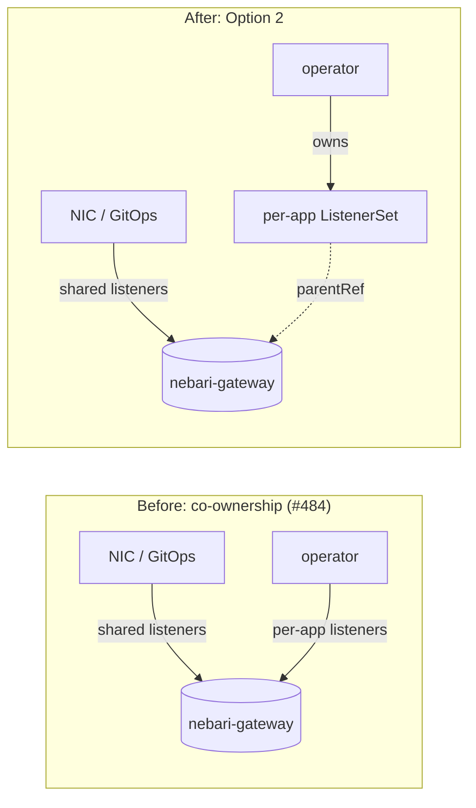
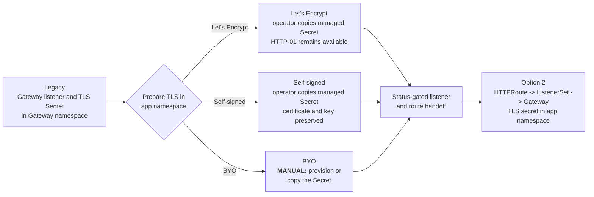

# ADR-0011: Per-app Gateway listener ownership

## Status

Proposed

This ADR records the decision for eliminating the
shared-Gateway listener co-ownership described in #484. It has been revised from
its first draft: an earlier version recommended Option 3 (mergeGateways) on the
premise that Option 2 required an experimental API. That premise no longer holds
(see below), so the decision is Option 2. Both directions have been
validated on a local k3d bed; the evidence is recorded here.

## Date

2026-07-17

Last updated: 2026-07-20

## Context

The nebari-operator provisions per-application TLS by a read-modify-write update
of NIC's shared `envoy-gateway-system/nebari-gateway` Gateway: it appends one
HTTPS listener (`tls-<app>-<namespace>`) per NebariApp to `Gateway.spec.listeners`.
NIC also owns that Gateway through GitOps. Two controllers therefore co-own one
mutable list field (#484). Consequences: `gateway-config` is permanently
OutOfSync; self-heal can churn and momentarily detach a route from its listener;
the 64-listener-per-Gateway cap leaves an effective ceiling of 62 per-app
listeners; and concurrent reconciles contend on one object.

The deciding constraint (per the discussion on #484) is the per-app secret model:
packs set `routing.tls.secretName`, and NIC issues certs over HTTP-01 only (no
DNS-01, no assumable public wildcard). So a single shared wildcard listener is not
a general answer; each app needs its own certificate, selected at `:443` by SNI.
Listing every per-app secret in the shared listener's `certificateRefs` does not
help either - that is the same co-ownership on a different field.

Removing co-ownership therefore requires the operator to own its own listener
resource. This ADR decides which one.

## Decision Drivers

- Remove co-ownership at the root (one writer per listener), not mask it.
- Preserve the per-app secret model (each app its own cert, selected by SNI).
- Keep NIC's platform ingress independent of the operator.
- Provide an ownership/delegation boundary for which namespace may attach
  listeners (relates to the operator's hostname-ownership hardening).
- Avoid founding the operator's first stable contract on an unstable API.
- Minimize upgrade-test surface and downtime risk.

## Considered Options

(Numbering follows #484 so "Option N" means the same thing across the discussion.)

1. Shared wildcard certificate + per-app HTTPRoutes on the shared listener.
2. Gateway API `ListenerSet` (operator owns one per app, attached to NIC's Gateway).
3. Separate Gateways + Envoy Gateway `mergeGateways`.
4. Explicit operator SSA field manager + NIC `managedFieldsManagers` ignore.

Short-term mitigation (not a target architecture): scoped Argo CD
`ignoreDifferences` on operator-created listeners with `RespectIgnoreDifferences`.

## Decision Outcome

**Option 2 is chosen:** the operator owns a per-app
`ListenerSet` (standard-channel `gateway.networking.k8s.io/v1`) attached to NIC's
Gateway, on Envoy Gateway v1.8.x.

Rationale:

- **The experimental-API objection is gone.** Gateway API v1.5 graduated
  `ListenerSet` to the Standard channel (`gateway.networking.k8s.io/v1`), and
  Envoy Gateway v1.8 reconciles it unconditionally (no feature flag, no
  experimental channel). This is the stable `ListenerSet`, not the experimental
  `x-k8s.io/XListenerSet` the first draft analyzed. The remaining cost of Option
  2 is the EG v1.6.2 -> v1.8.x upgrade and its compatibility testing (NIC PR
  #496). v1.8.2 is the minimum because it fixed ListenerSet conflict precedence
  and route-status behavior used by the migration below.
- **Option 3 does not avoid that upgrade; it defers it and adds work.** If
  ListenerSet is the intended end state, Option 3 still needs the EG upgrade
  eventually, while adding the `mergeGateways` implementation now plus a later
  migration. That migration changes the dataplane Service ownership model (from
  the GatewayClass under `mergeGateways` back to the shared Gateway), which can
  rotate the Service / load balancer and cause downtime unless identity is
  explicitly preserved.
- **Option 2 has a native delegation boundary.** `Gateway.spec.allowedListeners`
  authorizes listener attachment by namespace once; `mergeGateways` has no
  equivalent Gateway API attachment policy, so its boundary must be enforced in
  the operator, RBAC, or admission.
- `ListenerSet` is GA, but its implementation is newer than the core Gateway
  kinds. We own both NIC and the operator, so implementation changes and version
  upgrades remain coordinated and can be covered by one integration matrix.

Both options were validated on a local k3d bed (details under Options Detail).
This decision reverses the first draft based on the Standard-channel ListenerSet
and the evidence recorded here.

### Ownership: before and after

Two writers touch one Gateway object today; under Option 2 each writer owns a
distinct object. The operator attaches its ListenerSet through `spec.parentRef`;
NIC authorizes that attachment through `Gateway.spec.allowedListeners`.

### Consequences

**Good:**
- Per-app listener + cert in an operator-owned object; NIC's Gateway is never
  mutated by the operator. Co-ownership, the 64-listener cap, and the concurrency
  contention all go away.
- Stable Gateway API kind for the operator's first stable contract.
- `allowedListeners` gives a real, Gateway-API-native delegation boundary.
- Single Gateway / single dataplane model is preserved (no Service-identity
  migration, unlike the Option 3 -> Option 2 path).

**Bad:**
- Requires upgrading Envoy Gateway from v1.6.2 to a supported v1.8.x patch, with
  testing across every supported Kubernetes version (NIC PR #496).
- `ListenerSet` is newer than the core kinds; ecosystem/tooling support is thinner
  and EG does not yet support `ListenerSet` as an xPolicy `targetRef` (not a
  blocker today - the operator's SecurityPolicy targets the HTTPRoute - but worth
  integration-test coverage).

## Options Detail

### Option 1: Shared wildcard certificate + per-app HTTPRoutes

Keep NIC's single shared HTTPS listener; every operator HTTPRoute attaches to its
`https` section; the operator stops creating per-app Certificates and stops
mutating the Gateway.

**Pros:** no EG upgrade; no shared-resource mutation; no per-app listener limit.
**Cons:** no per-app certificate isolation, and a NIC-managed public wildcard needs
DNS-01, which NIC does not support. Viable only as a lighter mode for genuine
single-cert or self-signed deployments, not as the default.

### Option 2: Gateway API ListenerSet (chosen)

The operator creates and owns one `ListenerSet` per NebariApp in the app's own
namespace, attached to NIC's Gateway via `spec.parentRef`, each listener carrying
its own cert (co-located, resolved without a ReferenceGrant). NIC opts in via
`Gateway.spec.allowedListeners`. HTTPRoutes attach via `parentRefs` to the
ListenerSet.

**Pros:** purpose-built Gateway API delegation; removes co-ownership and the
64-listener cap; keeps `routing.tls.secretName` working with per-app certs; native
`allowedListeners` boundary; stable API on EG v1.8.x.
**Cons:** requires the EG v1.6.2 -> v1.8.x upgrade + test matrix.

**Initial bed validation (EG v1.8.1 on k3d):** the standard
`listenersets.gateway.networking.k8s.io` (v1) CRD is present and EG reconciles it
with no feature flag (`extensionApis: {}`), matching PR #496. A ListenerSet in a
separate namespace attached to `nebari-gateway` reached Accepted=True,
Programmed=True; its HTTPRoute resolved; `curl` returned HTTP 200 serving the
app's own SNI cert; and NIC's `Gateway.spec.listeners` was not modified by the
ListenerSet (no co-ownership). This proves the end-state shape, not the migration
sequence: v1.8.2 subsequently fixed Gateway-vs-ListenerSet conflict precedence
and route acceptance, so the full cutover must be revalidated on the selected
v1.8.x patch.

### Option 3: Per-app Gateway + mergeGateways

The operator creates one Gateway per NebariApp in the app's namespace, each with a
single HTTPS listener + co-located cert, owner-referenced for GC. EG `mergeGateways`
merges all Gateways on the class onto one dataplane. (Per-app, not one shared
operator Gateway, so the 64-listener cap is avoided.)

**Pros:** works on the current (now EOL) EG v1.6.2 pin using stable Gateway API
kinds only; one writer per Gateway; validated end to end on the k3d bed (three
Gateways across two namespaces merged onto one `:443`, each serving its own SNI
cert).
**Cons:** EG-specific (not portable Gateway API); no `allowedListeners` equivalent,
so the operator must guarantee global `(port, protocol, hostname)` uniqueness and
fail cleanly on collision; NIC endpoint discovery must select the merged dataplane
by `owning-gatewayclass`; and if ListenerSet is the end state, a later migration
rotates dataplane Service ownership (GatewayClass -> shared Gateway) with
LB-rotation/downtime risk.

### Option 4: Explicit operator SSA field manager

Operator uses server-side apply with a unique field owner; NIC ignores that
manager's fields via `managedFieldsManagers`.

**Pros:** small coordinated change; more robust than jq name-matching; better
concurrent-update behavior.
**Cons:** still tolerates co-ownership by design; does not remove the 64-listener
cap; no architectural isolation. Fallback, not a target.

## Migration considerations

Two layers move: NIC upgrades Envoy Gateway to the selected v1.8.x patch and
authorizes ListenerSets through `spec.allowedListeners`; the operator moves
per-app listeners out of the shared Gateway. The normal Helm/Argo CD upgrade
applied the bundled Gateway API CRDs on the k3d bed without a separate manual CRD
step. Existing Gateway, route, TLS, and authentication behavior still needs the
supported-version test matrix before ListenerSets are enabled.

Existing apps require a staged handoff. A listener defined directly on the parent
Gateway has precedence over an equivalent ListenerSet listener, so the replacement
cannot become programmed while the legacy listener remains. The migration must
preserve route attachment across that boundary (a temporary second route
`parentRef` is one viable mechanism), remove the legacy listener explicitly, and
gate cleanup on ListenerSet and route status. The exact reconcile and rollback
sequence belongs in the operator implementation plan, not this ADR.

This shows the required state transition, not a prescribed reconcile algorithm.

For operator-managed certificates, namespace migration does not require
reissuance. The old Certificate is deterministically named and labeled with the
NebariApp name and namespace, so the operator can verify ownership, copy the
valid TLS Secret into that app namespace, and then create the replacement
Certificate there. Copying the Secret before creating the Certificate allows
cert-manager to adopt the existing certificate and key. This preserves trust for
self-signed certificates and avoids unnecessary ACME issuance and rate-limit
exposure for Let's Encrypt. The operator must copy only the TLS material and
relevant cert-manager metadata, not stale Kubernetes identity or owner metadata.

If a usable managed Secret is absent, HTTP-01 issuance is still not circular.
cert-manager creates a temporary HTTPRoute in the Certificate's namespace for
the exact ACME challenge path and attaches it, through the existing ClusterIssuer
configuration, to the shared Gateway's port-80 listener. That listener permits
routes from app namespaces, and the exact challenge route takes precedence over
NIC's catch-all HTTPS redirect. The app's normal HTTPRoute and new HTTPS
ListenerSet therefore do not need to be active for the app-namespace certificate
to be issued. The same path supports future renewal.

The rollout is per-app and status-gated; it does not introduce a permanent
user-facing strategy flag. A temporary rollout switch, if useful, is an operator
implementation detail. `routing.tls.enabled=false` is unrelated: it routes the
app over plain HTTP rather than selecting the legacy TLS architecture.

**Secret placement: the app namespace.** The ListenerSet, managed
Certificate, and TLS Secret live with the NebariApp. This keeps the secret
reference same-namespace, permits owner references for new managed resources, and
preserves the intended delegation boundary. In the Option 2 contract,
`routing.tls.secretName` resolves in the NebariApp namespace.

| TLS mode | How the app-namespace Secret is created | Manual migration steps |
| --- | --- | --- |
| Let's Encrypt (HTTP-01) | The operator copies its existing valid Secret, then creates the replacement Certificate so cert-manager can adopt it and renew it in place. HTTP-01 is used if issuance is required. | **None.** DNS must still resolve to the Gateway and port 80 must remain reachable for issuance or renewal. The operator removes its old managed resources only after cutover. |
| Self-signed | The operator copies its existing valid Secret, preserving the certificate and private key, then creates the replacement Certificate so cert-manager can continue managing it. | **None.** Existing client trust or certificate pinning remains valid because migration alone does not rotate the certificate. The operator removes its old managed resources only after cutover. |
| Bring your own (`routing.tls.secretName`) | No Certificate is issued; the ListenerSet references the named user-owned Secret in the NebariApp namespace. | **Required:** provision or copy the Secret into every app namespace that uses it before cutover. Update any GitOps, External Secrets, Sealed Secrets, or other secret-sync configuration to target the new namespace. Keep the old gateway-namespace Secret until all dependent apps have migrated, then remove it manually. |

The NebariApp field and Secret name do not change; only the namespace in which
the operator resolves `routing.tls.secretName` changes. A single BYO Secret shared
by several apps today must therefore be replicated into each app namespace.

Keeping per-app secrets in the Gateway namespace through a `ReferenceGrant`, or
placing ListenerSets in `envoy-gateway-system`, would preserve the platform
coupling this design is intended to remove and is not the target contract.

## Remaining work and validation

- **The llm-serving-pack mutates shared Gateways through its own operator.**
  Beyond the per-app `tls-<app>-<namespace>` listeners this ADR addresses, the
  llm-serving-pack contains the distinct
  `github.com/nebari-dev/nebari-llm-serving-pack/operator` and a cluster-wide
  shared-TLS reconciler
  (`LLM_MANAGE_SHARED_LISTENERS`, values `platform.gateway.manageSharedListeners`)
  that patches HTTPS listeners for the shared `llm` / `llm-internal` hostnames onto
  its configured external and internal Gateway(s). When either target is a
  Git-owned NIC Gateway, this is the same co-ownership pattern. Adopting Option 2
  in the nebari-operator does **not** fix that path; the pack needs a corresponding
  ListenerSet migration or must set `manageSharedListeners=false` and delegate
  those listeners to another single owner.
- **`allowedListeners` namespace authorization.** `from: Selector` gives a real
  trust boundary only if ordinary namespace owners cannot grant themselves the
  selected label. Use a protected label applied by trusted NIC/operator automation
  and enforced by RBAC or admission. `from: All` is simpler but drops the boundary.
- **EG v1.8.x validation gates:** verify per-ListenerSet `allowedRoutes` namespace
  selectors, route attachment by `kind: ListenerSet` + `sectionName`, staged
  handoff availability, conflicting-listener status, managed-Secret adoption,
  HTTP-01 issuance and renewal, OIDC and public-route SecurityPolicy behavior,
  and cleanup/rollback.

## Related

- #484 (shared-Gateway co-ownership; option analysis and the per-app-secret axis)
- #403 (Listener-only TLS; a related missing-primitive proposal)
- PR #496 (NIC: Envoy Gateway v1.6.2 -> v1.8.x; prerequisite for
  Option 2)
- PR #492 (NIC: mergeGateways - the Option 3 implementation) and
  nebari-dev/nebari-operator#167 (operator: per-app Gateway behind
  `TLS_PER_APP_GATEWAY` - Option 3). Both were closed unmerged after the team chose
  Option 2; retained as implementation evidence for the rejected bridge.
- The operator's hostname/TLS ownership-boundary hardening (the boundary that
  `allowedListeners` provides natively under Option 2).
- [Gateway API ListenerSet documentation](https://gateway-api.sigs.k8s.io/api-types/listenerset/)
- Envoy Gateway v1.8.2 release notes (ListenerSet precedence and route-status
  fixes): [v1.8.2](https://gateway.envoyproxy.io/news/releases/notes/v1.8.2/)
- [cert-manager backup and restore guidance](https://cert-manager.io/docs/devops-tips/backup/)
  (restore Secrets before Certificates to avoid unnecessary reissuance)
