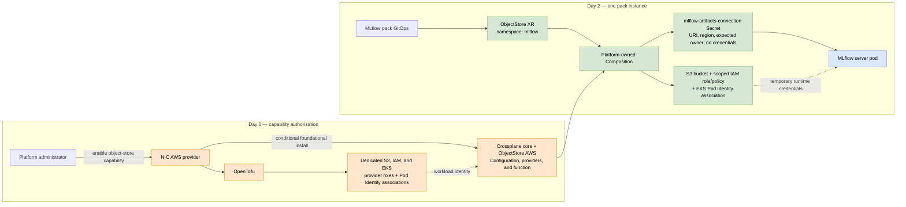

# ADR-0012: Crossplane Capability APIs for Software Pack Cloud Infrastructure

## Status

Proposed

Acceptance is conditional on the bounded AWS proof of concept and decision gates in
[Validation Plan](#validation-plan). This ADR chooses a direction to test; it does
not yet approve an in-cluster cloud provisioner for production.

## Date

2026-07-20

## Decision Summary

NIC should expose pack infrastructure through small, cloud-neutral capability APIs,
starting with `ObjectStore`. Packs must not depend on AWS managed-resource kinds or
cause pack-specific resources to accrete in the cluster OpenTofu module.

`ObjectStore` is a new Nebari-owned API proposed by this ADR. It does not exist
today and is not supplied by Crossplane. Nebari would define it as a Crossplane
CompositeResourceDefinition (XRD) and ship platform-owned Compositions that
implement it. Crossplane, not `nebari-operator`, would reconcile `ObjectStore`
resources. Packs would continue to use `NebariApp` separately for routing, TLS,
OIDC, and application registration.

For managed object storage, the preferred direction to validate is a namespaced
Crossplane v2 composite resource (XR) backed by a platform-owned AWS Composition.
OpenTofu still owns the day-0 IAM trust anchor. Crossplane owns day-2 instances of an
already-authorized capability. A bring-your-own object store remains a required
escape hatch.

This is deliberately narrower than a "capability marketplace":

- The first deliverable is one `ObjectStore` API, one AWS implementation, and one
  consumer: the MLflow pack.
- Crossplane is accepted only if the PoC proves that self-service reconciliation is
  worth its controller, CRD, IAM, security, and teardown costs.
- If it does not, NIC should keep the same pack-facing contract and implement managed
  instances with platform-owned, out-of-cluster capability providers. The AWS
  implementation may use OpenTofu without requiring every cloud to do so.

The stable contract is the pack-authored `ObjectStore` spec and the resulting
runtime binding. Crossplane-specific machinery under `spec.crossplane` and
provider managed resources are implementation details. A future out-of-cluster
implementation may reconcile the same user-authored fields when NIC runs, without
promising Crossplane's continuous reconciliation semantics.

For one MLflow bucket, Crossplane is not the simplest option. It becomes compelling
only if NIC wants repeatable day-2 provisioning for multiple pack instances and,
eventually, multiple capabilities.

## Context

Issue [#453](https://github.com/nebari-dev/nebari-infrastructure-core/issues/453)
asks for research and a PoC of using Crossplane in-cluster to provision
infrastructure required by software packs while retaining OpenTofu for foundational
cluster infrastructure.

NIC currently has a clean lifecycle boundary:

- Cluster providers own foundational, out-of-cluster infrastructure. AWS and Azure
  use OpenTofu; other providers may use a native tool.
- ArgoCD owns software installed inside the cluster.
- Software packs are ArgoCD Applications and may use `NebariApp` to request
  platform integrations such as routing, TLS, OIDC, and an in-cluster Postgres
  database.

That boundary has no general answer for an external cloud resource requested by a
pack. The motivating case is the
[`mlflow-pack`](https://github.com/nebari-dev/mlflow-pack). Its metadata
can live in the CloudNativePG database from ADR-0007, but its artifacts need durable
object storage.

### What the MLflow example actually needs

"Create a bucket" understates the integration. A production-shaped AWS result needs:

1. A private S3 bucket with public access blocked, encryption, versioning, ownership
   controls, lifecycle policy, tags, and a predictable retention policy.
2. An IAM role and least-privilege policy for the MLflow server.
3. A binding from the `mlflow` ServiceAccount in the `mlflow` namespace to that
   role. This PoC uses EKS Pod Identity, which requires an EKS Pod Identity
   association and the Pod Identity Agent; it does **not** use a ServiceAccount
   annotation.
4. A non-secret runtime binding containing the bucket URI, region, and expected AWS
   account owner. No static AWS access key belongs in Kubernetes.
5. Readiness and teardown behavior. The MLflow Deployment must not become ready
   before the binding exists, and removal must distinguish deleting access from
   deleting retained data.

MLflow supports both direct artifact access and proxied artifact serving. The NIC
default should use proxied artifact serving (`--artifacts-destination`) so only the
MLflow server needs S3 permissions; notebook and CI clients should not receive S3
credentials. Direct client-to-S3 access can remain an explicit advanced mode with a
different identity model.

The existing S3 code in NIC manages OpenTofu state buckets. Those buckets are
provider implementation details and must not be reused for application data.

### The unavoidable bootstrap boundary

Crossplane does not eliminate foundational coupling. It changes its granularity:

- OpenTofu must first create workload identities for the Crossplane AWS provider
  controllers. An in-cluster controller cannot create its own initial cloud
  credential from nothing.
- Platform administration must install Crossplane, its Configuration and function
  packages, provider runtimes, and provider configuration.
- Only then can a pack create an `ObjectStore` XR without a new foundational change.
- Crossplane's provisioning identity and MLflow's runtime identity are separate.
  The first creates infrastructure; the second can use only one bucket.

The desired boundary is therefore **one explicit authorization per capability and
cluster, followed by many constrained pack-scoped instances**. Foundational knows
that the cluster offers object storage; it never needs to know that MLflow asked for
bucket number one and another pack asked for bucket number ten.

### API and reconciler boundary

The pack-facing resource and the reconciliation engine are deliberately separate
concepts:

```text
MLflow pack
  |-- NebariApp   -> nebari-operator (routing, TLS, OIDC, registration)
  `-- ObjectStore -> Crossplane      (bucket, workload identity, binding)
```

The initial PoC does not require changes to `nebari-operator`. The MLflow chart
would create its ServiceAccount and `ObjectStore` request and consume the resulting
binding Secret. The PoC would add ArgoCD health checks and sync ordering to gate the
workload on the XR's `Ready` condition. A future `NebariApp` dependency reference
may aggregate status, but it must not make `NebariApp` responsible for cloud
provisioning.

### Community sentiment

Public practitioner sentiment is sharply mixed. The sources below are self-selected
anecdotes and published case studies, not a representative survey, so they should not
be read as an adoption score. They are useful for identifying recurring fit and
failure patterns that the PoC must test.

- **The strongest reported fit is a narrow platform API used repeatedly.** Positive
  accounts describe platform teams owning Compositions while developers request
  application-scoped buckets, databases, queues, roles, and similar dependencies
  through small Kubernetes resources. This is the recurring success pattern in the
  [community use-case discussion](https://www.reddit.com/r/kubernetes/comments/1lj6o0g/what_are_you_using_crossplane_for/)
  and the follow-up
  [fit discussion](https://www.reddit.com/r/kubernetes/comments/1loxvu2/that_crossplane_did_not_land_so_where_to/):
  relatively simple resources, created many times, in lockstep with namespaces and
  application deployments. Published production examples from
  [SIXT](https://aws.amazon.com/blogs/opensource/enhancing-internal-developer-platform-idp-with-crossplane-on-eks-at-sixt/)
  and Crossplane's
  [self-reported adopter list](https://github.com/crossplane/crossplane/blob/main/ADOPTERS.md)
  provide counterexamples to claims that Crossplane cannot work in production.
- **The strongest negative reports concern breadth and operability.** Practitioners
  repeatedly cite difficult Composition authoring, slow feedback, troubleshooting
  through several abstraction layers, controller resource use, provider/version
  upgrades, and the absence of a Terraform-like plan. Some report abandoning broad
  migrations or retaining Crossplane only for basic resources. These concerns recur
  in the
  [use-case discussion](https://www.reddit.com/r/kubernetes/comments/1lj6o0g/what_are_you_using_crossplane_for/),
  a
  [Crossplane-versus-provider-CRD discussion](https://www.reddit.com/r/kubernetes/comments/1l9iqfa/crossplane_vs_infra_provider_crds/),
  and the
  [Crossplane 2.0 release discussion](https://www.reddit.com/r/kubernetes/comments/1mqc5cw/crossplane_20_is_out/).
- **Scope appears more predictive than simple approval or disapproval.** One
  follow-up discussion summarizes the practical dividing line as simple things many
  times versus complex things with few permutations. This explains how credible
  production successes and credible migration failures can coexist: Crossplane is a
  control-plane framework and service-catalog substrate, not automatically a simpler
  syntax for an existing infrastructure estate.

This evidence reinforces, rather than changes, this ADR's conditional decision. The
`ObjectStore` proposal deliberately matches the reported sweet spot: one constrained
application dependency with many potential instances, behind a platform-owned API.
It must not grow into a general replacement for cluster OpenTofu. The PoC must assess
the platform-author experience as seriously as the pack-author experience, including
Composition development and tests, failure diagnosis, upgrade/rollback effort,
controller resource cost, and recovery after control-plane loss. A functional bucket
demo alone would not answer the community's main objections.

## Proposed AWS Flow



The exact NIC configuration schema is follow-up design work. The intended sequence
is:

1. A platform administrator explicitly enables the managed object-store capability.
   Enabling a pack must never silently grant new IAM permissions.
2. The AWS cluster provider uses OpenTofu to ensure the EKS Pod Identity Agent and
   create separate, cluster-scoped provisioner identities for the S3, IAM, and EKS
   provider controllers.
3. Because Crossplane is provider/profile-conditional foundational software, its
   core Helm release follows ADR-0006's provider-driven conditional install path.
4. Foundational manifests install the pinned `ObjectStore` Configuration package,
   `ImageConfig`/`DeploymentRuntimeConfig` objects for provider workload identity,
   and `ClusterProviderConfig` objects. Configuration packages may declare provider
   and Composition-function dependencies, but credentials and runtime identity
   remain deployment-specific foundational configuration.
5. Pack metadata declares the `ObjectStore` requirement. ADR-0003 codegen validates
   that the selected platform profile offers it; this extends ADR-0003 and requires
   a new capability-requirement schema.
6. The pack creates its ServiceAccount and an `ObjectStore` XR in its own namespace.
   The platform Composition creates cloud resources and a deterministic binding
   Secret. The pack consumes the binding; it does not own or patch composed IAM
   resources.
7. Crossplane continuously reconciles the requested resources while its control
   plane exists.

Crossplane v2 requires a Composition function for dynamic work such as constructing
the bucket-scoped IAM policy and rendering the binding Secret from observed values.
That function is part of the runtime and supply-chain footprint; it must be pinned
and tested like a provider, not treated as incidental YAML.

## Illustrative `ObjectStore` Contract

This example makes the handoff concrete. The API does not exist today; the PoC
would introduce it through a Nebari-owned XRD. This is not the final schema.

```yaml
apiVersion: infrastructure.nebari.dev/v1alpha1
kind: ObjectStore
metadata:
  name: mlflow-artifacts
  namespace: mlflow
spec:
  consumer:
    serviceAccountName: mlflow
```

The platform, not the pack, selects region, encryption, bucket naming, allowed
operations, and deletion policy. The XR intentionally exposes no arbitrary bucket
name, IAM JSON, role ARN, `providerConfigRef`, KMS key policy, or deletion policy.

The AWS Composition creates these resources:

| Resource | Purpose | Lifecycle with XR deletion |
| --- | --- | --- |
| S3 bucket and its configuration resources | Artifact data | `Retain` by default |
| IAM workload role and bucket-scoped policy | MLflow runtime access | Delete |
| EKS Pod Identity association | Bind role to `mlflow/mlflow` | Delete |
| `mlflow-artifacts-connection` Secret | Runtime discovery, not credentials | Delete |

The portable promise is the binding Secret and its destination key; a cloud
Composition may add provider-specific SDK hardening keys. The pack injects the
Secret as environment variables and does not branch on the cloud:

| Secret key | Example | Portability |
| --- | --- | --- |
| `MLFLOW_ARTIFACTS_DESTINATION` | `s3://nebari-a1b2-mlflow-artifacts/mlflow` | Required; passed to `--artifacts-destination` |
| `AWS_REGION` | `us-east-1` | AWS implementation only |
| `MLFLOW_S3_EXPECTED_BUCKET_OWNER` | `123456789012` | AWS implementation only; protects against bucket takeover |

An Azure Blob or GCS Composition supplies the same destination key and any
provider-specific environment needed by MLflow's storage client. If a future backend
cannot honor that behavioral contract, the API must be versioned rather than hiding
the incompatibility in an untyped map.

### MLflow pack wiring

The current pack pins the community MLflow chart at `1.8.1`. That chart already has
the four hooks this design needs: an explicit ServiceAccount name, proxied artifact
storage, a configurable artifact-destination argument, and additional `envFrom`
Secrets. The proposed pack values are therefore concrete:

```yaml
mlflow:
  serviceAccount:
    create: true
    name: mlflow

  artifactRoot:
    proxiedArtifactStorage: true
    # Kubernetes expands this from mlflow-artifacts-connection at pod start.
    defaultArtifactsDestination: "$(MLFLOW_ARTIFACTS_DESTINATION)"

  extraSecretNamesForEnvFrom:
    - nebari-mlflow-allowed-hosts
    - mlflow-artifacts-connection
```

The chart renders
`--artifacts-destination=$(MLFLOW_ARTIFACTS_DESTINATION)` and `--serve-artifacts`.
Kubernetes resolves the argument from the composed Secret, while the AWS SDK obtains
temporary credentials through EKS Pod Identity. The Secret contains configuration,
not an access key. The pack needs a template for the `ObjectStore` XR and a safe list
merge so the existing allowed-hosts Secret is not overwritten by codegen.

Managed mode creates the XR only after the platform profile has explicitly enabled
the capability. BYO mode omits the XR; an administrator supplies the same binding
Secret and arranges workload identity externally. MLflow consumes the same Secret in
both modes, so provisioning choice does not leak into the application configuration.

The pack should reference the deterministic Secret from its Deployment and wait for
the XR's `Ready` condition. ArgoCD health behavior, sync waves, and restart behavior
when the Secret first appears are part of the PoC; a pod repeatedly failing until a
late Secret appears is not a complete readiness design.

## Ownership and Lifecycle Boundaries

| Object | Owner | Why |
| --- | --- | --- |
| Cluster, EKS add-ons, Crossplane provisioner roles | Cluster provider / OpenTofu | Must exist before in-cluster provisioning is possible |
| Crossplane core, provider runtime identity, provider configuration | NIC foundational layer | Cluster-wide privileged control-plane machinery |
| `ObjectStore` API and AWS Composition | Nebari capability package | Stable platform contract and policy implementation |
| `ObjectStore` XR | Pack GitOps | One request, scoped to the pack namespace |
| MLflow ServiceAccount and Deployment | MLflow pack | Application-owned workload objects |
| Bucket data | Platform policy / cloud account owner | May outlive both pack and cluster |

This split is intentional. `NebariApp` should not become a god resource with
`database`, `objectStorage`, `queue`, and every future dependency as flags. An
in-cluster CloudNativePG database can reasonably share the app lifecycle. A cloud
bucket can survive the cluster, has destructive purge semantics, and needs an
independent resource identity.

As a rule, ephemeral in-cluster integrations with a strict one-to-one application
lifecycle may be fields on `NebariApp`. External, retained, shareable, or
independently governed resources require dedicated capability APIs.

## Decision Drivers

- Provide a self-service, day-2 contract when the capability is already authorized.
- Keep foundational ignorant of individual pack names and instances.
- Keep pack charts cloud-neutral.
- Make new classes of cloud authorization explicit and auditable.
- Use temporary workload identity and never static cloud credentials.
- Preserve an external/BYO path for organizations that provision cloud resources
  elsewhere.
- Keep data retention distinct from app and cluster deletion.
- Avoid installing privileged controllers and provider APIs on clusters that do not
  use them.
- Resolve managed capability support through provider interfaces/capability metadata;
  never add provider-name switches to shared CLI or orchestration code.
- Respect ADR-0006's conditional-foundational-software lifecycle and ADR-0003's
  GitOps pack model.

## Considered Options

| Option | Day-2 self-service | Pack portability | Credential location | Survives workload-cluster loss | Relative machinery |
| --- | --- | --- | --- | --- | --- |
| 0. Bring your own object store | Manual outside NIC | Strong if the binding is portable | External | Strong | Lowest |
| 1. Add pack resources to cluster OpenTofu | No; requires `nic deploy` | Weak | Operator/NIC process | Strong | Low initially, high coupling later |
| 2. NIC runs out-of-cluster capability providers | Admin-triggered | Strong | Operator/NIC process | Strong | Medium |
| 3. Packs apply raw Crossplane resources | Yes | Weak | In cluster | Weak for per-cluster Crossplane | Medium |
| 4. Packs apply abstract Crossplane XRs | Yes | Strong | In cluster, bounded by capability | Weak for per-cluster Crossplane | Highest |

### Option 0: Bring your own object store

An administrator provisions the bucket and workload identity through an existing
cloud platform, then supplies the portable binding expected by the pack.

**Strengths:**

- Smallest NIC attack surface and operational footprint.
- Fits organizations with established landing zones, service catalogs, or central
  infrastructure teams.
- The resource lifecycle is independent of the workload cluster.
- Works as an escape hatch on every provider, including clouds for which NIC has no
  managed implementation.

**Weaknesses:**

- Not self-service through Nebari; provisioning and correct IAM are external steps.
- Configuration drift and supportability depend on another system.
- A user can provide an under-secured bucket unless NIC validates the binding and
  documents the required policy.

**Disposition:** supported in every design. Managed provisioning is a convenience,
not a reason to remove BYO.

### Option 1: Add pack resources to cluster OpenTofu

Add the MLflow bucket, role, policy, and outputs to the AWS cluster module. NIC passes
the outputs into the pack.

**Strengths:**

- Reuses NIC's existing AWS mechanism and remote state.
- Cloud credentials exist only while NIC/OpenTofu runs, not continuously in-cluster.
- OpenTofu can still destroy or inspect resources after the Kubernetes cluster is
  unavailable.
- Lowest new operational cost for exactly one known AWS bucket.

**Weaknesses:**

- Ties the bucket lifecycle to cluster reconciliation rather than pack GitOps.
- Every new pack instance or resource type changes foundational state and code.
- Makes the cluster module enumerate software packs, violating the abstraction
  boundary this ADR is intended to preserve.
- Only AWS and Azure providers currently use OpenTofu, so the mechanism is not
  uniform across NIC providers.

**Disposition:** rejected as the general architecture. It may look cheapest for
MLflow alone, but its coupling grows linearly with packs.

### Option 2: NIC runs out-of-cluster capability providers

Add a narrow capability-provider interface alongside NIC's existing cluster and DNS
provider categories. An AWS implementation may run a platform-owned OpenTofu module;
another cloud remains free to use its SDK or CLI. State is separate per capability
instance, and MLflow resources do not enter the cluster module.

**Strengths:**

- Preserves the capability abstraction and pack portability.
- No persistent cloud-provisioning credential inside the cluster.
- State and reconciliation survive workload-cluster loss.
- Fits NIC's provider-abstraction principle and reuses OpenTofu skills and policy
  tooling for the AWS implementation.
- Easier teardown ordering and disaster recovery than per-cluster Crossplane.

**Weaknesses:**

- Not true GitOps self-service: an administrator or automation must invoke NIC after
  the request changes.
- NIC needs a new provider category plus state layout, locking, output-to-Secret
  handoff, and garbage collection for removed requests.
- Running third-party pack-supplied modules would execute arbitrary code with the
  deployer's cloud credentials. Modules therefore must be platform-owned and pinned,
  which makes this a service catalog rather than unrestricted pack extensibility.
- Continuous drift correction requires an external scheduler or service.

**Disposition:** the fallback if the Crossplane PoC fails its security, lifecycle,
or operational-cost gates. It is the strongest alternative, not merely a variation
of Option 1.

### Option 3: Packs apply raw Crossplane managed resources

Install Crossplane AWS providers and let packs ship `Bucket`, `Role`, `Policy`, and
`PodIdentityAssociation` resources directly.

**Strengths:**

- Real day-2 GitOps reconciliation with little platform API design.
- Fastest way to demonstrate that the provider resources work.
- Useful as a private spike before the pack-facing contract is finalized.

**Weaknesses:**

- The pack becomes AWS-specific and depends on provider API versions.
- Packs can select `providerConfigRef` and exercise the full delegated permission
  envelope unless a separate policy system prevents it.
- IAM, retention, naming, encryption, and binding logic are duplicated across packs.
- Provider upgrades become pack-breaking API upgrades.

**Disposition:** permitted only inside an isolated development spike. Raw managed
resources are not a supported pack API.

### Option 4: Abstract Crossplane capability API

Install a namespaced `ObjectStore` XR backed by a platform-owned, per-cloud
Composition. Packs express cloud infrastructure only through the XR; the Composition
selects provider configuration and creates managed resources.

**Strengths:**

- True day-2 GitOps and continuous reconciliation.
- Stable, cloud-neutral pack contract.
- Central enforcement point for IAM, encryption, naming, retention, tags, runtime
  binding, and upgrades.
- Adding another instance of an authorized capability does not change foundational
  code or IAM.
- Crossplane Configuration packages version XRDs and Compositions and declare pinned
  function and provider dependencies independently from NIC releases.

**Weaknesses:**

- Largest implementation and operations surface: Crossplane core, at least three AWS
  provider controllers for this design, a Composition function, package lifecycle,
  CRDs, health integration, and a capability API.
- Persistent in-cluster cloud credentials enlarge the impact of a compromised
  controller or cluster.
- Per-workload-cluster Crossplane cannot reconcile after that cluster is destroyed.
- A useful abstraction is hard: output binding, retention, encryption, readiness,
  and cross-cloud semantics must all be real rather than renamed AWS fields.
- The first bucket bears a disproportionate platform cost. The investment pays back
  only with repeated consumers.

**Disposition:** preferred direction for the PoC, subject to the validation gates.

### Other alternatives considered briefly

- **Add AWS SDK calls to `nebari-operator`:** avoids Crossplane but reimplements
  provider authentication, retries, drift detection, deletion, and cloud APIs in a
  Nebari-specific controller. Rejected.
- **AWS Controllers for Kubernetes (ACK):** viable for AWS resource reconciliation,
  but exposes cloud-specific APIs and still needs a Nebari abstraction and the same
  IAM bootstrap. It has no advantage over Crossplane for NIC's multi-cloud goal.
- **A central Crossplane management cluster:** materially improves survival and
  credential isolation, but introduces a required shared control plane, tenant
  isolation, remote-cluster binding delivery, and another bootstrap dependency. It
  should be reconsidered if NIC operates fleets; issue #453's first PoC remains
  per-workload-cluster.

## Decision Outcome

Adopt the **capability boundary** now and validate **Option 4** as the preferred
managed implementation.

This ADR commits to:

- A small, versioned, cloud-neutral `ObjectStore` contract owned by the Nebari
  platform, not by MLflow and not by an AWS provider package.
- A BYO mode alongside any managed mode.
- A bounded AWS/EKS PoC using namespaced Crossplane v2 XRs.
- OpenTofu ownership of the initial provider-controller identities, permission
  boundaries, and EKS Pod Identity associations.
- Separate Crossplane provisioning and MLflow runtime identities.
- Platform-controlled `Retain` as the default data policy.
- Capability enablement that is explicit in platform configuration. Pack metadata
  may validate a requirement but may not authorize IAM.
- Crossplane core installation through ADR-0006's conditional foundational path.

This ADR does **not** yet commit to:

- Production adoption of Crossplane.
- The final `ObjectStore` schema or NIC configuration fields.
- Automatic purge of retained data.
- Azure Blob, GCS, or S3-compatible Compositions.
- A second capability or a public "marketplace."
- A central Crossplane management plane.
- The Keycloak/provider-keycloak research mentioned near #453; that is foundational
  software configuration, not pack-owned cloud infrastructure.

## Security Requirements

These requirements are prerequisites, not follow-up hardening.

1. **Create a real pack API boundary.** The current `nebari-apps` AppProject allows
   wildcard resource kinds. Before cloud credentials exist, pack sync must be unable
   to create or modify `Provider`, `ProviderConfig`/`ClusterProviderConfig`,
   `DeploymentRuntimeConfig`, `ImageConfig`, XRD, Composition, Function, or any raw
   AWS managed resource. It may create the approved namespaced `ObjectStore` API.
2. **Enforce the platform Composition.** Crossplane v2 exposes Composition and
   CompositionRevision selection under `spec.crossplane`. The XRD must set
   `enforcedCompositionRef`, and admission must reject pack-supplied composition
   references, selectors, revision references/selectors, and update-policy
   overrides. Packs must not select an alternate or older policy implementation.
3. **Treat issue #480 as related but insufficient.** Its admission-policy scope
   covers privileged pods, host access, and RBAC escalation. This ADR additionally
   needs explicit denial of Crossplane administrative and provider APIs. AppProject
   restrictions and admission policy should both be used as defense in depth.
4. **Use no static AWS credentials.** Provider controllers and MLflow use EKS Pod
   Identity with dedicated ServiceAccounts. Provider packages must be verified to
   support the selected identity path and AWS SDK versions.
5. **Separate provider identities.** S3, IAM, and EKS provider runtimes use separate
   AWS roles and `ClusterProviderConfig` objects. Do not create one "Crossplane
   admin" role.
6. **Constrain the provisioners, not only the roles they create.** Identity policies
   restrict APIs and resource prefixes/tags. A permissions boundary caps created
   workload roles but does not restrict what the IAM provider's own role can do.
7. **Restrict IAM creation.** Workload roles use a cluster-specific path/name prefix,
   must attach the OpenTofu-owned boundary, and cannot modify or detach it. Restrict
   `iam:PassRole` to the workload-role path and `pods.eks.amazonaws.com`.
8. **Scope every workload identity to one request.** The generated policy names the
   exact bucket and object prefix. The EKS association names the exact cluster,
   namespace, and ServiceAccount. EKS IAM can restrict association creation to the
   cluster ARN but cannot authorize directly on the requested namespace or
   ServiceAccount fields. Therefore each workload role's trust policy must require
   the exact EKS Pod Identity session tags for the cluster, namespace, and
   ServiceAccount. Keep session tags enabled.
9. **Keep dangerous choices out of the XR.** No arbitrary policy JSON, trust policy,
   role ARN, bucket name, provider reference, public-access setting, or deletion
   policy is pack-controlled.
10. **Pin the full supply chain.** Pin Crossplane, Configuration, provider, and
   Composition-function packages by digest. Define an upgrade and rollback process;
   a tag alone is not reproducible.
11. **Validate generated IAM.** Use IAM Access Analyzer and negative integration tests
    to prove that MLflow can access its prefix and cannot access another request's
    bucket or IAM APIs.

## Data Retention and Destroy Semantics

The control plane cannot be allowed to disappear before it handles the resources it
owns.

- **Pack removal:** deleting the XR removes the Pod Identity association, workload
  role/policy, and binding Secret. The S3 bucket is retained by default. Because
  Composition functions do not run during XR deletion, the platform must write or
  refresh an out-of-cluster inventory while the XR is healthy, not attempt to create
  the only recovery record in a deletion path. The external inventory and bucket
  tags include bucket ARN, cluster ID, XR UID, and creation time so an administrator
  can adopt or purge the bucket later.
- **Explicit purge:** emptying a versioned bucket and deleting it is a separate,
  authenticated operation with a confirmation boundary. ArgoCD prune must not
  silently destroy MLflow artifacts.
- **Normal `nic destroy`:** add a pre-destroy phase that inventories XRs, reconciles
  deletion of ephemeral identity resources while the API server and Crossplane are
  alive, records retained resources, and only then destroys the cluster. If it cannot
  reach a safe state, destroy should fail with an actionable inventory rather than
  continue silently.
- **Abrupt cluster loss:** per-cluster Crossplane cannot clean up. Tags, a retained
  inventory outside the cluster, and an out-of-cluster recovery procedure are
  mandatory. This remains a structural weakness relative to Option 2 or a central
  Crossplane control plane.
- **Crossplane uninstall/disable:** must be blocked while managed XRs or non-retained
  managed resources remain.

## Consequences

**Good:**

- The architecture depends on capabilities rather than pack names.
- A second pack can request an authorized object store with no foundational code or
  IAM change.
- Packs stay cloud-neutral and receive a consistent runtime binding.
- IAM authorization remains an explicit day-0 platform decision.
- The managed path is declarative and continuously reconciled.
- BYO supports externally governed and unsupported-cloud deployments.

**Bad:**

- Considerable machinery is introduced for the first bucket.
- In-cluster cloud provisioners create a new high-value supply-chain and runtime
  attack surface.
- NIC gains pre-destroy and retained-resource inventory responsibilities.
- Per-cloud Compositions and their provider versions become products that must be
  tested and released.
- Cross-cloud parity may expose semantic differences that the first API misses.
- Pack GitOps must be constrained more tightly than it is today.

## Validation Plan

The ADR moves from Proposed to Accepted only when an AWS PoC demonstrates all of the
following.

### Functional

- With the capability disabled, NIC installs no Crossplane components or capability
  IAM roles.
- Enabling it on a fresh EKS cluster installs healthy, pinned packages using no
  static AWS keys.
- One `ObjectStore` XR creates a private, encrypted, versioned bucket, exact-scope
  workload role, Pod Identity association, and binding Secret.
- The MLflow pack uploads and downloads an artifact through the tracking server's
  proxied artifact endpoint. A client needs no AWS credential.
- Two namespaces receive distinct buckets and roles; neither can access the other.
- Crossplane corrects a safe, intentional drift change and reports readiness and
  failure clearly through Kubernetes and ArgoCD.
- BYO mode works without installing Crossplane.

### Security

- A pack cannot create raw managed resources or any Crossplane/provider
  administrative object.
- A pack cannot select a different provider config, IAM policy, role, bucket name,
  ServiceAccount outside its namespace, or deletion policy.
- Provider role policies, boundary behavior, `iam:PassRole`, and EKS conditions pass
  positive and negative IAM tests and Access Analyzer review.
- Compromise of the S3 provider identity does not grant IAM or EKS mutation; the same
  isolation is verified for the other provider identities.

### Lifecycle and operations

- Before pack removal, a healthy XR has an out-of-cluster inventory record. Removal
  with `Retain` deletes access, preserves data and tags, and leaves that record
  discoverable after the Kubernetes objects are gone.
- Explicit purge handles non-empty, versioned buckets safely.
- `nic destroy` proves the pre-destroy ordering and leaves no unintended IAM role or
  Pod Identity association.
- A documented recovery drill finds resources after simulated abrupt cluster loss.
- Provider and Configuration upgrade/rollback is tested with an existing bucket.
- Controller memory, pod count, CRD count, install time, and reconciliation latency
  are measured and judged acceptable for one capability.
- Unsupported profiles such as local or Hetzner fail validation with a clear BYO
  path instead of partially installing AWS machinery.

### Decision gate

After the PoC, compare measured results against Option 2. Accept Crossplane only if
day-2 GitOps reconciliation and the expected number of consumers justify its
persistent privilege and operational cost. Otherwise implement managed object stores
with platform-owned, out-of-cluster capability providers and preserve the pack-facing
binding contract.

## Open Questions

- What is the smallest portable `ObjectStore` schema across S3, GCS, Azure Blob, and
  S3-compatible storage without reducing to an untyped map?
- Where does the retained-resource inventory live so it survives cluster and
  OpenTofu-state loss?
- Should retention be fixed by the platform profile, selectable only by an
  administrator, or represented by separate capability classes?
- Should the `ObjectStore` template and binding values live directly in the MLflow
  pack, be injected by ADR-0003 codegen, or be split between them? List merging must
  preserve the pack's existing allowed-hosts Secret.
- How should ArgoCD assess XR health and order the MLflow Deployment behind the
  binding Secret?
- Are Crossplane managed-resource activation policies worth using while they remain
  alpha, given service-specific AWS provider packages already narrow the footprint?
- At what fleet size does a central management control plane become safer and simpler
  than Crossplane in every workload cluster?
- Should an in-cluster managed cloud database later use the same capability model, or
  remain distinct from ADR-0007's CloudNativePG pattern?

## Links

- [Issue #453](https://github.com/nebari-dev/nebari-infrastructure-core/issues/453) — Crossplane research and PoC request
- [Issue #480](https://github.com/nebari-dev/nebari-infrastructure-core/issues/480) — admission policy for dangerous workloads and RBAC
- [ADR-0003](0003-software-pack-codegen.md) — Software Pack Codegen
- [ADR-0006](0006-conditional-foundational-software-helm.md) — Conditional Foundational Software
- [ADR-0007](0007-cloudnativepg-managed-databases.md) — CloudNativePG managed databases
- [Crossplane v2 changes](https://docs.crossplane.io/latest/whats-new/) — namespaced XRs and managed resources, Composition functions, and removal of claims for v2 XRs
- [Crossplane Configuration packages](https://docs.crossplane.io/latest/packages/configurations/) — packaged XRDs and Compositions with declared function/provider dependencies
- [Crossplane ImageConfig](https://docs.crossplane.io/latest/packages/image-configs/) — runtime configuration for direct and transitive packages
- [Crossplane with ArgoCD](https://docs.crossplane.io/latest/guides/crossplane-with-argo-cd/)
- [Crossplane managed-resource activation policies](https://docs.crossplane.io/latest/managed-resources/managed-resource-activation-policies/) — alpha in Crossplane v2.3
- [MLflow artifact stores](https://mlflow.org/docs/latest/self-hosting/architecture/artifact-store/)
- [MLflow Kubernetes Helm deployment](https://mlflow.org/docs/latest/self-hosting/kubernetes-helm/)
- [Nebari MLflow pack values](https://github.com/nebari-dev/mlflow-pack/blob/main/values.yaml)
- [Pinned community MLflow chart values](https://github.com/community-charts/helm-charts/blob/mlflow-1.8.1/charts/mlflow/values.yaml)
- [Pinned community MLflow Deployment template](https://github.com/community-charts/helm-charts/blob/mlflow-1.8.1/charts/mlflow/templates/deployment.yaml)
- [EKS Pod Identity](https://docs.aws.amazon.com/eks/latest/userguide/pod-identities.html)
- [Assign a Pod Identity role to a ServiceAccount](https://docs.aws.amazon.com/eks/latest/userguide/pod-id-association.html)
- [AWS IAM permissions boundaries](https://docs.aws.amazon.com/IAM/latest/UserGuide/access_policies_boundaries.html)
- [EKS Pod Identity session tags](https://docs.aws.amazon.com/eks/latest/userguide/pod-id-abac.html)
