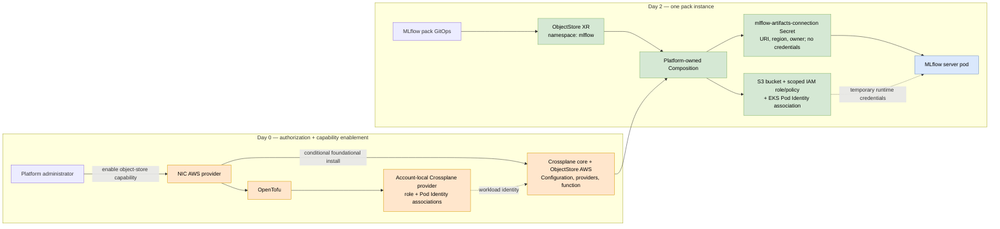
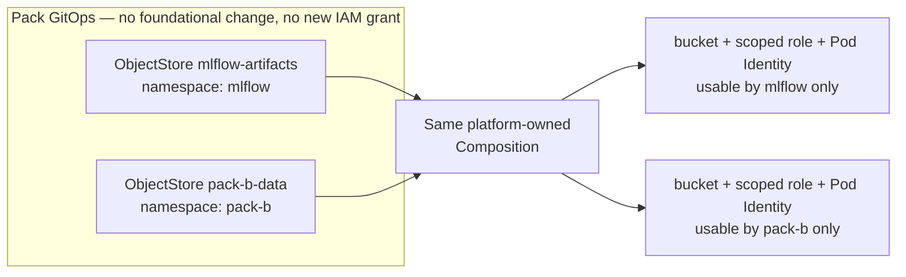

# ADR-0012: Crossplane Capability APIs for Software Pack Cloud Infrastructure

## Status

Proposed (2026-07-20)

Acceptance is conditional on the bounded AWS proof of concept and decision gates in
the [Validation Plan](#validation-plan). This ADR chooses a direction to test; it
does not approve an in-cluster cloud provisioner for production.

## Date

2026-07-20

## Context

Issue [#453](https://github.com/nebari-dev/nebari-infrastructure-core/issues/453)
asks for research and a PoC of using Crossplane in-cluster to provision the
infrastructure software packs need, while retaining OpenTofu for foundational
cluster infrastructure.

**What Crossplane is.** Crossplane is a set of Kubernetes controllers that
continuously reconcile custom resources into cloud resources — the way a Deployment
reconciles pods, but the "pods" are buckets and IAM roles. *Provider* packages run
per-cloud controller pods that hold cloud credentials and expose low-level *managed
resources* (roughly one CRD per cloud resource type: `Bucket`, `Role`, …). A platform
team defines its own higher-level API with an *XRD* (composite resource definition);
each instance of that API is an *XR* (composite resource); a platform-owned
*Composition* — in Crossplane v2, driven by pluggable *Composition functions* — maps
one XR to the set of managed resources that implement it. A *Configuration package*
bundles XRDs, Compositions, and their dependencies into a versioned, installable
unit. Reconciliation is continuous: drift is corrected automatically, but there is no
Terraform-style plan/preview step before changes take effect.

NIC has a clean lifecycle boundary today: cluster providers own foundational
out-of-cluster infrastructure (AWS/Azure via OpenTofu); ArgoCD owns in-cluster
software; packs are ArgoCD Applications that may use `NebariApp` for routing, TLS,
OIDC, and an in-cluster Postgres (ADR-0007). That boundary has no answer for an
external cloud resource requested by a pack. The motivating case is the
[`mlflow-pack`](https://github.com/nebari-dev/mlflow-pack): its metadata fits the
CloudNativePG database from ADR-0007, but its artifacts need durable object storage.

**What "a bucket" actually means.** A production-shaped AWS result needs a private,
encrypted, versioned S3 bucket with a retention policy; a least-privilege IAM role
and policy for the MLflow server; a binding from the `mlflow` ServiceAccount to that
role via EKS Pod Identity; a non-secret runtime binding (bucket URI, region, expected
owner — no static keys); and readiness/teardown behavior that gates the workload on
the binding and separates deleting access from deleting data. NIC should default to
MLflow's proxied artifact serving so only the server needs S3 access and clients get
no credentials. Existing NIC S3 code manages OpenTofu state buckets and must not be
reused for application data.

**The bootstrap boundary is unavoidable.** Crossplane changes the granularity of
foundational coupling, not its existence: OpenTofu must first create the workload
identity for the Crossplane AWS provider controllers, and platform admin must install
Crossplane and its packages. Only then can a pack create an `ObjectStore` without a
foundational change. Crossplane's provisioning identity and MLflow's runtime identity
stay separate — the first creates infrastructure, the second can use only one bucket.

**API vs. reconciler.** The pack-facing resource and the reconciliation engine are
separate concerns. `ObjectStore` is a new Nebari-owned API (a Crossplane XRD with
platform-owned Compositions); it does not exist today and is not supplied by
Crossplane. `NebariApp` stays responsible for routing/TLS/OIDC; `ObjectStore` is
reconciled by Crossplane:

```text
MLflow pack
  |-- NebariApp   -> nebari-operator (routing, TLS, OIDC, registration)
  `-- ObjectStore -> Crossplane      (bucket, workload identity, binding)
```

The initial PoC needs no `nebari-operator` change: the pack creates its
ServiceAccount and `ObjectStore`, consumes the binding Secret, and ArgoCD health
checks gate the workload on the XR's `Ready` condition.

**Community sentiment is mixed but patterned.** Practitioner reports (see Links)
converge on one line: Crossplane fits a *narrow platform API used many times*
(application-scoped buckets, databases, roles behind platform-owned Compositions) and
struggles with *broad migrations* (hard Composition authoring, slow feedback,
multi-layer debugging, no Terraform-like plan). Published production users (SIXT, the
Crossplane adopter list) coexist with reported migration failures because scope, not
approval, is the predictor. The `ObjectStore` proposal deliberately targets that
sweet spot. The PoC must assess the platform-author experience — Composition
development, failure diagnosis, upgrade/rollback, controller cost, recovery after
control-plane loss — not just a working bucket demo.

## Decision Drivers

- Self-service, day-2 provisioning once a capability is authorized, without touching
  foundational code or IAM per instance.
- Keep foundational ignorant of individual pack names and instances.
- Keep pack charts cloud-neutral; the stable contract is the `ObjectStore` spec and
  the resulting runtime binding, not the Crossplane machinery underneath.
- Make broad Crossplane authorization and capability enablement explicit and
  auditable.
- Use temporary workload identity, never static cloud credentials.
- Preserve a bring-your-own (BYO) path for organizations that provision elsewhere.
- Don't overfit Crossplane to packs: operators may adopt Crossplane for their own
  infrastructure, so NIC's install must coexist with operator-owned packages and
  provider configs rather than assume exclusive ownership.
- Keep data retention distinct from app and cluster deletion.
- Avoid installing privileged controllers on clusters that don't use them (ADR-0006
  conditional install; ADR-0003 pack model).

## Considered Options

| Option | Day-2 self-service | Pack portability | Credential location | Survives cluster loss | Machinery |
| --- | --- | --- | --- | --- | --- |
| 0. Bring your own object store | Manual, external | Strong if binding is portable | External | Strong | Lowest |
| 1. Add pack resources to cluster OpenTofu | No (`nic deploy`) | Weak | NIC process | Strong | Low now, high coupling later |
| 2. NIC out-of-cluster capability providers | Admin-triggered | Strong | NIC process | Strong | Medium |
| 3. Packs apply raw Crossplane resources | Yes | Weak | In cluster | Weak (per-cluster) | Medium |
| 4. Packs apply abstract Crossplane XRs | Yes | Strong | In cluster | Weak (per-cluster) | Highest |

- **Option 0 — BYO.** Admin provisions the bucket and identity externally and
  supplies the portable binding. Smallest footprint; fits existing landing zones;
  independent lifecycle; works on every provider. Not self-service, and correctness
  depends on an external system. **Supported in every design as the escape hatch.**
- **Option 1 — cluster OpenTofu.** Reuses NIC's AWS mechanism, but makes the cluster
  module enumerate packs: every new instance changes foundational state and code, and
  only AWS/Azure use OpenTofu. **Rejected as the general architecture** — coupling
  grows linearly with packs.
- **Option 2 — out-of-cluster capability providers.** A new NIC provider category
  (AWS could use a platform-owned OpenTofu module). Preserves the abstraction, keeps
  no persistent cloud credential in-cluster, survives cluster loss, and eases
  teardown/DR. Not true GitOps self-service, and needs new state/locking/GC
  machinery. **The fallback if the Crossplane PoC fails its gates — the strongest
  alternative, not a variant of Option 1.**
- **Option 3 — raw Crossplane resources.** Fast day-2 GitOps with little API design,
  but packs become AWS-specific, can exercise the full permission envelope, and
  duplicate IAM/retention/naming logic. **Permitted only in a development spike; not
  a supported pack API.**
- **Option 4 — abstract `ObjectStore` XR** backed by platform-owned per-cloud
  Compositions. True day-2 GitOps, a stable cloud-neutral contract, and one
  enforcement point for IAM/encryption/naming/retention/binding. Largest surface
  (Crossplane core, provider controllers, a Composition function, CRDs, packages),
  persistent in-cluster credentials, and it cannot reconcile after its own cluster is
  destroyed. The first bucket bears a disproportionate cost that only repays with
  repeated consumers. **Preferred direction for the PoC, subject to the gates.**

Rejected briefly: AWS SDK calls in `nebari-operator` (reimplements a cloud provider);
ACK (cloud-specific, still needs a Nebari abstraction and the same bootstrap); a
central Crossplane management cluster (better survival/isolation but adds a shared
control plane — reconsider if NIC operates fleets).

## Decision Outcome

Adopt the **capability boundary** now and validate **Option 4** as the preferred
managed implementation, with **Option 2** as the fallback. The first deliverable is
deliberately narrow: one `ObjectStore` API, one AWS implementation, one consumer
(MLflow) — not a "capability marketplace." `NebariApp` must not become a god
resource: ephemeral in-cluster integrations with a 1:1 app lifecycle may be
`NebariApp` fields, but external, retained, or independently governed resources get
dedicated capability APIs.



The intended sequence (exact NIC schema is follow-up work): an admin explicitly
enables Crossplane and the object-store capability, acknowledging the account-level
blast radius — enabling a pack never silently grants IAM; OpenTofu ensures the Pod
Identity Agent and creates the account-local provisioner identity; Crossplane core
installs via ADR-0006's conditional path; foundational manifests install the pinned
`ObjectStore` Configuration, provider config, and workload-identity objects; ADR-0003
codegen validates the pack's capability requirement; the pack creates its
ServiceAccount and `ObjectStore` XR; Crossplane reconciles continuously. Crossplane
v2 needs a Composition function for the bucket-scoped policy and binding Secret —
pinned and tested like a provider.

**Illustrative contract** (not the final schema; the pack authors only intent, the
platform owns region, naming, encryption, allowed operations, and deletion policy):

```yaml
apiVersion: infrastructure.nebari.dev/v1alpha1
kind: ObjectStore
metadata:
  name: mlflow-artifacts
  namespace: mlflow
spec:
  consumer:
    serviceAccountName: mlflow
```

The Composition creates the S3 bucket (`Retain` on delete), a bucket-scoped IAM
role/policy and Pod Identity association (deleted with the XR), and a non-secret
`mlflow-artifacts-connection` Secret carrying `MLFLOW_ARTIFACTS_DESTINATION`
(portable) plus AWS-only `AWS_REGION` and `MLFLOW_S3_EXPECTED_BUCKET_OWNER`. Other
clouds supply the same destination key; a backend that cannot honor the behavioral
contract forces an API version bump, not an untyped map. MLflow consumes the same
Secret in managed and BYO modes, so provisioning choice never leaks into app config.

**The same bucket under Option 1, and what a second pack costs.** Without
Crossplane, the same production-shaped result is foundational code — written,
reviewed, and re-applied by an admin running `nic deploy` for every pack instance:

```hcl
# cluster module — edited and re-applied for EVERY pack instance
resource "aws_s3_bucket" "mlflow_artifacts" { # + encryption, versioning, retention
  bucket_prefix = "nebari-mlflow-artifacts-"
}
resource "aws_iam_role" "mlflow_artifacts" { ... }        # trust: EKS Pod Identity
resource "aws_iam_role_policy" "mlflow_artifacts" { ... } # this bucket only
resource "aws_eks_pod_identity_association" "mlflow" {
  cluster_name    = var.cluster_name
  namespace       = "mlflow"
  service_account = "mlflow"
  role_arn        = aws_iam_role.mlflow_artifacts.arn
}
# ...plus wiring the binding values back into the pack's namespace
```

Under Option 4 the equivalent is the short `ObjectStore` above, delivered through
the pack's own GitOps. The difference compounds with the second consumer: under
Option 1 a second pack means another copy of the HCL block, another foundational PR,
and another `nic deploy`; under Option 4 it is one more XR in a different namespace,
with no foundational or IAM change:



The same shape — one XR per instance, one platform Composition per cloud — is how a
future capability (an external relational database, say) would scale to multiple
packs, though this ADR commits to `ObjectStore` only.

**Security model.** The recommended baseline is a **dedicated-account model**: the
AWS account is dedicated to one Nebari administrative trust domain (cloud, cluster,
and pack-platform admin are the same people/automation). Crossplane may then use a
broad account-local provider role, with ownership tags, name separation, and
practical denies used to prevent *accidental* collision with foundational OpenTofu —
explicitly not claimed as a hard security boundary. The tradeoff, stated plainly:
**provider-controller compromise is compromise of the dedicated account.** A
**strict-separation model** (capability-specific default-deny roles, permissions
boundaries, per-service identities) is documented as an alternative for reviewers but
is *not* proposed for initial support; selecting it materially expands the
implementation and PoC scope. The initial PoC (on the
[`crossplane-isolated-iam-snapshot-2026-07-23`](https://github.com/nebari-dev/nebari-infrastructure-core/tree/crossplane-isolated-iam-snapshot-2026-07-23)
branch) in fact implemented this strict-separation variant — per-capability provider roles
(`provider-aws-s3`/`-iam`/`-eks`) with individually scoped policies, per-provider
permissions boundaries, ownership-tag denies, and boundary-constrained workload roles
— and it runs end-to-end. That confirmed the predicted cost: the tight IAM was the
dominant implementation effort and surfaced AWS edge cases such as `iam:GetRole` on a
not-yet-created role authorizing against the path-less name (which blocked the
provider's observe-before-create) and `CreatePodIdentityAssociation` requiring
`iam:GetRole` on the target role. Equal
administrators does not mean privileged
workloads: pack pods, ServiceAccounts, and GitOps must remain unable to use
provider-controller credentials or mutate provider config and Compositions.

This ADR **commits to**: a small, versioned, cloud-neutral `ObjectStore` owned by the
platform; BYO alongside managed mode; a bounded AWS/EKS PoC using namespaced
Crossplane v2 XRs; OpenTofu ownership of the provisioner identity; the
dedicated-account trust assumption; separate provisioning and runtime identities;
`Retain` by default; explicit capability enablement (pack metadata may validate a
requirement but never authorizes IAM); Crossplane install via ADR-0006; and a support
boundary that lets operators run their own Crossplane extensions under separate
packages and provider configs.

It does **not** commit to: production adoption; the final schema or NIC config
fields; automatic purge of retained data; Azure/GCS/S3-compatible Compositions; a
second capability or a marketplace; a central management plane; the strict-separation
model or multiple selectable security profiles; or support for arbitrary
operator-authored Compositions and raw managed resources.

### Consequences

**Good:**

- Architecture depends on capabilities, not pack names; a second pack needs no
  foundational or IAM change and receives a consistent runtime binding.
- Packs stay cloud-neutral; IAM authorization stays an explicit day-0 decision.
- The dedicated-account assumption makes the OpenTofu→Crossplane handoff far simpler
  than per-capability isolation.
- BYO covers externally governed and unsupported-cloud deployments.

**Bad:**

- Considerable machinery for the first bucket; a new high-value supply-chain and
  runtime attack surface in-cluster.
- NIC gains pre-destroy and retained-resource inventory duties; per-cloud
  Compositions become products to test and release.
- Pack GitOps must be constrained more tightly than today; operators may reason about
  state across three IaC systems (their own IaC, NIC OpenTofu, Crossplane).
- The AWS account, not fine-grained IAM, becomes the primary security boundary —
  controller compromise can reach everything in it. Strict separation would turn that
  IAM boundary into a product in its own right.

## Security Requirements

For the recommended dedicated-account model. The central risk: a provider controller
is a continuously credentialed cloud client; code execution in that pod yields its
temporary AWS credentials, and Kubernetes RBAC does not reduce that cloud-side blast
radius. Broad account-local access is deliberate, so:

1. **Dedicated-account boundary.** No unrelated workloads in the account; no
   cross-account assumption or org-management authority; enablement records an
   explicit admin acknowledgement of the account-level blast radius.
2. **Real pack API boundary.** Ordinary pack sync must not create or modify
   `Provider`, provider configs, `DeploymentRuntimeConfig`, `ImageConfig`, XRDs,
   Compositions, Functions, or raw managed resources — only the namespaced
   `ObjectStore`. Tighten the wildcard `nebari-apps` AppProject; use admission policy
   (related [#480](https://github.com/nebari-dev/nebari-infrastructure-core/issues/480))
   as defense in depth.
3. **Enforce the platform Composition.** Set `enforcedCompositionRef` on the XRD;
   reject pack-supplied composition/revision selectors and update-policy overrides.
4. **No static credentials.** EKS Pod Identity for both controllers and MLflow, on
   dedicated ServiceAccounts.
5. **Separate provisioning from runtime identity.** The broad role is never mounted
   into an app pod. Generated workload roles are bucket/prefix-scoped with
   cluster/namespace/ServiceAccount trust conditions and session tags; a permissions
   boundary and constrained `iam:PassRole` guard against Composition defects (they do
   not contain controller compromise).
6. **Keep dangerous choices out of the XR** — no arbitrary policy JSON, role ARN,
   bucket name, provider reference, public-access setting, or deletion policy.
7. **Pin the full supply chain by digest** (Crossplane, Configuration, provider,
   function) with a defined upgrade/rollback process.
8. **Prove isolation.** IAM Access Analyzer plus positive/negative tests that MLflow
   reaches its prefix and nothing else; verify collision guardrails and record the
   actions for which AWS cannot enforce the tag-based deny.

## Data Retention and Destroy Semantics

The control plane must not disappear before handling what it owns.

- **Pack removal:** deleting the XR removes the Pod Identity association, workload
  role/policy, and binding Secret; the bucket is retained by default. Because
  Composition functions do not run on delete, the platform writes/refreshes an
  **out-of-cluster inventory** (bucket ARN, cluster ID, XR UID, creation time) while
  the XR is healthy.
- **Explicit purge** of a versioned bucket is a separate authenticated operation with
  a confirmation boundary; ArgoCD prune must not destroy artifacts.
- **`nic destroy`** adds a pre-destroy phase that reconciles ephemeral-identity
  deletion while the API server and Crossplane are alive, records retained resources,
  and fails with an actionable inventory if it cannot reach a safe state.
- **Abrupt cluster loss:** per-cluster Crossplane cannot clean up — tags, the external
  inventory, and a recovery procedure are mandatory. This is a structural weakness
  relative to Option 2 or a central control plane.
- **Crossplane uninstall/disable** is blocked while managed XRs or non-retained
  resources remain.

## Validation Plan

Move from Proposed to Accepted only when an AWS PoC demonstrates all of:

- **Functional:** capability disabled installs nothing; enabling on fresh EKS
  installs healthy pinned packages with no static keys; one `ObjectStore` yields a
  private/encrypted/versioned bucket, scoped role, Pod Identity association, and
  binding; MLflow round-trips an artifact through the proxied endpoint with no client
  credential; two namespaces get isolated buckets/roles; Crossplane corrects a safe
  drift and reports status through Kubernetes and ArgoCD; BYO works without Crossplane.
- **Security:** recorded dedicated-account acknowledgement; provider role has no
  cross-account/org authority (broad access documented, not called least-privilege);
  packs cannot create administrative/provider objects or select alternate
  config/policy/role/bucket/deletion policy; workload-role policies, `iam:PassRole`,
  trust conditions, and session tags pass positive/negative tests and Access Analyzer;
  two workloads cannot reach each other's buckets or the controller identity;
  collision guardrails verified with the bypassable actions listed.
- **Lifecycle/ops:** a healthy XR has an external inventory record discoverable after
  removal; purge handles non-empty versioned buckets; `nic destroy` leaves no orphan
  role/association; a recovery drill finds resources after simulated cluster loss;
  provider/Configuration upgrade-rollback tested against an existing bucket; an induced
  reconcile failure (e.g. a denied provider action) is diagnosable from XR conditions,
  events, and provider logs through the platform's normal observability path and
  surfaces as degraded in ArgoCD; controller
  memory/pods/CRDs/latency measured and judged acceptable for one capability; a
  minimal operator-owned package survives NIC upgrade untouched; unsupported profiles
  (local, Hetzner) fail cleanly with a BYO path.
- **Decision gate:** compare measured results against Option 2 and accept Crossplane
  only if day-2 GitOps and the expected consumer count justify its persistent
  privilege, account-level blast radius, and operational cost. If reviewers require
  strict separation, revise the estimate and gates first. Otherwise implement Option 2
  and keep the same pack-facing binding contract.

## Open Questions

- Is a dedicated AWS account with a single admin trust domain acceptable, or do target
  operators require strict separation strongly enough to change the recommendation?
- How broad should the account-local provider role be (AWS-managed admin with outer
  denies, a Nebari-managed broad policy, or another account-scoped policy)?
- Is retention fixed by profile, admin-selectable, or split into capability classes?
- Should the `ObjectStore` template and binding values live in the pack, be injected
  by ADR-0003 codegen, or split — preserving the pack's existing allowed-hosts Secret
  on merge?


## Links

- [Issue #453](https://github.com/nebari-dev/nebari-infrastructure-core/issues/453) — Crossplane research and PoC request
- [Issue #480](https://github.com/nebari-dev/nebari-infrastructure-core/issues/480) — admission policy for dangerous workloads and RBAC
- [ADR-0003](0003-software-pack-codegen.md) — Software Pack Codegen
- [ADR-0006](0006-conditional-foundational-software-helm.md) — Conditional Foundational Software
- [ADR-0007](0007-cloudnativepg-managed-databases.md) — CloudNativePG managed databases
- [Crossplane v2 changes](https://docs.crossplane.io/latest/whats-new/) — namespaced XRs, managed resources, Composition functions
- [Crossplane Configuration packages](https://docs.crossplane.io/latest/packages/configurations/) — packaged XRDs/Compositions with declared dependencies
- [Crossplane with ArgoCD](https://docs.crossplane.io/latest/guides/crossplane-with-argo-cd/)
- [Community use-case discussion](https://www.reddit.com/r/kubernetes/comments/1lj6o0g/what_are_you_using_crossplane_for/) and [follow-up on fit](https://www.reddit.com/r/kubernetes/comments/1loxvu2/that_crossplane_did_not_land_so_where_to/)
- [SIXT: Crossplane on EKS](https://aws.amazon.com/blogs/opensource/enhancing-internal-developer-platform-idp-with-crossplane-on-eks-at-sixt/) and the [Crossplane adopter list](https://github.com/crossplane/crossplane/blob/main/ADOPTERS.md)
- [MLflow artifact stores](https://mlflow.org/docs/latest/self-hosting/architecture/artifact-store/) and [Kubernetes Helm deployment](https://mlflow.org/docs/latest/self-hosting/kubernetes-helm/)
- [Pinned community MLflow chart values](https://github.com/community-charts/helm-charts/blob/mlflow-1.8.1/charts/mlflow/values.yaml)
- [EKS Pod Identity](https://docs.aws.amazon.com/eks/latest/userguide/pod-identities.html) and [session tags](https://docs.aws.amazon.com/eks/latest/userguide/pod-id-abac.html)
- [AWS IAM permissions boundaries](https://docs.aws.amazon.com/IAM/latest/UserGuide/access_policies_boundaries.html)
