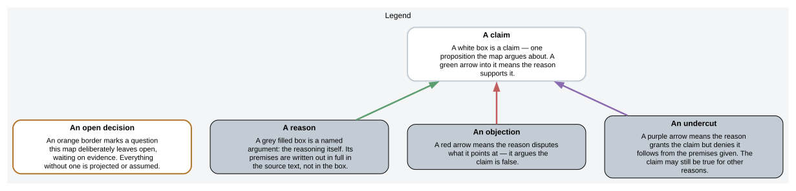
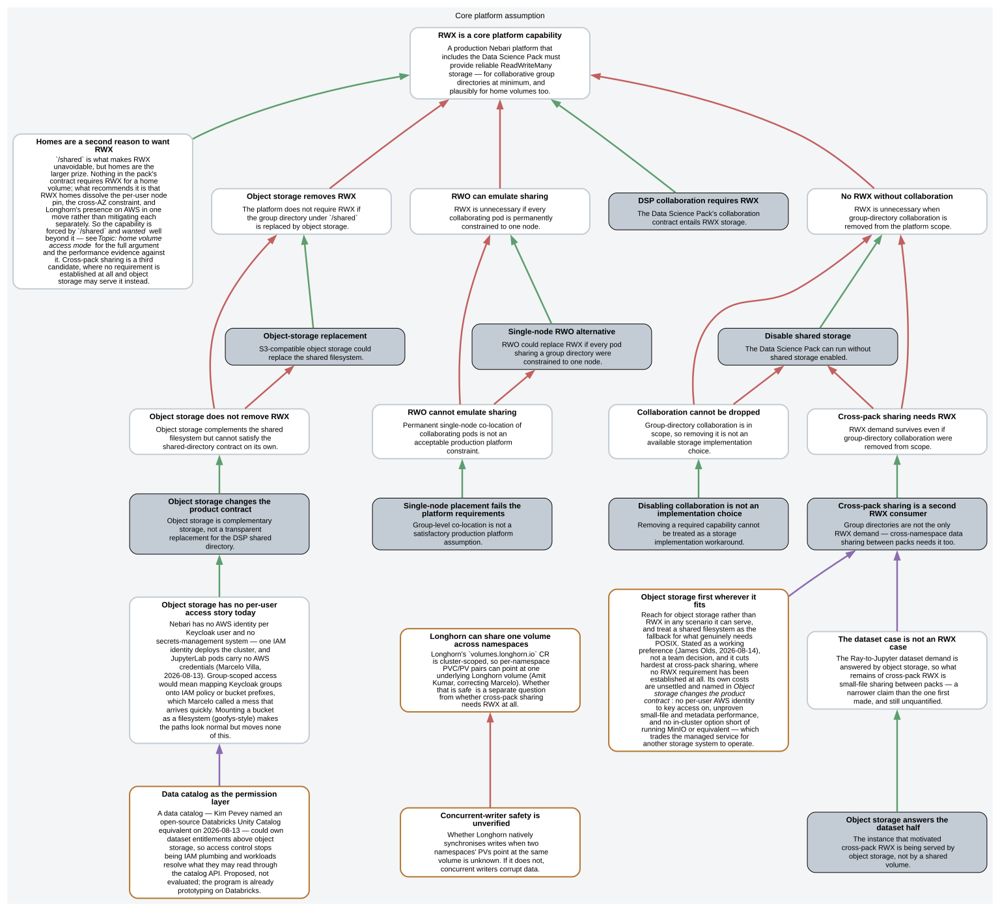
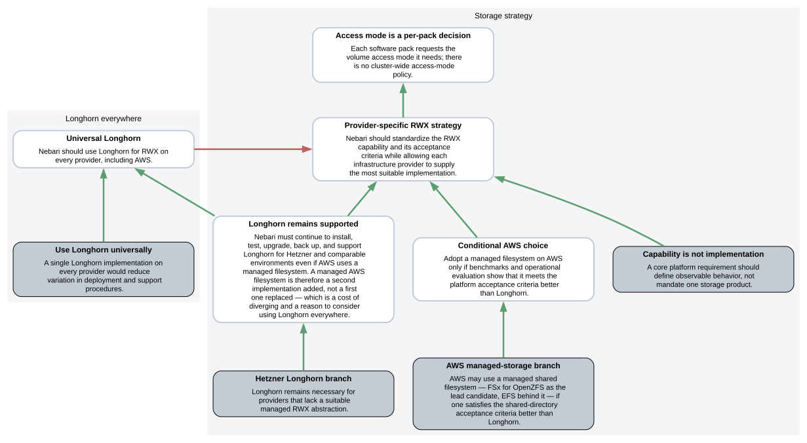
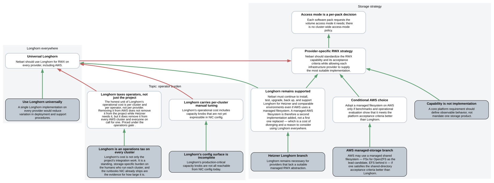
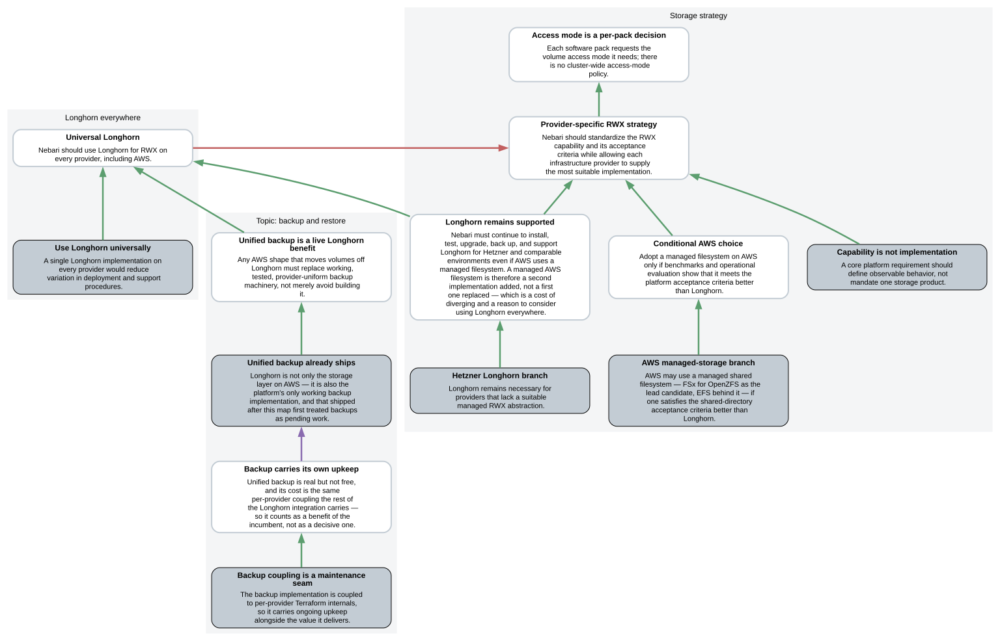
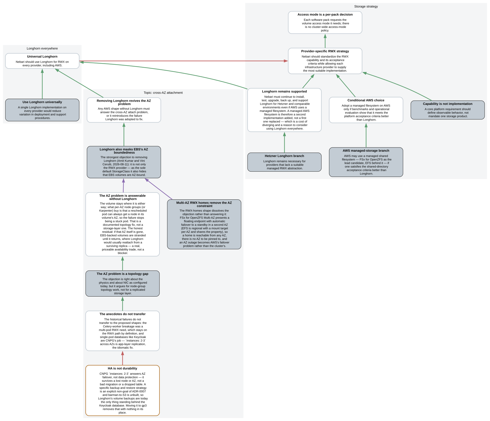
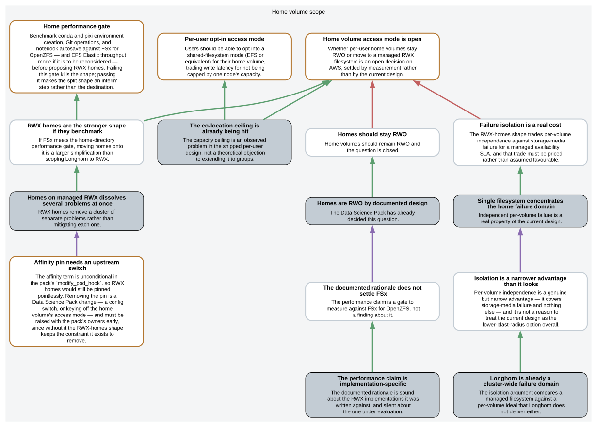

# RWX storage as a Nebari platform capability

This is an argument map, not an ADR. It records what the team has argued about ReadWriteMany (RWX) storage on AWS — which claims are settled, which are open, and what evidence would close them — so the eventual ADR is written from a position everyone can inspect.

The source of truth is [`rwx-storage-strategy.argdown`](rwx-storage-strategy.argdown). Rendering is `make argdown`, which writes every SVG below from that one file; the sections in the source are the sections on this page.

The whole argument in one picture is [`overview.svg`](overview.svg) — 87 nodes, useful as a reference, unreadable as an introduction. The maps below are the same argument split by *direction*: each one takes the central fork and hangs a single line of attack off it.

## How to read the maps

## Does the platform need RWX at all?

Everything downstream depends on this. The claim is that a production Nebari with the Data Science Pack must provide RWX, because the pack's collaboration contract (`/shared/group-name`, written concurrently by users whose pods must stay independently schedulable) cannot be served by a ReadWriteOnce volume.

Three ways out are argued and all three fail: pinning every collaborating pod to one node, replacing the shared directory with object storage, and dropping group collaboration from scope. A second RWX consumer — cross-namespace data sharing between packs — survives even if the first were removed, though it is gated on the requester writing a user story.

The 2026-08-13 standup narrowed that second consumer without removing it: large datasets go to object storage — so the Ray-to-Jupyter case that motivated cross-pack RWX is answered by a bucket, not a volume — leaving small-file sharing between packs, which the map argues is structural to a composable pack model. The user story is now in flight, and the object-storage side has its own open gap: no per-user AWS identity, with a data catalog proposed as the permission layer.

## One implementation, or one per provider?

This is the fork every direction below hangs off. Nebari can standardize the RWX *capability* and let each provider supply the implementation (managed filesystem on AWS, Longhorn on Hetzner), or it can run Longhorn everywhere and buy uniformity.

Only the per-pack principle is decided (2026-08-12): each pack requests the access mode it needs, with no cluster-wide policy. The fork itself is not — the rest of the page is the case against "Longhorn everywhere", direction by direction, plus what each direction has to measure before it counts.

## Direction: operator burden

Longhorn's cost is not only the project's integration work — it is a standing burden on whoever runs each cluster, and the runbooks already in this repo are the evidence for its size: node drains need a five-step replica-eviction procedure, failure diagnosis needs Longhorn-specific concepts, and some capacity knobs are still tuned by hand per cluster.

That cost scales with clusters and on-call operators, not with providers, which is where the uniformity argument prices it. Priced under the operations gate.

## Direction: the shared data path

Longhorn does not serve RWX from its replicated block layer directly — it puts an NFS server pod in front, and the pack requests one shared PVC for all groups, so a single pod is the data path for every group's shared storage at once. On a stock deploy today that pod is the pack's own transitional NFS server exporting a Longhorn RWO volume, with Longhorn's share-manager not in the path at all. Either way, every operation across it pays a network round trip, which is what makes metadata-heavy work slow.

Note what that does *not* cover: the metadata-heavy workloads usually cited — environment builds, `git status`, autosave — live on the home volume, not on `/shared`, so they price the home gate below; the two comparisons must not be run together. The counter is that the whole-cluster *scope* of the path is the pack's layout choice, fixable without changing storage backend. What survives is per-group and smaller: one pod's network connection as the bandwidth ceiling, and the still-unanswered question of whether Longhorn synchronises concurrent cross-namespace writers at all.

## Direction: backup and restore

Native Longhorn backups shipped in July 2026 and are hard-gated on Longhorn being the default StorageClass — `nic validate` and `nic deploy` both refuse otherwise. There is no storage-agnostic backup path in the project, so any AWS shape that moves volumes off Longhorn replaces working, tested machinery rather than merely avoiding work it would have had to build.

The offsetting point is that the implementation is coupled to per-provider Terraform internals and carries its own upkeep. Backup is priced on its own gate, not folded into availability or cost.

## Direction: the compute model

Keeping Longhorn on AWS also decides the compute model. Longhorn needs a node-level iSCSI prerequisite that has no install path on EKS Auto Mode's managed immutable nodes, and Auto Mode's forced node rotation is hostile to node-local replicas — so the two are one decision, not two.

Two things soften it: a hybrid fleet (Auto Mode plus a classic storage node group) is technically available, though it keeps every code path Auto Mode was meant to remove; and whether Auto Mode is adoptable at all is separately open.

## Direction: cross-AZ attachment

The strongest objection to removing Longhorn: as the sole default StorageClass it also hides that EBS volumes are AZ-bound, which is the failure ADR-0002 was originally adopted to fix.

The response is that this is a node-group topology gap, not a storage-layer one — a rescheduled pod needs a node in its volume's AZ, which per-AZ node groups or Karpenter supply and NIC's single multi-AZ ASG does not. The residual is AZ-outage availability for EBS-backed volumes, to be priced rather than argued away.

## Direction: home volume access mode

Scoped separately because it decides how ambitious the AWS change is. Two shapes are live on AWS: the **split shape** moves only single-pod system volumes to gp3 and keeps homes and RWX on Longhorn; the **RWX-homes shape** puts homes on a managed RWX filesystem too, which removes Longhorn from AWS entirely. Homes are RWO today by deliberate pack design, on a performance rationale written against Longhorn's and EFS's data paths and silent about FSx for OpenZFS.

If FSx clears the home performance gate, moving homes onto it removes the per-user node pin, the cross-AZ objection, and Longhorn from AWS together. If it does not, the RWX-homes shape is dead and the split shape stands. Measurement decides, not argument.

Two pack-side prerequisites ride along, both easy to miss because they are not storage-layer work: the per-user affinity term is unconditional, so RWX homes stay pinned until the pack gains a switch; and home ownership relies on kubelet-applied `fsGroup`, which NFS-backed CSI drivers do not support, so the uid/gid model has to be rebuilt on the appliance's export semantics.

## Decision gates

The gates carry no map — they are the acceptance criteria the directions above defer to, listed in full in the [source](rwx-storage-strategy.argdown) under *AWS decision gate*: POSIX behavior, representative performance, availability, backup and restore, operations, cost, migration, portability cost, and cross-namespace sharing.

Two of them are now being measured rather than argued. Benchmarking started on 2026-08-13: a matrix over small files, large files, and real workloads, including gp2 versus gp3 — which may move the split shape's numbers before any managed filesystem is compared. Cost sits in the same matrix, with operator overhead priced as a line inside it.
