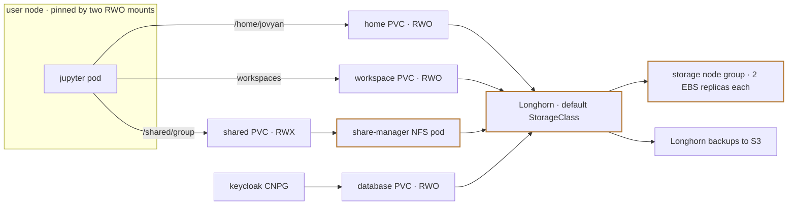
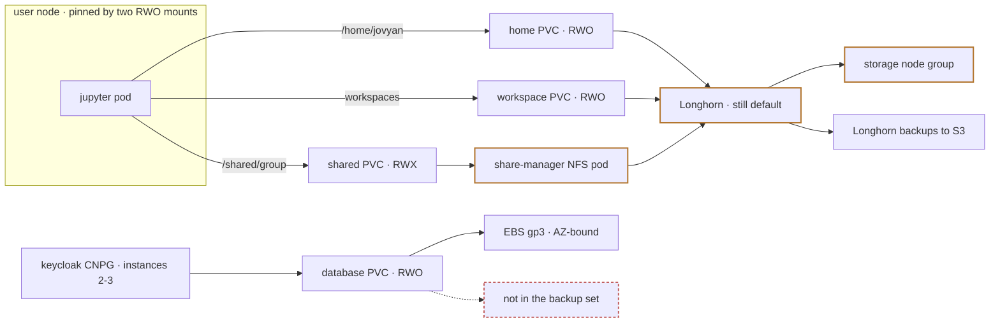
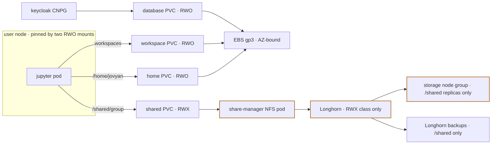
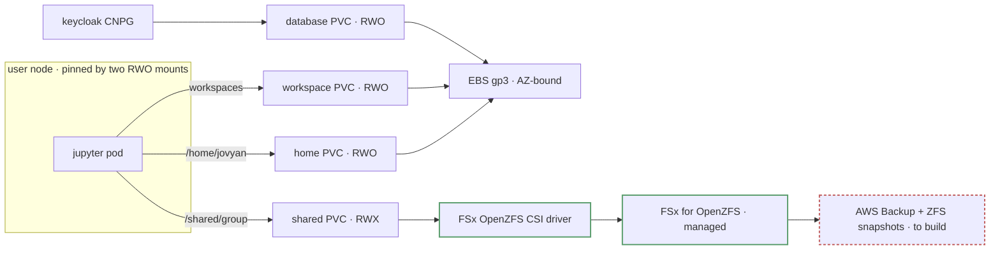
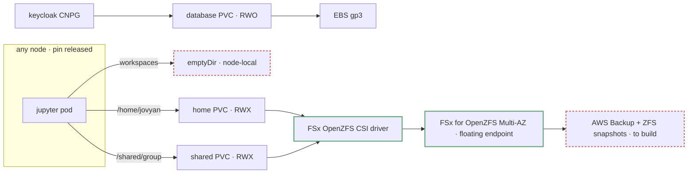

# Nebari storage strategy

Longhorn holds several roles in a Nebari cluster at once — sole default StorageClass, RWX implementation, backup implementation. This page works through which of those roles it should keep, on which providers, and what replaces the rest. It started as the narrower question of ReadWriteMany (RWX) storage on AWS, and kept running into the others.

Nothing here proposes a decision. It records what has been argued, which claims are settled, which are open, and what evidence would close them, so that whatever gets proposed later starts from a position anyone can inspect and dispute. Some of it will end up amending [ADR-0002](../0002-longhorn-distributed-block-storage-for-aws.md), which adopted Longhorn to solve cross-AZ EBS attachment and named RWX and backups as later benefits.

The source of truth is [`storage-strategy.argdown`](storage-strategy.argdown). Rendering is `make argdown`, which writes every SVG below from that one file; the sections in the source are the sections on this page. The source also carries two things this page does not: the acceptance gates each topic defers to (under *AWS decision gate*), and the running list of assumptions the argument leaves behind.

The whole argument in one picture is [`overview.svg`](overview.svg) — useful as a reference, unreadable as an introduction. The maps below are the same argument split by *topic*: each one takes the central fork and hangs one strand of the argument off it.

## How to read the maps

## The shapes

<!-- Hand-written: not generated by `make argdown`, unlike the SVGs. Keep in sync with Assumption 12 and the cost note. -->

Four candidate shapes are live on AWS, plus the incumbent. Each is a superset of the change before it, so the question is not which one to pick but how far down the list to go.

Four volume classes are in play, and each shape routes them differently:

| Volume | Access mode | What it holds | Who mounts it |
| --- | --- | --- | --- |
| `claim-{user}` — home | RWO | `/home/jovyan`, plus nebi's own database | every pod a user runs |
| `nebi-workspaces-{user}` | RWO | materialised environments, 20 GiB, rebuildable | every pod a user runs |
| `/shared/{group}` | **RWX** | group collaboration files | pods of every member of every group |
| Keycloak CNPG | RWO | the identity database | one database pod |

### Comparison

| | **A. Incumbent** | **B. Split** | **C. RWX-only** | **D. Middle** | **E. RWX homes** |
| --- | --- | --- | --- | --- | --- |
| Home | Longhorn RWO | Longhorn RWO | gp3 | gp3 | **FSx RWX** |
| Workspace | Longhorn RWO | Longhorn RWO | gp3 | gp3 | ephemeral (required) |
| `/shared` | Longhorn RWX | Longhorn RWX | Longhorn RWX | FSx | FSx |
| Keycloak CNPG | Longhorn | gp3 | gp3 | gp3 | gp3 |
| Longhorn on AWS? | yes, under everything | yes | yes, RWX only | **no** | **no** |
| Cost — 10 / 50 / 200 users | $231 / $1,045 / $6,235 | ≈ A | *est.* ~$182 / ~$589 / ~$3,032 | **$86 / $423 / $2,466** | $231 / $1,083 / $6,307 |
| Operator hours/mo | ~9.3 | ~9.3 | ~9.3 | ~2.3 | ~2.3 |
| Home write latency | baseline | baseline | ≈ baseline (gp2↔gp3 within noise) | ≈ baseline | **9–37x** |
| `/shared` at 1 writer | baseline | baseline | baseline | within noise of Longhorn | within noise |
| `/shared` at 4 writers | baseline | baseline | baseline | 1.2–1.4x slower than Longhorn | 1.2–1.4x slower |
| Per-user node pin | pinned | pinned | pinned | pinned | **released** |
| Cross-AZ work owed | none (masked) | CNPG multi-instance | per-AZ node groups or Karpenter | per-AZ node groups or Karpenter | none (Multi-AZ FSx) |
| Backup coverage | every volume, shipped | **minus system volumes** | **minus homes + workspace + system** | **must be built** | **must be built** |
| User-data migration | none | none | every home moves | every home moves | every home moves |
| EKS Auto Mode | foreclosed | foreclosed | foreclosed | open | open |
| FSx integration owed | none | none | none | yes (branch-only today) | yes (branch-only today) |

The `/shared` rows compare only the operations that volume actually sees — extraction, clone, checkout, status. Both backends degrade under concurrent writers (Longhorn 2.2–2.6x, FSx 1.7–2.7x from one to four), but they degrade together, so the *gap* between them barely moves; EFS in place of FSx is the one option whose curve stays flat, and it should win somewhere past four writers.

Three caveats on that table. **C's cost is my arithmetic, not the model's** — the 2026-08-14 run priced five shapes and C was not among them; the figures are gp3 homes plus a 2.67x-multiplied `/shared` plus the storage node group plus S3 backup, at the model's own unit prices, and they assume the `instance-manager` CPU reservation disappears once no user node attaches a Longhorn volume, which is the assumption most likely to be wrong. **B is not priced separately** because system volumes are a few GiB against terabytes of homes; the change is operationally significant and financially invisible. And the workspace PVC — 20 GiB per user — is in **no** shape's cost line, because it was found after the model was built; adding it raises every gp3 column a little and every Longhorn column 2.67x as much.

### A. Incumbent — Longhorn under everything

**Platform devs:** nothing to build; the AZ problem stays masked, and every future PVC inherits Longhorn whether it wants it or not. **Operators:** the five-step replica-eviction drain, `--force` node rolls, hand-tuned overprovisioning, Longhorn CRs in every triage — and a working backup with one config surface.

### B. Split — system volumes only

**Platform devs:** build the per-workload storage-class seam that does not exist today (NIC renders one cluster-wide class as a literal into the CNPG manifest), and answer durability for the identity database before moving it — `nic` refuses a backups config when the effective class is not `longhorn`, so this is a validation error on day one, not a silent gap. **Operators:** every Longhorn cost above, unchanged, plus one volume that is no longer in the backup set and a database whose AZ resilience is now CNPG's `instances` count rather than the storage layer's.

### C. RWX-only — Longhorn kept purely as the RWX provider

**Platform devs:** the same class seam as B, plus per-AZ node groups or Karpenter now that homes are AZ-bound, plus a home-migration path — and **no managed filesystem to integrate at all**, which is the whole appeal: no FSx Terraform, no CSI IAM wiring, no new ownership mechanism, no second backup implementation. **Operators:** Longhorn is still installed, so the drain procedure and the Longhorn vocabulary survive, but they apply to one volume per group instead of two per user; capacity tuning gets much smaller; homes and the database leave the backup set; per-AZ capacity headroom becomes a thing to watch.

### D. Middle — managed `/shared`, block homes *(benchmark- and cost-favoured)*

**Platform devs:** the largest build of the four. FSx Terraform and the CSI driver's Pod Identity and IAM wiring, none of which exists upstream and all of which is a branch-only harness today; a storage-agnostic backup path, because Longhorn's is gated on being the default class; per-AZ node groups or Karpenter; a home-migration path; and Longhorn stays in the tree for Hetzner regardless, so this is a second implementation added, not a first one replaced. **Operators:** no replica evictions, no `--force` rolls, no Longhorn concepts in triage — about 7 h/mo/cluster back. In exchange: an FSx throughput tier that is a purchasing decision rather than a config knob, a filesystem that grows by at least 10% with a 6-hour cooldown and never shrinks, `allowVolumeExpansion: false` so a PVC edit is accepted and silently never completes, per-AZ capacity headroom, and a `/shared` that is measurably slower at one writer than what it replaced.

### E. RWX homes — everything on the managed filesystem

**Platform devs:** everything in D, plus per-user dynamic FSx volumes with the quota-or-growth trade (a child volume can have a hard quota or be growable, not both), plus a POSIX ownership mechanism that moves out of the pod spec into StorageClass parameters, plus two pack changes — making the affinity term conditional and making the workspace volume ephemeral — and the pack change is load-bearing: **without it the pin survives and the shape buys nothing it exists to buy.** **Operators:** the best day-2 story on paper — no AZ pin, no node pin, drains that are just drains, one filesystem to watch — bought with 9–37x on interactive file writes, `git checkout` at 15–32 s against 0.4 s today, and environment rebuilds moving from user-initiated to whenever the scheduler moves a pod.

### What the shapes turn on

- **A → B** is gated on durability for the identity database, and it is the only step that moves no user data.
- **B → C** is gated on whether an AZ-bound home is acceptable, and it is the cheapest path to *most* of the operational win — if the `instance-manager` assumption in C's cost column holds.
- **C → D** buys the end of Longhorn on AWS for the price of owning an FSx integration and a new backup story, and it is the shape both the benchmark and the cost model favour.
- **D → E** buys the end of the node pin for a 9–37x write penalty on interactive work, and nobody has written down the latency bar that would make that a yes or a no.

## Does the platform need RWX at all?

Everything downstream depends on this. The claim is that a production Nebari with the Data Science Pack must provide RWX, because the pack's collaboration contract (`/shared/group-name`, written concurrently by users whose pods must stay independently schedulable) cannot be served by a ReadWriteOnce volume.

Three ways out are argued and all three fail: pinning every collaborating pod to one node, replacing the shared directory with object storage, and dropping group collaboration from scope.

**Homes are the second reason to want it, and the larger one.** `/shared` is what makes RWX unavoidable, so it is what this section argues from — but nothing about the requirement stops there. Nothing in the pack's contract requires RWX for a *home* volume; what recommends it is that RWX homes dissolve the per-user node pin, the cross-AZ constraint, and Longhorn's presence on AWS in one move, rather than mitigating each separately. That is a supporting reason for the capability, not a second requirement, and it is why homes get [their own topic](#topic-home-volume-access-mode) — including the performance evidence running against them. Cross-namespace sharing between packs is a third candidate, and the weakest: no requirement is established there at all.

That third candidate has shifted twice. The 2026-08-13 standup narrowed it: large datasets go to object storage, so the Ray-to-Jupyter case that originally motivated cross-pack RWX is answered by a bucket, not a volume, leaving small-file sharing between packs. And the user-story gate is now met — the work is two tracked spikes, [#597](https://github.com/nebari-dev/nebari-infrastructure-core/issues/597) (object-storage access) and [#598](https://github.com/nebari-dev/nebari-infrastructure-core/issues/598) (cross-namespace volume sharing). What has *not* been established is that the remainder needs RWX at all. The map now carries the working preference that it probably does not: reach for object storage wherever it fits and treat a shared filesystem as the fallback for what genuinely needs POSIX. That preference is not free either, and its costs are the open ones — no per-user AWS identity to key access on (a data catalog is the leading proposal for the permission layer), unproven small-file and metadata performance, and nothing in-cluster short of running MinIO, which trades a managed service for another storage system to operate.

## One implementation, or one per provider?

This is the fork every topic below hangs off. Nebari can standardize the RWX *capability* and let each provider supply the implementation (managed filesystem on AWS, Longhorn on Hetzner), or it can run Longhorn everywhere and buy uniformity.

Only the per-pack principle is decided (2026-08-12): each pack requests the access mode it needs, with no cluster-wide policy. The fork itself is not — the rest of the page works through it topic by topic: the case against "Longhorn everywhere", the strongest points for it, and what each topic has to measure before it counts.

## Topic: operator burden

Longhorn's cost is not only the project's integration work — it is a standing burden on whoever runs each cluster, and the runbooks already in this repo are the evidence for its size: node drains need a five-step replica-eviction procedure, failure diagnosis needs Longhorn-specific concepts, and some capacity knobs are still tuned by hand per cluster.

That cost scales with clusters and on-call operators, not with providers — which is where the uniformity argument prices it, if it prices it at all. Priced under the operations gate.

Two of those costs stopped being arguments during the benchmark work: a routine node-group resize was blocked three times by the instance-manager PDB and completed only with `--force`, and Longhorn RWX turned out not to work at all on NIC's default AWS node disk size. Both are in the map under this topic — and both are NIC bugs we can and will fix, so neither is evidence that Longhorn cannot work here. What they are evidence of is how much Longhorn-specific knowledge the integration assumes: the disk-size failure names no cause, and the drain needs a data-safety setting relaxed before maintenance proceeds. Better tooling shortens that work; it does not remove the class of it, which is what this topic is about.

## Topic: cost

Priced on 2026-08-14 against the AWS Price List API — us-east-1, on-demand, five shapes across 10 / 50 / 200-user tiers, with operator overhead kept as a line item in hours rather than folded into dollars. The RWX-only shape — every RWO volume on gp3 with `/shared` left on Longhorn — is not one of the five, and it is the gap most likely to change the ordering, since it removes the same two cost drivers as the managed shapes without buying a managed filesystem.

**Longhorn costs 2.5-2.7x the benchmark-favoured shape at every tier** — $231 / $1,045 / $6,235 a month against $86 / $423 / $2,466 for gp3 homes plus an FSx Single-AZ `/shared`. The driver is not $/GB: it is a 2.67x capacity multiplier (two replicas ÷ the 25% reserve) on provisioned block storage, paid for bytes that are mostly empty, plus a dedicated storage node group and roughly 12% of every user node's CPU for `instance-manager` — which scales with `max_nodes` and reaches $2,826/mo on a 200-user cluster, the largest single figure in the model and the one least likely to be in anyone's estimate. The map has been treating performance and cost as a trade; on the numbers available they agree.

The operator delta is **~7 h/mo/cluster** — ~9.3 h on Longhorn against ~2.3 h residual on a managed filesystem — and it is deliberately left in hours, because converting it needs a loaded rate that belongs to whoever owns the staffing budget. Two consequences do not need one: it is flat, so ten Longhorn clusters is roughly half an FTE; and being flat it lands hardest on small clusters, where the entire infrastructure bill is $231/mo. It is an estimate built from shipped runbooks and two observed incidents, not a measurement, and it is the number most worth firming up.

Three results cut against the simple story. **Multi-AZ FSx is cheap in latency and not in dollars** — ~20% on performance but 1.65x on the bill — so the cross-AZ question moves from performance to cost, and nobody has been asked whether AZ-outage availability for `/shared` is worth ~$285/mo at the medium tier. **EFS buys its flat concurrency scaling with an unbounded bill**: storage is 3.3x FSx Single-AZ and Elastic mode charges per GB of data access, reaching $7,300/mo at the large tier under plausible I/O — worse than Longhorn — though GB/user/month is unmeasured, so that is a sensitivity range rather than a price. And **Longhorn does not fit a 200-user cluster as configured**: replica capacity lives on the node root disk, gp3 caps at 16 TiB per volume, so 66.7 TiB raw needs at least five storage nodes rather than the two or three the examples imply, and NIC cannot express gp3 IOPS or throughput at all — likely a second ceiling behind the measured concurrency degradation, and the cheaper one to fix.

What would most change these numbers: per-request charges for EFS Elastic and FSx Intelligent-Tiering are unmodelled on a workload the benchmark showed is metadata-operation-bound, which is the likeliest way the cheap options are cheaper than they look. And right-sizing home PVC requests is an untested do-nothing-else alternative that is 2.67x more effective under Longhorn than under gp3, with no migration attached. Full model, unit prices, and caveats are in the task's `pricing` note.

## Topic: the shared data path

Longhorn does not serve RWX from its replicated block layer directly — it puts an NFS server pod in front, and the pack requests one shared PVC for all groups, so a single pod is the data path for every group's shared storage at once. On a stock deploy today that pod is the pack's own transitional NFS server exporting a Longhorn RWO volume, with Longhorn's share-manager not in the path at all. Either way, every operation across it pays a network round trip, which is what makes metadata-heavy work slow.

Note what that does *not* cover: the metadata-heavy workloads usually cited — environment builds, `git status`, autosave — live on the home volume, not on `/shared`, so they price the home gate below; the two comparisons must not be run together. The counter is that the whole-cluster *scope* of the path is the pack's layout choice, fixable without changing storage backend. What survives is per-group and smaller: one pod's network connection as the bandwidth ceiling — now measured, since Longhorn RWX degrades 2.2-2.6x from one to four concurrent writers where EFS Elastic is flat — and the still-unanswered question of whether Longhorn synchronises concurrent cross-namespace writers at all. The pack's own transitional NFS fallback measures worst of everything tested, about 2x slower than Longhorn RWX while doing strictly less work, which is empirical support for removing it.

One open idea would cut across all of it: data-intensive jobs may not need to run *from* shared storage. Stage the inputs onto the node's local NVMe, run there, copy results back, and the network filesystem is paid at the edges instead of per operation. Unexplored — it needs a staging mechanism, a cache-invalidation story, and instance types with enough local disk — but if it works it narrows what the storage layer has to be fast at, which changes what the performance gate is measuring.

## Topic: Longhorn as the default StorageClass

Longhorn holds several roles in NIC at once — sole default StorageClass, RWX implementation, backup implementation — and it was adopted for none of them: ADR-0002 adopted it to solve cross-AZ EBS attachment, with RWX and backups named as benefits that came later. Those roles arrived separately and are separable. NIC installs the chart with `persistence.defaultClass: true` and then, on install and on upgrade, walks every other StorageClass and patches it to non-default. Only the replica count is configurable; nothing gates the default or the demotion. On AWS, Longhorn is on unless you opt out. So "Longhorn everywhere" in practice means "Longhorn under everything", which is a larger commitment than the RWX requirement asks for.

The workload that makes this concrete is a database. Keycloak's Postgres runs on CloudNativePG, which replicates across instances at the application layer; synchronously replicated block storage underneath it stores a second copy of a guarantee the database already provides, adds a replication round trip to every fsync, and puts a shared storage control plane in the failure path of the component that gates every login. It needs neither RWX nor cross-node attach. None of that depends on the AWS question — even under "Longhorn everywhere", Longhorn can be the RWX class while single-pod volumes use native block storage. It is the cluster-level counterpart of the per-pack principle already decided: if each pack should request what it needs, no cluster-wide default should be answering that question for every unclassed PVC.

Two things stand between that and a config change, and they are why this is scoped as its own topic rather than assumed done.

**There is no seam to hang it on.** Dropping the default annotation would not actually move the database. NIC computes one cluster-wide storage class and renders it as a literal into the only PVC-bearing manifest it owns — the Keycloak CNPG cluster — so with Longhorn enabled that volume is pinned to `longhorn` explicitly, not by default-class inheritance. What is missing is a per-workload class field. The only precedent for a second class is the opt-in EFS provisioner mode, which creates an `efs-sc` class without annotating it default and has nothing routed onto it — it shows the gap rather than filling it. Same missing injection seam ADR-0003 designs for pack values. Worth noting too that the fallback class is assumed rather than provisioned: NIC names `gp2` when Longhorn is off, but nothing in Terraform creates it — that is EKS's built-in in-tree class. Which of the two it is turns out not to matter for speed — the benchmark puts gp2 and gp3 within noise of each other — so what is at stake in the class choice is cost and durability.

**Backups set the order.** Backup enrolment is keyed to the default `longhorn` class, and `nic` refuses a backups config outright when the effective storage class is not `longhorn` — so this is a validation error the operator meets immediately, not a silent gap. The Keycloak database is exactly the volume the argument wants moved, and its only data protection today is Longhorn's volume backups: barman-to-S3 is unbuilt and ADR-0007 makes backup an explicit non-goal. Durability answer first, then de-defaulting; the other order trades an unnecessary storage layer for an unprotected database.

## Topic: backup and restore

Native Longhorn backups shipped in July 2026 and are hard-gated on Longhorn being the default StorageClass — `nic validate` and `nic deploy` both refuse a backups config otherwise. There is no storage-agnostic backup path in the project, so any AWS shape that moves volumes off Longhorn replaces working, tested machinery rather than merely avoiding work it would have had to build.

The offsetting point is that the implementation is coupled to per-provider Terraform internals and carries its own upkeep. Backup is priced on its own gate, not folded into availability or cost.

## Topic: the compute model

Keeping Longhorn on AWS also decides the compute model. Longhorn needs a node-level iSCSI prerequisite that has no install path on EKS Auto Mode's managed immutable nodes, and Auto Mode's forced node rotation is hostile to node-local replicas — so the two are one decision, not two.

Two things soften it: a hybrid fleet (Auto Mode plus a classic storage node group) is technically available, though it keeps every code path Auto Mode was meant to remove; and whether Auto Mode is adoptable at all is separately open.

## Topic: cross-AZ attachment

The strongest objection to removing Longhorn: as the sole default StorageClass it also hides that EBS volumes are AZ-bound, which is the failure ADR-0002 was originally adopted to fix.

The response is that this is a node-group topology gap, not a storage-layer one. Worth spelling out, because "per-AZ node groups fix it" is doing a lot of work in one clause.

The volume never moves, either way. An EBS volume lives in one AZ for its whole life, and a dynamically provisioned PV carries a zone requirement the scheduler treats as a hard constraint — so a pod is never placed somewhere it cannot attach. The failure is not a wrong-AZ mount attempt; it is a pod stuck `Pending` because nothing can give it a node in the right AZ. NIC ships one autoscaling group spanning every AZ, and Cluster Autoscaler cannot ask a multi-AZ ASG for capacity in a *specific* zone, so it may well add a node in the wrong one and leave the pod pending anyway. One node group per AZ (or Karpenter, which reads the PV's zone requirement natively) is what makes "give me a node in us-east-1b" an answerable request. So the pod comes back as soon as that AZ has capacity — and if the AZ is what failed, it comes back when the AZ does, instead of sitting in an unexplained pending state that looks like a storage bug.

That is a real cost, not a free fix. Per-AZ groups multiply the node-group config surface by the number of AZs — scaling limits, instance types, taints, labels, and GPU variants replicated per zone — and each group scales independently, so headroom is per-AZ too and utilisation drops. Karpenter avoids the fan-out but replaces cluster-autoscaler, which is another migration with its own surface. Neither is exotic; both are more configuration than the single ASG NIC ships today, and that difference belongs in the comparison rather than in a footnote.

The honest residual is availability: if the AZ itself is gone, EBS-backed volumes are stranded until it returns, where Longhorn would usually reattach from a surviving replica.

It is worth sizing that before treating it as decisive. Full-AZ outages are infrequent and usually measured in hours; recovery needs no operator action, since the volumes are intact and the pods reschedule when capacity comes back; and the workload is interactive analysis, not a customer-facing service, so the tolerable answer may simply be that affected users cannot work until the AZ returns. Two caveats keep that from being a finding: Nebari has no stated availability objective to check it against, so "acceptable" is a preference until someone writes the number down; and the things that genuinely should survive a lost AZ are databases, which belong to CNPG replication rather than to the storage layer. Longhorn's own survival is also softer than assumed — NIC sets replica zone anti-affinity to *soft* with two replicas, so both can be sitting in the AZ that just failed.

Either way the residual disappears in the RWX-homes shape, where a Multi-AZ filesystem has no AZ to be pinned to — and that dissolution is cheap in latency: Multi-AZ FSx costs ~20% over Single-AZ on extraction and clone, nothing on environment creation, and nothing at all at four writers. It is not cheap in dollars — 1.65x Single-AZ on the bill — so the trade is a cost question rather than a performance one, priced under the cost topic. And the shape still has the adverse home-gate numbers to answer regardless.

## Topic: the other clouds

The uniformity argument is being made on two providers. NIC wires Longhorn on AWS and Hetzner; GCP, Azure, and local hardcode `LonghornEnabled: false` with a "not yet wired" comment. The clouds that would actually test "Longhorn everywhere" are the ones it has never run on — and on the evidence available, they are where the case for it is weakest.

Both ship RWX as a managed service rather than something to install: GKE has the Filestore CSI driver as a cluster addon (working on Autopilot as well as Standard); AKS ships the Azure Files CSI driver in-box with RWX storage classes. There is no ZFS-based service outside AWS, but the closest analogue exists on both — Google Cloud NetApp Volumes and Azure NetApp Files, ONTAP-based managed NAS sold on the same low-latency, provisioned-throughput property that makes FSx for OpenZFS a candidate here, and sitting above the commodity tier much as FSx sits above EFS. Whether that tier clears the home gate is the same open question on all three clouds, and the answer will probably travel.

The cross-AZ problem barely exists there. Multi-zone AKS on 1.29+ defaults its built-in StorageClasses to zone-redundant disks and fails stateful pods over to a healthy zone; GKE offers regional persistent disks and Hyperdisk Balanced High Availability as synchronously replicated cross-zone block storage. ADR-0002's founding motivation is an AWS property, not a cloud property. The same goes for the compute argument: GKE Autopilot forbids privileged pods and hostPath outright, which is stricter than EKS Auto Mode, so keeping Longhorn everywhere declines the managed-node model everywhere.

### What the platform team builds, per cloud

The counter is straightforward and unresolved: four providers with four managed filesystems means four of everything, and Hetzner keeps Longhorn in the project under every shape — so the project's total is N+1, not N. The integration count is the headline; the per-cloud detail is where the work is, and almost none of it ports between clouds.

| Platform-dev surface | AWS | GCP | Azure | Longhorn (any cloud) |
|---|---|---|---|---|
| Driver install | hand-rolled Helm + IAM; **no** upstream EKS-module support | Filestore CSI addon, a boolean on the cluster resource | Azure Files CSI ships in-box | one chart, imperative Helm install outside GitOps |
| Credential model | EKS Pod Identity association, written by hand | Workload Identity | managed identity | per-provider Terraform internals + S3-style creds |
| POSIX ownership | FSx volume-creation uid/gid + root-squash; EFS access points | export policies | uid/gid as mount options | kubelet `fsGroup`, unchanged |
| Resize / quota | filesystem-level, +10% min, 6 h cooldown, never shrinks, `allowVolumeExpansion: false` | per-tier minimums and step sizes | share quota; separate premium provisioning | PVC expansion, one semantic |
| Backup | AWS Backup + ZFS snapshots | Filestore backups/snapshots | Azure Backup for Files | one config surface, shipped and tested |
| Failure catalogue | throughput-tier exhaustion, endpoint failover | tier and quota limits | share throttling | replica/engine faults, PDB and drain behaviour |
| Cross-zone | Multi-AZ FSx, EFS regional | regional PD, Hyperdisk Balanced HA | ZRS defaults on 1.29+ | replicas (soft anti-affinity only) |

The two rows to weigh hardest are ownership and backup, because they are the ones people assume port and do not. Ownership moves out of the pod spec into StorageClass parameters, and the mechanism is different on every cloud, so the pack's uid/gid model has to be re-established and verified four times rather than once. Backup is worse: Longhorn gives one config surface across providers, while managed filesystems give four implementations with four credential models, four retention semantics, four restore granularities, and four restore-into-a-fresh-cluster stories — four runbooks and four things to test. That is what the portability cost gate prices.

**But "Longhorn everywhere" is one implementation, not one integration.** The uniformity claim counts storage systems where the cost is in integrations, and on that measure it is not one either. Longhorn needs a node platform that permits its iSCSI prerequisite, privileged pods and hostPath, and that is a per-cloud fight it has not had: it forecloses EKS Auto Mode, GKE Autopilot forbids privileged pods and hostPath outright, AKS has its own managed-node mode, and neither GCP nor Azure is wired at all. So it is one implementation against four unproven node platforms, and the two clouds that would test it are the two where a managed filesystem ships in the box. Its backup implementation is already coupled to per-provider Terraform internals rather than being cloud-neutral, so one backup story is one *interface* over N credential models, not one integration. What uniformity genuinely buys is one set of concepts, one runbook vocabulary and one failure catalogue for **operators** — which is real, and is priced from the other side under operator burden — rather than one integration for **developers** to build. Those are different budgets and the argument tends to spend one and claim the other.

All of this is desk research from vendor documentation, dated 2026-08-14, unverified against any Nebari deployment, and subject to version floors (GKE 1.33+ for Hyperdisk Balanced HA, AKS 1.29+ and multi-zone for the ZRS defaults). It is scoping for when those providers are wired, not evidence about them.

## Topic: home volume access mode

Scoped separately because it decides how ambitious the AWS change is: the home access mode is what separates [the four shapes](#the-shapes) from each other. This topic is the evidence that decides between them.

**Why the split shape stops at system volumes.** It is described as scoping Longhorn to the volumes that need RWX, and it does not do that: a home is an RWO single-pod volume, the same category as the Keycloak database the shape does move. On the stated principle it should go to gp3 too. Two unstated reasons draw the line where it is, and both are real — homes are user data, so moving them pays the migration gate in full where system volumes are rebuildable cluster state, and gp3 homes are AZ-bound, so moving them revives the topology work the split shape exists to defer. So the boundary is migration risk and AZ exposure, not principle, which is worth stating: read as principle, it makes Longhorn's retained role on homes look justified rather than deferred.

Drawing the line at access mode instead is the **RWX-only shape**, and the cost model did not price it. Three things recommend doing so. It needs no FSx integration at all, so it skips both the branch-only Terraform and IAM wiring and the ownership mechanism described below. It keeps the fastest measured `/shared` and a shipped, tested backup implementation on the one volume carrying collaboration data, where every managed shape has to build one. And it should cut both of Longhorn's large cost lines rather than one: the 2.67x capacity multiplier and the `instance-manager` CPU reservation are levied on home bytes and on the user nodes that attach home volumes, so with only `/shared` left, replicas and engines can be confined to the dedicated storage node group NIC already supports — subject to checking whether an attached engine still places an instance-manager on the consuming node. Against it, Longhorn stays in the cluster so every operator cost survives at reduced volume, homes still drop out of the backup set, and the AZ topology work still has to be done. Homes are RWO today by deliberate pack design, on a performance rationale written against Longhorn's and EFS's data paths and silent about FSx for OpenZFS — so it was a gate to measure rather than a finding to cite, and measuring it is what the numbers below did.

If FSx clears the home performance gate, moving homes onto it removes the per-user node pin, the cross-AZ objection, and Longhorn from AWS together. If it does not, the RWX-homes shape is dead and homes stay RWO — on Longhorn in the split shape, or on gp3 in the middle one. Measurement decides, not argument — and the measurement is now in; what it still lacks is a bar to judge against.

### The numbers

The benchmark is complete: thirteen configurations on `jamesolds-dev`, 2026-08-14 — EBS gp2 and gp3, Longhorn RWO and RWX, FSx for OpenZFS Single-AZ and Multi-AZ, EFS Elastic, and the pack's chart NFS server, each RWX backend also at four concurrent writers, over fio and real pack workloads with the network staged out of the timed window.

**RWX homes cost 9-37x on write-heavy workloads, on every implementation tested.** The spread between RWX implementations is about 2x, small next to the 10x-and-up gap to local block — so this is a property of the access mode, not of any one product, and no appliance on the market closes it.

Wall-clock seconds, median across pods, one sample per configuration; `x4` columns are four concurrent pods against one shared volume.

| backend | untar | clone | checkout | env-create † | autosave p95 | untar x4 | env-create x4 |
| --- | --- | --- | --- | --- | --- | --- | --- |
| `ebs-gp2` | 0.39 | 0.74 | 0.44 | 2.83 | 8 ms | - | - |
| `ebs-gp3` | 0.39 | 0.71 | 0.32 | 3.01 | 8 ms | - | - |
| `longhorn-rwo` | 0.48 | 0.97 | 0.42 | 3.59 | 10 ms | - | - |
| `longhorn-rwx` | 14.51 | 15.31 | 15.83 | 31.97 | 13 ms | 32.35 | 83.20 |
| `fsx-openzfs-1az` | 16.99 | 13.32 | 15.15 | 56.30 | 80 ms | 45.90 | 98.51 |
| `fsx-openzfs-maz` | 20.65 | 18.71 | 18.37 | 53.41 | 100 ms | 48.15 | 108.39 |
| `chart-nfs` | 29.86 | 25.59 | 24.80 | 59.37 | 12 ms | 44.35 | 83.40 |
| `efs-elastic` | 38.86 | 33.09 | 31.77 | 61.62 | 63 ms | 42.25 | 72.41 |

† `env-create` prices the *workspace* volume's class, not the home volume — see *where environments actually live* below. The home gate rests on the untar, clone, and checkout columns.

Two comparisons make that airtight. Longhorn RWO against Longhorn RWX — same engine, same cluster, same node, only the access mode differs — is 30x on extraction and 37x on `git checkout`, which is the cleanest possible test of the round-trip argument. And the gp3 re-baseline the gate asked for is done: gp2 and gp3 are within noise of each other, and Longhorn RWO is within 1.2-1.4x of both, so the three-second figure is not a gp2 artefact, and moving system volumes off Longhorn to either class is performance-neutral.

What collapses is narrower than the pack's rationale says. Metadata *reads* actually improve — `git status` over ~2,900 files runs twice as fast as local EBS on Longhorn RWX and FSx, served from cache — and bulk I/O is fine everywhere. It is metadata *writes*, file creation, that cost 11-50x. Notebook autosave stays imperceptible on every backend except Longhorn RWX under load, which removes one worry the gate raised explicitly. So the case against RWX homes rests on write latency alone, and FSx's ARC read cache helps exactly where the problem is not.

**Concurrency compresses the ranking** — it does not invert it, which is how this page read the result until the workload was pinned down. From one to four writers Longhorn degrades 2.2-2.6x and FSx 1.7-2.7x while EFS Elastic stays flat, so the field closes up as users are added. The inversion rested on environment creation, where EFS is fastest at four writers — and environment builds land on the per-user workspace volume, never on `/shared`, so that figure is evidence about neither volume under discussion. On the operations `/shared` does see, FSx is 2.1-2.5x faster than EFS at one writer and about 10x faster on metadata reads; at four writers the write-heavy gaps fall inside the ~1.2x noise band while FSx keeps a 2.8x lead on `git status`. What survives is the mechanism and its direction: one share-manager pod on one node, and FSx's provisioned tier, are fixed budgets divided among clients where EFS scales capacity on demand — so EFS is the only candidate whose curve stays flat and it should win somewhere past four writers. Where that crossover sits is unmeasured and is the most decision-relevant gap left, and FSx's side of it is a purchase rather than a limit, since the matrix ran at the 160 MBps entry tier.

**Between the two managed candidates, the deciding factor is integration cost, not cost or performance.** FSx wins both of those for `/shared` — 2.1-2.5x faster at one writer, level at four, and cheaper at every tier ($423/mo against $545-$1,550 at medium, since EFS storage is 3.3x FSx Single-AZ and Elastic bills per GB of access on a metadata-bound workload). What EFS has instead is that it already exists: NIC ships an `efs:` config block and an `efs-sc` StorageClass, the upstream EKS module supports EFS including the Pod Identity association, and it is in the configuration reference, so it is reachable from production documentation today. FSx needed the filesystem and the CSI driver's IAM wiring written into NIC's own templates, and none of it is on `main`. So the real question is whether FSx's single-writer margin is worth owning an integration when a shipped one is roughly 2x slower — which turns entirely on the latency bar nobody has set. A loose bar makes the shipped integration the right answer; a tight one does not. Two unmodelled lines could move the cost half either way: EFS lifecycle tiering to Infrequent Access ($0.016/GB-mo) or Archive ($0.008), never applied in the model although `/shared` collaboration files are exactly the cold-data profile it exists for, against FSx Intelligent-Tiering's $0.023/GB-mo frequent-access tier with its own per-request charges.

Cost is modelled separately and points the same way — see the cost topic above, where the benchmark-favoured shape is also the cheapest at every tier.

Two more results worth carrying. Longhorn's lead as the fastest RWX option at one writer is real but narrower than it looks for `/shared` specifically: it rests on environment creation, where it is 1.8x faster than FSx, and per _Assumption 20_ nothing installs environments to `/shared`. On the operations that volume actually sees the two are within noise at one writer — Longhorn ahead on extraction, FSx ahead on clone — and Longhorn is up to ~1.4x better at four. So moving `/shared` to a managed filesystem is a modest regression rather than the measurable one this map previously recorded — within noise at one writer, ~1.2-1.4x at four. And Multi-AZ FSx is close to free: ~20% over Single-AZ on extraction and clone, nothing on environment creation, indistinguishable at four writers. Cross-AZ write acknowledgement is not what constrains FSx; its throughput tier is, which makes the concurrency ceiling a cost question rather than a hard limit.

**It is still not a verdict.** The trade is narrower than it first looked, because the environment-build figure that made the cost look worst prices a volume homes do not touch — see *where environments actually live*. What is left is interactive file work: whether 15-32 s for a branch switch, several times an hour where it is sub-second today, is a fair price for free scheduling, no AZ pin, and one less storage system to operate. Nobody has written down what is acceptable, and a measurement without a stated bar cannot settle anything. The gp3 re-baseline is done, so the ceiling is the only thing outstanding — and it is a product conversation, not a measurement. Caveats: one sample per configuration, so treat differences under ~1.2x as noise (the gaps that carry the conclusions are 10x+); FSx ran at the 160 MBps entry tier; Longhorn at two replicas; concurrency tested to four writers only. Method, full tables, and the nine harness bugs found while validating it are in the task's `storage-benchmark-results` note.

### Where environments actually live

The environment-build number is the one most likely to be quoted against RWX homes, and it is not a home-directory number. The pack provisions a *second* per-user RWO PVC — `nebi-workspaces-{slug}`, 20 GiB, its own `workspace-storage-class` knob — and mounts it at `/var/lib/nebi/workspaces`. Interactive `nebi` builds land there, not on `/home/jovyan`. And on the jhub-apps path nothing durable is involved at all: selecting an environment adds a `nebi-pull` init container that runs `nebi pull` and `pixi install` into an `emptyDir` on node-local disk, freshly on every launch, with the pixi cache ephemeral alongside it.

So environment builds are already on block or node-local storage, and moving homes to RWX would not slow them down. What RWX homes actually price is interactive file work — `git checkout` at 15-32 s against 0.4 s today, several times an hour — which is a narrower case than the pack's rationale states but also the one users are most likely to notice. The check still outstanding is whether users keep environments, `.venv` directories, or model caches under `/home/jovyan` anyway, in which case the cost returns by the back door.

That second volume also changes the pin story. The per-user affinity term is usually described as downstream of the RWO *home*, but both PVCs are mounted into every pod the user runs, and the workspace mount is added unconditionally by the pre-spawn hook. Two RWO volumes need single-node attachment, so RWX homes on their own leave the pin — and everything it constrains — exactly where it is.

The way out is that the workspace volume does not need to be durable. It holds materialised environments, which are rebuildable, and the jhub-apps path already rebuilds them from scratch on every launch. Move it to an `emptyDir` or node-local ephemeral volume and it carries no attach constraint at all, which releases the pin, drops 20 GiB per user off Longhorn's per-replica capacity bill, and removes one more volume that blocks a node drain. Making it a *cheaper* RWO PVC does none of that — RWO forces co-location however cheap the storage under it is.

Two things gate that, and neither is answerable from the pack repository. Nebi's database lives on the **home** volume (`~/.local/share/nebi/nebi.db`) while the workspaces live on the **workspace** volume, so losing the latter leaves a database describing directories that are gone, and whether nebi re-materialises or wedges is unknown. And nebi runs in local mode with the remote optional, so a workspace never pushed to the nebi server is authored work rather than cache. Both are questions for the nebi maintainers. The cost, if they come back favourably, is that environment rebuilds move from rare and user-initiated to whenever the scheduler moves the pod — which on an autoscaled fleet is not rare.

### What building it turned up

Three findings that stand independently of the timings.

**FSx's per-PVC form works, with three constraints.** Dynamic provisioning does yield one child volume per PVC with its own quota and snapshot lineage, which is what RWX homes assume. But resizing happens at the file-system level, not the volume level: AWS grows the shared pool live (minimum +10% per change, 6-hour cooldown, never shrinks), while the CSI driver refuses a child-volume resize outright (`Unimplemented: Storage of ResourceType Volume can not be scaled`). For homes that is workable — leave the child volumes thin, so each home draws from the shared pool and "growing a home" is "growing the file system" — but a home can have a hard quota or it can grow, not both, and the StorageClass has to advertise `allowVolumeExpansion: false` or a PVC edit is accepted and silently never completes. PVCs must also request exactly `1Gi`, since capacity comes from the StorageClass; and the upstream EKS cluster module has no FSx support at all, so both the filesystem and the CSI driver's IAM wiring had to be written into NIC's own templates to get a cluster to measure. Nothing FSx is on `main` — that wiring is a benchmark harness on a branch, not a shipped provider path — so adopting FSx means deciding whether NIC owns it or it goes upstream.

**Longhorn RWX is broken on a default-shaped AWS cluster.** Replicas live on the node root disk with 25% reserved, so NIC's 20 GB default leaves ~2.4 GB schedulable and a 20 GiB RWX volume goes straight to `faulted` — no share-manager pod, consuming pods stuck in `ContainerCreating`, and no error naming disk space. RWX is the only capability the split shape keeps Longhorn for, and it does not work out of the box.

**The drain tax is observed, not argued.** A routine node-group disk resize failed three times, ~29 minutes each, with `PodEvictionFailure`: Longhorn's instance-manager PDB reports zero allowed disruptions while it holds a volume's last replica. Neither surge headroom nor detaching the workload cleared it; the roll completed only with `--force`. Node maintenance on a Longhorn cluster means deliberately relaxing a data-safety setting first.

### Three pack-side prerequisites

All three are easy to miss because none is storage-layer work, and none is a blocker — they are listed so the shape is not proposed without them.

The per-user affinity term is unconditional, so RWX homes would stay pinned pointlessly until it is made conditional. That is small work on a pack the same maintainers own, not an external dependency — and it is now specified and tracked there as [#221](https://github.com/nebari-dev/data-science-pack/issues/221), which proposes a deployment-level `custom.storage-access-mode` (`ReadWriteOnce` default, `ReadWriteMany` opt-in) with a required RWX `custom.storage-class`, and skips the co-location term entirely when RWX. Two constraints from that issue are worth carrying here: the switch is deployment-wide rather than per-user or per-profile, because every server mounts the same `claim-{username}` PVC and PVC access modes are immutable after creation; and dropping the affinity without moving to RWX makes things worse, trading a Pending pod for a `Multi-Attach` failure in `ContainerCreating`.

That issue also prices the pin from the other direction, which strengthens the benefit side of this topic: it names three user-visible failures the pin causes today. A GPU-profile lab cannot spawn at all while any of the user's apps runs on a CPU node — nothing satisfies both the GPU node selector and the co-location term, a freshly autoscaled GPU node never can, and the spawn dies at the 300 s `startTimeout`. An app that lands on a GPU node keeps that node from scaling down after the lab stops. And a user's whole concurrent footprint is capped by whatever allocatable capacity is left on the one node their first pod happened to land on, invisibly to them, regardless of what the rest of the cluster has free.

The nebi workspace volume has to move too, per *where environments actually live*. Making the affinity term conditional is not enough while a second RWO volume is mounted into every user pod, so the shape needs the workspace volume to become ephemeral — or at least optionally so — which is the same pack, and gated on the two nebi questions above.

Ownership is the subtler one. On a block volume the kubelet sets it: `fsGroup: 100` makes the volume root group-owned so the container's non-root user can write. NFS-backed CSI drivers report no fsGroup support, so the kubelet skips that step and a freshly provisioned export arrives owned by root, with the user unable to write to their own home. A dedicated per-user volume does not fix this by itself — nothing chowns it. The fix is to have the appliance do the job instead: FSx for OpenZFS takes root uid/gid and permissions as volume-creation parameters and controls root-squash, and EFS uses access points that force a POSIX user. So it is solvable per user; the point is that it moves from the pod spec to StorageClass parameters, and therefore has to be verified rather than assumed to carry over.

