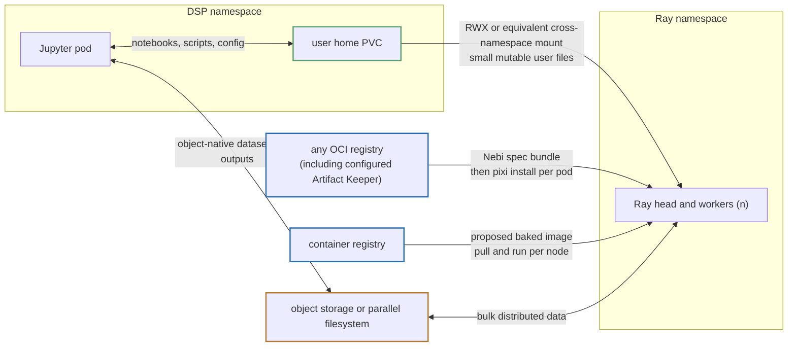
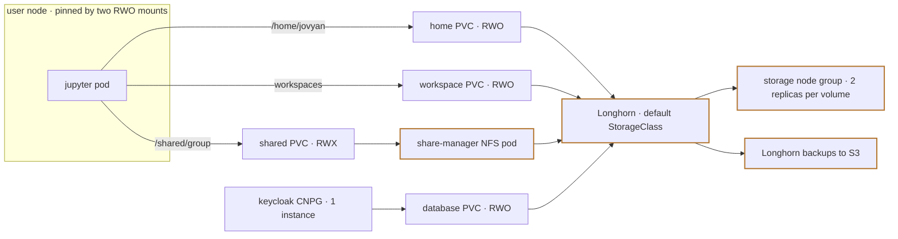
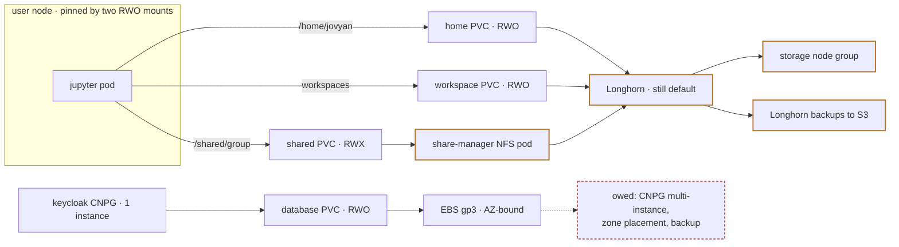
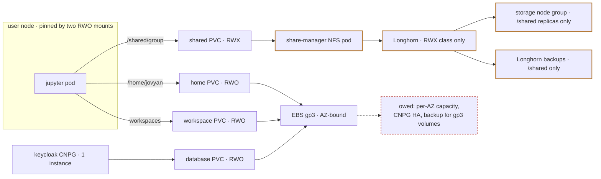
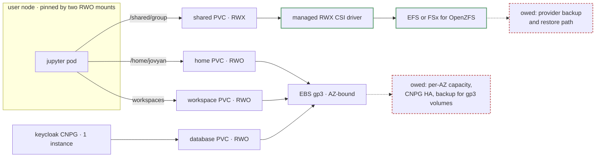
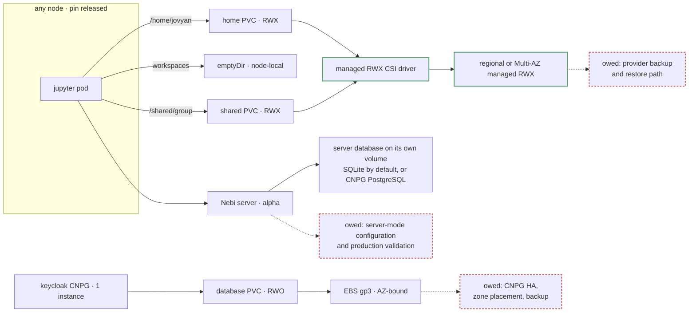
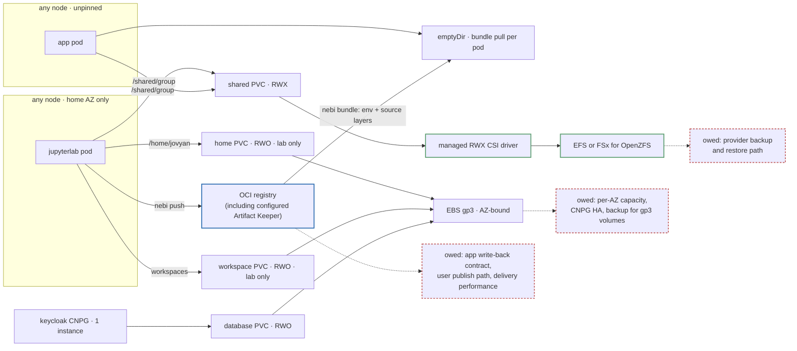

# Nebari storage strategy

## Status and scope

This document is a research and decision-support artifact. It records the current storage requirements, measurements, cost estimates, candidate shapes, and arguments; it does not select an AWS storage architecture. Settled platform requirements are stated as such, while provider selection and the other unresolved choices remain open for the team to evaluate against the decision gates below.

## Background

Nebari began as a bundled data-science platform on Kubernetes. Nebari Infrastructure Core (NIC) now provisions the cluster and its foundational services, while software packs add workload-specific capabilities. The Data Science Pack (DSP) is one of those packs.

DSP runs JupyterHub and schedules each user's Jupyter servers and applications as Kubernetes pods. Those workloads need several kinds of persistent data:

- a private home directory for notebooks, source code, configuration, and user state;
- a workspace for materialized software environments;
- shared POSIX directories for collaboration within groups; and
- object storage for large datasets and other data that does not require filesystem semantics.

These uses have different access, performance, durability, and scheduling requirements. Treating them all as one storage problem makes the platform simpler to configure, but forces every workload onto the compromises of one implementation.

## Why Nebari uses Longhorn

AWS EBS volumes are limited to one Availability Zone (AZ). A user pod can be rescheduled, but its EBS-backed home remains in the AZ where the volume was created. NIC uses one autoscaling group across several AZs, and Cluster Autoscaler cannot request capacity in a specific AZ from that group. The result can be a pod that remains `Pending` because the cluster adds capacity in the wrong AZ.

[ADR-0002](../0002-longhorn-distributed-block-storage-for-aws.md) selects Longhorn to mask that topology problem. Longhorn replicates data across Kubernetes nodes, so a volume can follow a workload to another node or AZ. It also gives Nebari one storage implementation across AWS, Hetzner, and on-premises-style deployments where no managed shared filesystem is available.

Longhorn currently fills three separate roles:

1. It is the default StorageClass, including for single-pod RWO volumes.
2. It provides RWX volumes through an NFS share-manager pod.
3. It provides NIC's only implemented backup and restore path.

Those roles do not have to remain coupled. The storage decision is therefore broader than choosing an RWX backend: it determines which workloads use Longhorn, how pods are scheduled, what happens during an AZ outage, how backups work, and how much storage infrastructure operators own.

## How to read the maps

In the shape diagrams, orange outlines mark Longhorn components, green outlines mark managed services, blue outlines mark artifact registries, and red dashed outlines mark work the shape still owes. The Ray data-flow diagram uses its own key: green for the mounted home volume, blue for artifact registries, orange for bulk data stores. The Argdown maps use this legend:

## What DSP storage needs

The current DSP storage layout has four volume shapes:

| Volume | Access mode | Contents | Consumers |
| --- | --- | --- | --- |
| `claim-{user}` | RWO | `/home/jovyan`, including Nebi local mode's SQLite database at `~/.local/share/nebi/nebi.db`, opened in WAL mode | every pod run by that user; Ray workers under the interim mount |
| `nebi-workspaces-{user}` | RWO | materialized environments; 20 GiB by default | mounted into every pod run by that user, though the jhub-apps path re-materializes into an `emptyDir` rather than reading it |
| `/shared/{group}` | RWX | POSIX files shared by group members | pods belonging to multiple users |
| Keycloak CNPG | RWO | identity database | one database instance per volume |

The group directory creates one hard RWX requirement. Multiple users must be able to read and write the same POSIX path while their pods remain independently schedulable. RWO can serve several pods only when they all run on the same node; applying that constraint to a group creates a hard capacity ceiling and composes badly when users belong to several groups.

Ray is the second live consumer. The adopted interim path mounts a user's home into Ray workers so exploratory jobs can reuse local files without publishing everything to object storage first, and [rayserve-pack #30](https://github.com/nebari-dev/rayserve-pack/issues/30) is filed and blocked on making that mount work across namespaces. A single-node Ray job can run on the current RWO home; a distributed cluster places workers in another namespace and across several nodes, so a production design needs multi-node home access or an explicit alternative for each direction: environments delivered as prebuilt bundles or images, inputs broadcast or copied to workers, and results copied back to the user's volume after the job. What is unsettled is the design, not the requirement.

Pointing PVCs in two namespaces at one Longhorn RWO volume was tested and rejected. It works while the pods share a node, which is the problem: RWO attaches per node, so the arrangement is an undeclared single-node pin spanning two packs, and it takes a cluster-admin static `PersistentVolume` to build rather than anything a tenant reaches by accident. Longhorn's `Volume` CR also records only one of the two consumers, so a drain check gets an incomplete answer. Cross-namespace access needs a real RWX volume. The full test and its findings are in [this comment on NIC #597](https://github.com/nebari-dev/nebari-infrastructure-core/issues/597#issuecomment-5356169820).

Ray environment delivery is a separate open problem. Ray's own mechanism is a pip-install serialization command that breaks because pip resolves differently on the worker than locally. Nebi already publishes workspace bundles through any OCI registry (Artifact Keeper is just another configured registry); each content-addressed bundle carries `pixi.toml`, `pixi.lock`, and optional assets, so every consumer still runs `pixi install`. Nebi does not yet support `[tool.pixi.*]` tables in `pyproject.toml`. An environment-baked container image remains a proposal: bundles pay install time per pod, baked images pay pull time per node, and neither profile is measured.

Object storage complements this filesystem rather than replacing it. It is the appropriate default for large datasets and immutable artifacts, but it does not provide the POSIX rename, locking, directory, and permission behavior that existing notebooks and tools expect from `/shared`. Nebari also lacks a per-user AWS identity and permission layer for mapping Keycloak users and groups to object-storage access. The preferred boundary is therefore:

- use object storage for large datasets and other object-native workflows;
- use volume storage for homes, user outputs, environments, and shared small-file workflows that require POSIX behavior.

That boundary is also a scale boundary, and it rests on observed failures rather than caution: the saturation cases below took down both an in-cluster NFS share and a managed EFS whose performance tier had already been raised. Volume storage is a convenience path for exploratory, single-node, and small-scale work; high-concurrency distributed compute reads bulk data from object storage or a parallel filesystem. Per-user volumes narrow the failure domain — a job that saturates its own home harms one user, while one shared filesystem behind every home lets it affect the whole deployment.

Cross-pack sharing is a live dependency. [NIC #597](https://github.com/nebari-dev/nebari-infrastructure-core/issues/597) covers cross-namespace volume access and [NIC #598](https://github.com/nebari-dev/nebari-infrastructure-core/issues/598) object-storage access; [rayserve-pack #30](https://github.com/nebari-dev/rayserve-pack/issues/30), which would expose head and worker `volumes` and `volumeMounts` in the chart, is blocked on the first. The real requirement is narrower than that chart change: not arbitrary volumes, but the requesting user's home plus the group directories that user is entitled to, resolved per user at cluster launch — which no static `values.yaml` field can express, so it needs the same absent gateway layer. It also constrains layout, not just backend: `/shared` is one RWX PVC with group directories beneath it, so mounting it from another namespace exposes every group unless the volume is split per group or the claim is subpath-scoped.

## Platform requirements

These are the settled requirements the architecture has to satisfy. They come from current DSP workloads, observed failures, and the provider architecture; they do not select an implementation. Everything still open appears as an open decision in the argument map.

- **RWX is a required capability, not a cluster-wide default.** Group members must read and write one POSIX path while their pods stay independently schedulable, but each pack requests the access mode its own workload needs. NIC therefore needs a per-workload StorageClass surface, because DSP's home and workspace PVCs currently inherit the cluster default.
- **Distributed workers must reach the user's environment and files across nodes.** Either the home satisfies a multi-node contract — an RWX home plus a workspace that no longer requires single-node attachment — or explicit alternatives cover each direction: environments as prebuilt bundles or images, inputs broadcast to workers, results copied back to the user's volume after the job. Group-level independence is settled by the RWX requirement above; releasing the *per-user* node pin is the open home-access-mode trade, not a settled requirement.
- **POSIX semantics only where the contract requires them.** Large datasets and immutable artifacts go to object storage; homes, outputs, environments, and shared small-file work go on volumes. Cross-pack sharing defaults to object storage for the same reason.
- **Volume storage is not the bulk data path for distributed compute.** High-concurrency Ray and Dask read from object storage or a parallel filesystem, so one workload cannot make unrelated homes unresponsive. Per-user volumes keep a saturating job inside one user's failure domain.
- **Cross-namespace sharing requires real RWX.** Two PVCs on one RWO volume is an undeclared single-node pin that Longhorn under-reports, so drain checks get an incomplete answer. Layout counts too: `/shared` must be split per group or subpath-scoped before another namespace mounts it.
- **The contract describes observable behavior, not one product.** Access mode, POSIX semantics, durability, availability, and performance are defined at the pack boundary; each provider supplies an implementation. Longhorn stays supported for Hetzner regardless of the AWS choice.
- **Every volume needs durability coverage under whatever backend holds it.** Longhorn is NIC's only implemented backup path, so anything moving off it needs replacement backup, retention, and restore-into-a-new-cluster procedures. Keycloak's single CNPG instance needs multi-instance replication, verified zone placement, and a backup path before its database moves to gp3.
- **AZ-bound volumes require compute in their AZ.** Removing Longhorn does not make EBS portable, so per-AZ node groups or a topology-aware provisioner such as Karpenter is a prerequisite, not an optimization.

### Acceptance gates

A proposal is tested against those requirements by closing these questions explicitly:

- **POSIX behavior:** concurrent reads and writes, locking, atomic rename, ownership, permissions, setgid propagation, `subPath`, and failure recovery.
- **Performance:** an agreed latency threshold for home operations, concurrency testing beyond four writers for `/shared`, and a load-isolation test showing that distributed compute cannot make homes or collaboration storage unavailable.
- **Availability:** node failure, AZ failure, endpoint failover, remount behavior, lock recovery, and stated recovery objectives.
- **Backup and restore:** coverage for every volume, retention, credentials, and restore into a new cluster.
- **Operations:** installation, upgrades, observability, capacity changes, incident response, and security patching.
- **Cost:** realistic customer sizes, shared-storage I/O, request charges, cross-AZ traffic, backups, compute overhead, and operator time.
- **Migration:** a tested path for every user volume that changes backend or access mode.
- **Portability:** the permanent cost of Longhorn plus each provider-native implementation.

## Current scheduling constraint

DSP adds required pod affinity so every pod belonging to one user runs on the same node. This allows all of those pods to mount the same RWO home and workspace PVCs, but it makes that node's remaining capacity the maximum capacity available to the user.

[DSP #221](https://github.com/nebari-dev/data-science-pack/issues/221) records the resulting scheduling failures:

- a GPU JupyterLab cannot start while one of the user's applications is pinned to a CPU node;
- an application pinned to a GPU node prevents that node from scaling down after the lab stops; and
- all concurrent workloads for one user must fit on one node even when the cluster has free capacity elsewhere.

Changing the home to RWX does not remove this constraint by itself. The workspace PVC is also RWO and is mounted into every user pod. Releasing the pin therefore requires both an RWX home and a workspace that no longer requires single-node attachment, such as an ephemeral node-local volume. Shape F reaches the same end from the other side: leave home on block storage and remove every other consumer, delivering published bundles to app pods instead.

## AWS storage shapes

Six AWS shapes capture the meaningful choices. Shapes B through E each change another workload rather than representing a small variation of the same design; shape F keeps D's backends and changes what app pods consume instead.

| | **A. Incumbent** | **B. System split** | **C. Longhorn RWX only** | **D. Managed shared** | **E. Managed homes** | **F. Published apps** |
| --- | --- | --- | --- | --- | --- | --- |
| Home | Longhorn RWO | Longhorn RWO | gp3 RWO | gp3 RWO | managed RWX | gp3 RWO, lab pod only |
| Workspace | Longhorn RWO | Longhorn RWO | gp3 RWO | gp3 RWO | ephemeral | gp3 RWO, lab pod only |
| `/shared` | Longhorn RWX | Longhorn RWX | Longhorn RWX | managed RWX | managed RWX | managed RWX |
| Keycloak CNPG | Longhorn RWO | gp3 RWO | gp3 RWO | gp3 RWO | gp3 RWO | gp3 RWO |
| Longhorn on AWS | all volumes | homes, workspaces, and `/shared` | `/shared` only | no | no | no |
| Cost model, using FSx Single-AZ in D and F, Multi-AZ in E: 10 / 50 / 200 users | $231 / $1,045 / $6,235 | approximately A | est. $182 / $589 / $3,032 | $86 / $423 / $2,466 | $231 / $1,083 / $6,307 | approximately D |
| Operator time per month | ~9.3 h | ~9.3 h | ~9.3 h | ~2.3 h | ~2.3 h | ~2.3 h |
| Home write latency vs gp3 | approximately block baseline | approximately block baseline | block baseline | block baseline | 26-57x block baseline | block baseline |
| `/shared` with FSx, one writer vs Longhorn RWX | Longhorn baseline | Longhorn baseline | Longhorn baseline | within benchmark noise | within benchmark noise | within benchmark noise |
| `/shared` with FSx, four writers vs Longhorn RWX | Longhorn baseline | Longhorn baseline | Longhorn baseline | 1.2-1.4x slower | 1.2-1.4x slower | 1.2-1.4x slower |
| User node pin | yes | yes | yes | yes | no | no, except concurrent named servers |
| AZ and database HA work | no | CNPG multi-instance with zone placement | per-AZ groups or Karpenter, plus CNPG multi-instance | per-AZ groups or Karpenter, plus CNPG multi-instance | CNPG multi-instance with zone placement | per-AZ groups or Karpenter, plus CNPG multi-instance |
| Backup coverage | all volumes | excludes system volumes | excludes homes, workspace, and system volumes | new implementation required | new implementation required | new implementation required |
| User-data migration | no | no | yes | yes | yes | yes |
| EKS Auto Mode possible | no | no | no | yes | yes | yes |
| Managed RWX integration required | no | no | no | yes | yes | yes |
| Nebi workspace coordination | unchanged: local mode | unchanged: local mode | unchanged: local mode | unchanged: local mode | server mode required; Nebi is alpha | local mode; apps pull published bundles |

The C estimate is derived from the model's unit prices rather than from a modeled scenario. It assumes Longhorn's `instance-manager` CPU reservation disappears from user nodes when they no longer attach Longhorn volumes. The model also excludes the 20 GiB workspace PVC from every shape; including it increases each gp3 total slightly and each Longhorn total by the 2.67x replica-and-reserve multiplier.

### A. Incumbent: Longhorn for every volume

The incumbent keeps the current AWS behavior. It avoids migrations and preserves one backup path, while retaining Longhorn's node-drain procedure, capacity tuning, dedicated storage nodes, and cluster-wide failure vocabulary. Because Longhorn is the default StorageClass, new unclassified PVCs also inherit it whether or not they need replication or RWX.

### B. System split: native block for system volumes

This shape moves the Keycloak database to gp3 while leaving both user volumes and `/shared` on Longhorn. It avoids user-data migration and keeps the current scheduling behavior for users. Keycloak currently runs as one CNPG instance, so this shape must also configure multiple instances with zone-aware placement and provide a database backup strategy. Replication supplies failover only after that work exists, and it still does not protect against logical corruption or deletion.

The shape reduces little of Longhorn's cost or operational burden. Its architectural value is conditional: once CNPG provides database-level high availability, Longhorn replication beneath it becomes unnecessary for failover. Until then, moving the database to gp3 removes both cross-AZ attachment and the current storage-layer redundancy.

### C. Longhorn only for RWX

This shape applies the access-mode boundary consistently. Homes, workspaces, and the Keycloak database use gp3; only `/shared` uses Longhorn.

It avoids using a managed RWX service and preserves Longhorn backup coverage for shared group data. It also moves every home, requires AZ-aware node provisioning, requires multi-instance CNPG for Keycloak availability, and removes homes and system volumes from the existing backup set. Longhorn remains installed, so its drain, upgrade, capacity, and incident-response procedures remain part of every AWS cluster even though they apply to less data.

### D. Managed `/shared`, block-backed homes

This shape puts RWO workloads on gp3 and `/shared` on an AWS-managed RWX service. It removes Longhorn from AWS while preserving fast block storage for interactive home workloads. EFS and FSx for OpenZFS are implementation candidates for the same shape.

The benchmark favors the RWO half of this boundary and is neutral to mildly negative on the RWX half; the FSx cost model is what makes it the cheapest measured implementation. It requires a managed-RWX StorageClass and workload routing, a provider-specific backup and restore path, per-AZ node groups or Karpenter, multi-instance CNPG for Keycloak availability, and user-data migration. EFS support already exists in NIC and the upstream EKS module; FSx requires new provisioning, CSI installation, and IAM wiring. The FSx evaluation implementation on the `remove-longhorn-aws` branch demonstrates feasibility but is not a capability shipped on `main`.

### E. Managed homes and shared storage

This shape puts homes and `/shared` on a regional or Multi-AZ managed RWX service, keeps the Keycloak database on gp3, and makes workspaces ephemeral. It removes the user node pin, the persistent AZ binding for homes, and Longhorn from AWS. Keycloak still needs multi-instance CNPG with zone-aware placement because its gp3 volumes remain AZ-bound. Nebi's local-mode SQLite database uses WAL, which cannot reside on NFS or be opened by clients on different hosts; the correctness fix is relocating the Nebi data directory to node-local storage, and this shape requires server mode because server mode is what makes that relocation lossless.

With the modeled Multi-AZ FSx implementation, this shape imposes a 26-57x penalty on metadata-write-heavy home operations relative to gp3. `git checkout` takes about 18 seconds rather than 0.32 seconds. It also costs about the same as the Longhorn incumbent at every modeled tier: $231 / $1,083 / $6,307 versus $231 / $1,045 / $6,235. This shape additionally requires DSP to make its affinity conditional, change the workspace lifecycle, deploy Nebi in server mode, and establish POSIX ownership through filesystem-specific StorageClass parameters. Server mode is configuration of a shipped capability rather than a new one, and Keycloak already supplies the OIDC it expects, but Nebi is alpha and explicitly not recommended for production use.

### F. Single-mount homes, apps from published bundles

This shape keeps homes and workspaces on gp3 and removes the pin by removing the reason it exists: the requirement that several of a user's pods share the same RWO volumes. Only the JupyterLab pod mounts the home and workspace PVCs. App pods mount neither — they pull the user's published workspace bundle, environment and source layers together, into a per-pod `emptyDir`, extending the `nebi-pull` mechanism DSP already runs for environments. With one consumer per volume, required affinity has no purpose, and EBS single-attach stops being a scheduling constraint. There is no read-only middle ground this competes with: two pods on different nodes cannot attach one gp3 volume even read-only.

It keeps block latency for interactive work, keeps Nebi local mode (the home-resident database now has exactly one client, which is what WAL requires), removes Longhorn from AWS, and shares D's cost and prerequisites: per-AZ capacity or Karpenter, multi-instance CNPG, a new backup path, and the managed-RWX integration for `/shared`.

Its gates are the publish contract rather than storage:

- **Write-back.** Bundles are one-directional. App pods must be stateless consumers of published content, with outputs going to `/shared`, object storage, or an explicit pull-back; whether current jhub-apps satisfy that is unverified.
- **Publish path.** Every user needs a registry to publish to — the unresolved Artifact Keeper-in-core question.
- **Delivery performance.** Per-pod install and pull times are unmeasured.
- **Iteration loop.** Apps see the last publish, not a live home; edit, push, respawn is a slower loop than reading files in place.
- **Named servers.** A second concurrent Jupyter server for the same user still needs the RWO home, so those co-locate or fail — a residue of the pin, not its removal.

### Selecting the AWS managed RWX provider

Shapes D, E, and F do not require FSx specifically. EFS is the lower-effort integration baseline: NIC already exposes an `efs:` configuration block and `efs-sc` StorageClass, and the upstream EKS module supplies the filesystem and Pod Identity integration. FSx is an optimization candidate that requires NIC to own additional Terraform, CSI-driver installation, IAM, StorageClass, lifecycle, and backup behavior.

The measured and modeled differences remain relevant to that implementation choice. For `/shared`, FSx is 2.1-2.5x faster than EFS at one writer and retains a metadata-read advantage at four writers; write-heavy results converge within benchmark noise at four. EFS Elastic has the flatter concurrency curve. At 50 users, the model prices FSx at $423 per month and EFS at $545-$1,550; at 200 users, FSx is $2,466 and EFS is $3,280-$7,300. That is a recurring difference of $122-$1,127 per month for a medium cluster and $814-$4,834 per month for a large cluster. EFS request volume and lifecycle tiering are not sufficiently measured to treat those ranges as final.

The economic test is symmetric. FSx must save enough recurring cost or improve performance enough to recover its one-time integration and continuing maintenance cost across the expected cluster fleet and lifetime. EFS must not accumulate more recurring cost over that same period than the integration work it avoids. The storage architecture remains valid with either managed RWX provider; choosing between them requires both sides of that comparison.

## Arguments

### Standardize the capability, not the implementation

Nebari should define observable storage behavior at the pack boundary: access mode, POSIX semantics, durability, availability, and performance. Each infrastructure provider can then supply the implementation that best meets those requirements.

This approach fits the provider architecture and the infrastructure available on each cloud. Hetzner and on-premises-style environments need an in-cluster RWX implementation such as Longhorn. AWS can choose between Longhorn and a managed RWX provider, with EFS and FSx for OpenZFS as candidate implementations. GKE and AKS expose their own managed RWX services and cross-zone block-storage options.

The cost is permanent divergence. Longhorn remains in the project for Hetzner, so a managed AWS path adds another implementation rather than replacing the existing one.

| Integration surface | AWS managed RWX | GCP Filestore | Azure Files | Longhorn |
| --- | --- | --- | --- | --- |
| Driver installation | EFS uses existing NIC and upstream-module support; FSx requires NIC-owned Helm, IAM, and Terraform | GKE cluster addon | included with AKS | Helm plus host iSCSI prerequisites |
| Workload identity | EKS Pod Identity and an IAM role | Workload Identity | managed identity | provider-specific backup credentials |
| POSIX ownership | EFS access points or FSx volume-creation parameters | export policies | uid and gid mount options | kubelet `fsGroup` |
| Resize and quota | provider-specific filesystem, access-point, or child-volume rules | service-tier capacity rules | share quotas and premium provisioning | Kubernetes PVC expansion |
| Backup | AWS Backup plus provider-native snapshots where available | Filestore backups and snapshots | Azure Backup for Files | NIC's implemented Longhorn workflow |

The implementation count understates the ongoing work: each provider has a different credential model, ownership mechanism, capacity behavior, failure catalogue, and restore procedure.

### Longhorn uniformity

Using Longhorn everywhere provides one storage model, one operator vocabulary, and one recovery workflow. It also preserves NIC's working cross-provider backup interface.

That uniformity is narrower than it appears. NIC supports Longhorn on AWS and Hetzner, while GCP and Azure do not have it wired. Each cloud still needs nodes that permit iSCSI, privileged pods, and host access; provider-specific credentials and backup resources; Terraform wiring; and compatibility with its managed-node model. GKE Autopilot forbids the required privileged and host access, while EKS Auto Mode provides no path for installing the iSCSI prerequisite. Longhorn therefore supplies one operator model, not one implementation-free cloud integration.

### Shared-data path

Longhorn implements RWX by attaching the replicated volume to one share-manager pod and exporting it over NFS. DSP uses one shared PVC with group directories underneath it, so one server pod handles the shared path for every group. The stock DSP configuration adds another transitional form: its own NFS pod exports a Longhorn RWO volume.

This architecture concentrates bandwidth and failure handling in one pod. On untar, clone, and checkout, Longhorn RWX slows by 2.0-2.4x from one to four concurrent writers. FSx slows by 2.6-2.7x at its 160 MBps entry tier, while EFS Elastic remains about 1.1x. The measured FSx tier is the floor used by the small cost-model tier; the medium and large models buy 320 and 640 MBps, so their concurrency behavior is not measured. The benchmark does not locate the crossover beyond four writers.

Nebari Classic supplies two higher-scale warnings that the four-writer result cannot answer. Dharhas Pothina described a conference tutorial where large numbers of multi-node Dask clusters exhausted shared NFS, and a separate occasion where managed EFS became unresponsive even after its performance tier was raised. These are historical operational examples rather than controlled benchmarks, but they show that a managed NFS service can still become a system-wide bottleneck when distributed workers use it as their data plane.

For operations that `/shared` actually serves, Longhorn and FSx are within noise at one writer; at four writers Longhorn is 1.2-1.4x faster on extraction and checkout. Environment creation is not part of this comparison because environments live on the per-user workspace volume, not `/shared`.

### Home performance

The benchmark covers thirteen configurations: EBS gp2 and gp3, Longhorn RWO and RWX, FSx for OpenZFS Single-AZ and Multi-AZ, EFS Elastic, and DSP's chart NFS server, including four-writer tests for RWX backends.

| Backend | Untar | Clone | Checkout | Environment create | Autosave p95 | Untar x4 | Environment create x4 |
| --- | --- | --- | --- | --- | --- | --- | --- |
| EBS gp2 | 0.39 s | 0.74 s | 0.44 s | 2.83 s | 8 ms | - | - |
| EBS gp3 | 0.39 s | 0.71 s | 0.32 s | 3.01 s | 8 ms | - | - |
| Longhorn RWO | 0.48 s | 0.97 s | 0.42 s | 3.59 s | 10 ms | - | - |
| Longhorn RWX | 14.51 s | 15.31 s | 15.83 s | 31.97 s | 13 ms | 32.35 s | 83.20 s |
| FSx OpenZFS Single-AZ | 16.99 s | 13.32 s | 15.15 s | 56.30 s | 80 ms | 45.90 s | 98.51 s |
| FSx OpenZFS Multi-AZ | 20.65 s | 18.71 s | 18.37 s | 53.41 s | 100 ms | 48.15 s | 108.39 s |
| DSP chart NFS | 29.86 s | 25.59 s | 24.80 s | 59.37 s | 12 ms | 44.35 s | 83.40 s |
| EFS Elastic | 38.86 s | 33.09 s | 31.77 s | 61.62 s | 63 ms | 42.25 s | 72.41 s |

The decisive gap is metadata writes and file creation. Metadata reads can improve through caching, bulk I/O is acceptable across the tested backends, and notebook autosave remains short. The environment-create column measures the workspace volume, not the home volume. Home access-mode decisions should use untar, clone, and checkout instead.

No acceptable latency threshold exists for this trade. The product decision is whether slower interactive file operations are worth free scheduling, removal of the AZ pin, and a smaller AWS operations surface.

Nebi local mode creates a separate correctness constraint, not another performance threshold. Its SQLite database lives inside the home PVC and opens in WAL mode, whose shared-memory file requires every process touching the database to run on the same host and is unsupported on network filesystems. The current RWO home and per-user node pin jointly provide that same-host guarantee; shape E replaces the home with NFS and releases the pin, removing both guarantees. The storage benchmark cannot detect this failure mode because it measures untar, clone, and checkout rather than concurrent database access.

The fix is one environment variable, not a new component: pointing `NEBI_DATA_DIR` at node-local ephemeral storage keeps every client's database off the network filesystem, which DSP already does for jhub-apps pods. Server mode is what makes that relocation lossless — workspace tracking moves behind one server process with its own database on its own volume, so a discarded local database costs a cache miss rather than a user's workspace list. SQLite remains the server default and PostgreSQL on CNPG is a separate availability choice, and DSP already ships the Keycloak OIDC server mode expects. Two things stay open: Nebi is alpha and explicitly not recommended for production, and whether a server-mode client still keeps a local database needs confirmation against Nebi's source — DSP's `nebi-pull` container writes a `nebi.db` even though it only pulls.

Making the workspace ephemeral has two gates. **Durability:** a lockfile reproduces only declared content, so editable installs (`pip install -e`), in-place compiled extensions, and unpublished authored files are specific loss cases. **Sharing** is not a blocker: DSP already snapshots the selected workspace at launch, with a `nebi-pull` init container running `nebi pull` and `pixi install` into a per-pod `emptyDir`, and server mode extends the same push/pull model through `workspaces_dir`. Every spawn still mounts two per-user RWO volumes — home and the workspace store at `/var/lib/nebi/workspaces` — and together those are why DSP pins app pods to the JupyterLab node. Shape F removes that pin from the other direction: bundles carry optional source layers, so app pods can pull authored files along with the environment instead of mounting home at all.

The benchmark prices the ephemeral path favorably. With the package cache primed, `pixi install` takes 2.83-3.59 s on block storage against 31.97-61.62 s single-pod on every tested RWX backend and 68-122 s per pod across four concurrent pods (the benchmark table reports per-backend medians, 72-108 s). An `emptyDir` is node-local disk, so per-spawn materialization sits in the block-storage column: these numbers argue against an RWX environment store, not against materializing per spawn. One combination is untested — the benchmark kept the package cache node-local while DSP sets no `PIXI_CACHE_DIR`, leaving it under the home that shape E puts on NFS. Pinning the cache to node-local storage removes the question in one chart change.

### Cross-AZ behavior

Removing Longhorn from RWO workloads does not make EBS portable across AZs. A dynamically provisioned EBS PV carries a zone requirement, so Kubernetes schedules the pod into that AZ or leaves it `Pending`. NIC must provide capacity in the required zone through one node group per AZ or a provisioner such as Karpenter that understands PV topology.

This solves rescheduling when the AZ is healthy. It does not provide service during an AZ outage: the EBS-backed workload waits for its AZ to return. The acceptability of that behavior depends on a platform availability objective that is not defined. Longhorn's guarantee is also weaker than full multi-AZ durability because NIC uses two replicas with soft zone anti-affinity.

A regional or Multi-AZ managed RWX service removes the home-volume AZ constraint. In the measured FSx implementation, Multi-AZ latency is close to Single-AZ. Its modeled total is about 1.7x the Single-AZ shape at the medium tier and ranges from 1.3x to 2.3x across the modeled tiers. This makes cross-AZ availability primarily a cost decision rather than a performance decision for FSx; EFS is regional by design and has its own request-based cost model.

### Default StorageClass

Longhorn's RWX role and default-class role are separate. NIC configures Longhorn as the default and demotes every other StorageClass during installation and upgrade. The Keycloak CNPG manifest also receives NIC's cluster-wide StorageClass as an explicit value and currently sets `instances: 1`.

Changing the default therefore requires a per-workload StorageClass surface, not only a chart flag. DSP's home and workspace PVCs inherit the cluster default, while the Keycloak database is explicitly rendered. A safe change must control both paths and state which class each workload uses.

### Backup and restore

NIC has a working Longhorn backup path: configuration, recurring snapshots and backups, keyless S3 access on AWS, retained backup buckets, a restore runbook, and an integration test. Backup enrollment follows Longhorn volumes, and NIC rejects backup configuration when Longhorn is not the effective storage implementation.

Every shape that moves a volume off Longhorn must provide a replacement durability story. Keycloak currently has one CNPG instance, so moving it to gp3 requires both multi-instance database replication for node and AZ failover and a separate backup path for bad migrations, deletion, and corruption. Managed filesystems also require provider-specific backup, retention, and restore-into-a-fresh-cluster procedures.

The Longhorn path carries maintenance of its own because retained backup buckets are coupled to provider Terraform state addresses. This is a real implementation benefit with a continuing provider-integration cost, not a decisive argument by itself.

### Operator burden

Longhorn makes node maintenance storage-aware. The NIC runbook requires cordoning the node, disabling Longhorn scheduling, requesting replica eviction, waiting for replicas to move, and only then draining and terminating the node. Diagnosis also requires Longhorn-specific CRs and concepts such as engines, replicas, faulted volumes, placement, and replenishment delays.

The cost model estimates Longhorn work at 9.3 operator hours per cluster per month and managed-filesystem work at 2.3 hours, a difference of about seven hours. This is an estimate derived from runbooks and observed incidents rather than measured operational data. It should remain a separate line item instead of being treated as zero.

Longhorn also assumes capacity settings that NIC does not fully validate. A 20 GiB default AWS node disk leaves roughly 2.4 GiB schedulable after system use and Longhorn's 25% reserve, so a 20 GiB RWX volume cannot be provisioned on the default-shaped node. This is a correctable NIC configuration defect, but it illustrates the storage-specific knowledge operators need.

### Cost

The AWS model uses on-demand `us-east-1` pricing for 10-, 50-, and 200-user clusters. Longhorn costs 2.5-2.7x the managed-shared shape at each tier. The main drivers are:

- two replicas plus a 25% disk reserve, producing a 2.67x capacity multiplier;
- a dedicated storage node group; and
- approximately 12% of each user node's CPU reserved for `instance-manager`.

Using FSx as the managed provider, the model estimates the managed-shared shape at $86, $423, and $2,466 per month, compared with $231, $1,045, and $6,235 for the incumbent. It excludes cross-AZ replication traffic, workspace PVCs, and operator labor from the dollar total. It also uses assumed customer sizes and shared-storage I/O rather than observed production distributions.

That saving does not generalize to managed homes. The Multi-AZ FSx shape that puts both homes and `/shared` on managed RWX costs $231, $1,083, and $6,307: effectively the same as the incumbent while carrying the measured home-latency penalty.

EFS has a different cost risk. Elastic throughput stays flat in the four-writer test but charges per GiB read and written, so the bill has no fixed ceiling. The model places EFS $122-$1,127 per month above FSx at 50 users and $814-$4,834 above it at 200 users, depending on I/O. FSx has a fixed provisioned-throughput ceiling that can be raised by purchasing a higher tier. Actual shared-storage I/O per user and the value of EFS lifecycle tiering are therefore key missing inputs.

Right-sizing home PVC requests is a lower-risk cost intervention under every shape and has 2.67x the effect under Longhorn. It should be priced before migration work is justified solely by storage cost.

### Compute model and other clouds

Longhorn requires node-level iSCSI support, privileged access, and host storage. These requirements exclude EKS Auto Mode's immutable nodes and GKE Autopilot. A hybrid EKS fleet can keep traditional storage nodes beside Auto Mode compute, but it retains both compute-management paths.

Provider-native storage changes the trade elsewhere. GKE exposes Filestore and cross-zone block storage; AKS exposes Azure Files and zone-redundant block storage. These observations come from vendor documentation rather than Nebari deployments and define future evaluation scope rather than verified product behavior.

The source argument map is [`storage-strategy.argdown`](storage-strategy.argdown). [`overview.svg`](overview.svg) renders the complete graph; the topic maps above render smaller sections of the same argument.
