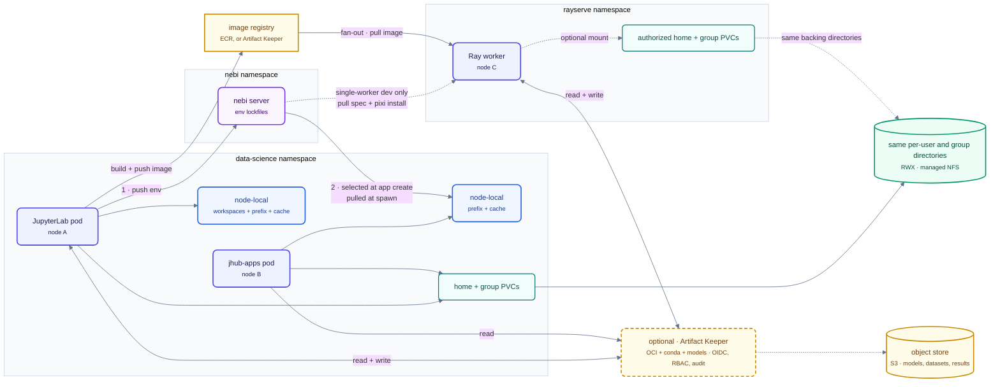

# Proposal: managed RWX homes with artifact-based environments

Give each user an RWX home that can be mounted across nodes and deliver environments from lockfiles stored by Nebi server. Ray workers can use the same lockfile workflow during development or a container image for more production-like deployments.

This proposal targets clouds with a managed RWX offering, starting with AWS. Longhorn remains the RWX implementation for on-prem and Hetzner deployments, where a managed filesystem does not exist. The Azure equivalent of EFS is not yet identified and is an open item rather than a settled part of this design.


## Storage patterns

Four storage patterns solve different problems. This proposal uses all four and gives each one a distinct role; RWO block remains only under platform databases, which CNPG manages with its own HA and backup story.

| Pattern | Shape | Good at | Bad at |
| --- | --- | --- | --- |
| **RWO block** | one volume attached to one node at a time | low latency, metadata-heavy work | sharing — forces every consumer onto one node |
| **RWX filesystem** | one volume, many nodes, POSIX over NFS | concurrent access from anywhere | metadata latency, 26–57x block on small-file work |
| **Object store** | HTTP API, no POSIX | bulk data, durability, cheap at scale | not a filesystem; no mount, no partial writes |
| **Artifact store** | immutable, versioned, content-addressed | reproducing an exact thing elsewhere | mutable working files |

**RWO vs RWX** is the distinction that drives the scheduling design. `ReadWriteOnce` means a volume can attach to only one node at a time. Every pod that mounts it must therefore run on that node, which causes the current user-pod pin. `ReadWriteMany` removes that constraint by serving the filesystem over the network, at the cost of an extra round trip for metadata operations such as `stat` and `create`.

**Object and artifact stores are not filesystem substitutes.** Object storage is the bulk-data path, not a home directory. Artifact stores move reproducible inputs between pods that share no storage: Nebi server holds environment specifications, and a container registry can hold production-oriented images built from them. Mutable files remain on filesystems; reproducible environments move as artifacts.

## Proposal



The design has four data paths with distinct responsibilities:

- **Mutable files** — each user gets an RWX home mounted by that user's lab and jhub-apps pods, even when they run on different nodes. Group directories under `/shared` use RWX for the same reason. Neither path has a single-node attachment constraint.
- **Application environments** — the lab pushes an environment specification to Nebi server. An app selects a workspace when it is created and pulls the current specification when it starts. The app materializes the environment on node-local storage, keeping `pixi install` off the network filesystem.
- **Ray workloads** — workers can mount the initiating user's RWX home through an authorized claim in the `rayserve` namespace when live file access is useful. Environment delivery remains separate, and anything that fans out uses a prebuilt image: the user builds once with Docker, another OCI-compatible builder, or the Nebi OCI workspace format, and every worker pulls it. Pulling and materializing a Nebi workspace per worker is a development convenience for small jobs, not the path for production.
- **Bulk data** — models, datasets, and job results live in object storage. Pods access them through credentials rather than filesystem mounts.

Object storage is the common exchange point for the lab, apps, and Ray. Homes hold authored files that users edit interactively; large or immutable inputs and job-produced outputs belong in object storage. An authorized home mount can support small, mutable files and interactive results, but it does not replace object storage as Ray's bulk-data path.

The dashed layer in front of object storage is optional. Without it, pods access the bucket directly and inherit the permissions of their workload credential. A Ray worker carries its workload identity rather than the initiating user's identity, so direct access cannot enforce that user's permissions. Supplying a Nebi token to the worker may be straightforward, but that service-specific authentication does not by itself authorize S3 data or home mounts. A governed artifact layer could add per-user authorization, versioning, and audit history.

[Artifact Keeper](https://artifactkeeper.com) is one candidate for that layer and could also provide the image registry. It is an MIT-licensed, self-hosted service that supports OCI and Helm alongside conda, PyPI, and Hugging Face artifacts, with OIDC, fine-grained RBAC, audit logging, signing, and vulnerability scanning. One service could therefore hold Ray images, environment packages, and published models behind one identity model. The tradeoff is operating another stateful service and its PostgreSQL database.

## How it works

### Files — one RWX home per user, no affinity

Each user receives an RWX home claim. The user's lab and jhub-apps pods mount that claim regardless of which nodes they run on, so DSP can remove the affinity rule that currently pins those pods together.

The per-user workspace PVC also goes away. Nebi server becomes the durable source for workspace specifications; a pod keeps only a disposable local copy and its materialized environment. With no user-mounted block volumes, neither node attachment nor AZ binding constrains placement. User pods can schedule anywhere in the cluster, and operators have one fewer persistent volume per user to provision and protect.

JupyterHub routinely culls idle lab servers, so rebuilding this disposable state must not create visible recovery work for the user. Authored project files, lockfiles, and Pixi configuration remain in the home. On spawn, the lab re-fetches Nebi's workspace index and specifications but does not materialize every environment. Each specification is only kilobytes, whereas building every workspace would become increasingly expensive as the user creates more of them. The lab builds an environment lazily when the user opens its project; an app builds only the one environment selected for that app.

The remaining tradeoffs are narrow. Retaining the workspace PVC gives a faster spawn and remains usable while Nebi server is unavailable, and the current two-PVC split lets an operator resize a user's home and their environment storage independently. Collapsing them means one quota covers authored files only, with environment size bounded by node-local capacity instead. Against that, disposable node-local state removes the AZ constraint and one persistent volume per user.

Files do not require a publish step. If a user edits `~/apps/hello.py` in the lab, the app reads the same file from the shared home when it reloads.

### What is persistent and what is not

Collapsing the workspace PVC leaves the home as the only durable per-user filesystem. Everything else a pod writes is disposable, and the lifetimes differ:

| Path | Durability | Destroyed when |
| --- | --- | --- |
| `$HOME` (per-user RWX) | persistent, backed up | the user's account is removed, or the user deletes the files |
| `/shared` group directories (RWX) | persistent, backed up | the group is removed |
| Workspace specifications in Nebi server | persistent, backed up with CNPG | the user deletes the workspace |
| Objects in S3 | persistent, versioned by the bucket policy | the user or a lifecycle rule deletes them |
| Node-local prefix and package cache (`/tmp/pixi-*`) | disposable | the pod stops — cull, restart, eviction, node drain, or upgrade |
| Node-local materialized app environment (`/tmp/nebi-env`) | disposable | the app pod stops, for any of the same reasons |
| `/var/lib/nebi/workspaces` | **persistent today, disposable under this proposal** | the pod stops — cull, restart, eviction, node drain, or upgrade |
| Everything else in the container filesystem | disposable, as it is today | the pod stops, for any of the same reasons |

The second-to-last row is the whole behaviour change, and it is narrower than "writes stop persisting". Today a user pod mounts exactly two persistent volumes: the home at `/home/jovyan`, and the per-user workspace PVC at `/var/lib/nebi/workspaces` (`config/jupyterhub/01-spawner.py`). A write to any other path — `/data`, `/tmp`, the container root — is already lost when the pod stops. Collapsing the workspace PVC removes one of those two paths; it does not make a previously stateful container ephemeral.

For the environment itself that loss is free, which is the point of the change. The prefix and cache rebuild from the lockfile in seconds on node-local storage and the workspace index re-fetches from Nebi server, so a cull costs a slower first action after respawn rather than lost work. Apps already work this way: the spawner gives an app an `emptyDir` at `/tmp/nebi-env` and materializes into it at start.

The risk is confined to **user data written under `/var/lib/nebi/workspaces` that is not part of the environment** — a notebook or dashboard saving output next to the workspace it runs from. That path persists today and will not, the platform cannot distinguish those files from rebuildable environment state, and the triggers are ordinary and mostly not user-initiated: an idle-server cull, an app restart to pick up a new environment, a node drain during an upgrade, eviction under pressure. Code doing this has to be changed to write to the home or to object storage before this ships, and the change has to be documented for users rather than left as an implication of the architecture.

### Environments — the project stays in home, the build does not

A Pixi project in the home is small: primarily `pixi.toml` and `pixi.lock`. Its materialized prefix is about 400 MB across roughly 10,000 files. Writing that small-file tree to NFS is what makes `pixi add` take minutes. Two settings move the prefix and package cache to node-local storage:

```
pixi config set --global detached-environments /tmp/pixi-envs   # the prefix
PIXI_CACHE_DIR=/tmp/pixi-cache                                  # the package cache
```

For the same environment in a lab pod, the operation completed in **406 ms** with both paths node-local; the home-based run exceeded two minutes and was aborted. The cache location dominates: a cold node-local cache completed in 1.78 seconds, five times faster than a fully warm EFS cache at 9.0 seconds. Cold node-local storage was 56 times faster than cold EFS, consistent with the ADR's measured 26–57x RWX write penalty. Persisting the cache offers little benefit: a local cache miss costs under two seconds, while a cache in the home consumes 0.4–1.6 GB of the user's quota.

DSP should set both paths by default rather than require each user to configure them. `PIXI_CONFIG_FILE` is honored, while `PIXI_CACHE_DETACHED_ENVIRONMENTS_DIR` is not. DSP can therefore use `singleuser.extraFiles` to write the configuration from a Secret and point `PIXI_CONFIG_FILE` to it.

### Environments — the lockfile is what crosses

`nebi push demo` uploads the workspace specification — `pixi.toml` and `pixi.lock` — rather than the materialized environment. Each push receives a content-addressed identifier and updates `latest`. The hub obtains the user's token through a Keycloak exchange when the pod starts, so users do not run `nebi login`.

When a user creates an app, a picker lists Nebi workspaces in the `ready` state. The app pod receives a private node-local directory at `/tmp/nebi-env`; an init container runs `nebi pull` and `pixi install` into that directory. Two pods do not need to share a materialized environment: installing from the same lockfile gives them the same resolved environment.

A lockfile pins an exact resolution but does not hold the packages themselves, so it reproduces an environment only while every pinned package is still fetchable from its upstream registry. Rebuilding on every spawn also puts the platform's package pulls on those upstreams and their rate limits. Both are addressed by holding the packages closer: a caching artifact service such as Artifact Keeper, or the Nebi OCI workspace format carrying a fully solved package set rather than a specification alone. Neither is required for this design to work, and each is a straightforward addition to it.

This creates deliberately different update semantics for files and environments:

| Change | Effect |
| --- | --- |
| Edit a file in home | Visible in the app immediately — same mount, nothing to publish |
| `pixi add` + `nebi push` | Running app is unchanged; a push does not reach a materialized pod |
| Restart the app | The init container re-pulls `latest` and materializes it; no app reconfiguration is required |

The residual friction is remembering to run `nebi push` after changing an environment. A file watcher on `pixi.toml` and `pixi.lock` could push automatically, in the way Tilt reconciles local edits into a running Kubernetes workload. This is a developer-experience improvement rather than part of the storage design, and no one owns it yet.

### Ray — optional home access, prebuilt images for the environment

PVCs are namespace-scoped, so a worker in `rayserve` cannot reference the existing home claim in `data-science` directly. With an RWX backend, however, the `rayserve` namespace can have its own PV and PVC pointing to the same underlying directory or filesystem access point. The Ray pods can then mount the user's live home across nodes. This requires rayserve-pack to expose or inject `volumes` and `volumeMounts`, plus a launch-time authorization path that resolves the initiating user's home ([rayserve-pack #30](https://github.com/nebari-dev/rayserve-pack/issues/30), blocked on [NIC #597](https://github.com/nebari-dev/nebari-infrastructure-core/issues/597)). It is feasible storage plumbing, not a limitation of RWX.

The current environment substitute is `runtime_env={"working_dir": "~/demo"}`: Ray ships the code with the job and resolves the environment again on the worker. That second resolution can produce a different environment. Mounting the home makes the project files available but does not make a materialized environment portable, so environment delivery remains a separate choice.

The proposal replaces that implicit re-resolution with an explicit, reproducible one. **Anything that fans out uses a prebuilt image.** The user builds a container image from the project with Docker, another OCI-compatible builder, or the Nebi OCI workspace format, and pushes it to ECR, an existing registry, or Artifact Keeper. Workers pull that image and start with the environment already in place.

The reasoning is that per-worker materialization scales the wrong way. Every worker in the cluster resolves and installs the same environment independently, so the work, the registry traffic, and the startup latency all multiply by the worker count while the result is identical each time. Building once and pulling many times is the shape that matches the workload.

A single-worker or small development job may instead select a Nebi workspace and run `nebi pull` plus `pixi install` on node-local storage, if that is the faster loop for the user. It is a convenience for iteration, not a second supported path for production; a job large enough to care about worker startup should be running an image. Nebi authentication for workers is expected to be straightforward to supply and is not an architectural blocker either way.

Tenancy remains the unresolved design problem. A long-lived shared RayCluster can serve jobs from many users, while a home and Nebi workspace belong to one user. Mounting one user's home globally into that cluster would be incorrect. The launch path must carry the initiating user's identity, authorized home, and selected workspace into the job, or the platform must create a per-user or per-job Ray cluster. This is separate from the mechanics of authenticating to Nebi or mounting RWX storage.

### Nebi's own state

Nebi local mode keeps a SQLite database in the home. Its write-ahead log (WAL) assumes that every process accessing the database is on the same host, an assumption NFS cannot satisfy. Nebi local mode is therefore incompatible with an RWX home.

Nebi server mode resolves the conflict by making the server the durable workspace authority. Its database runs on CNPG like the platform's other databases, with replication and backup handled at the database layer rather than the volume layer. A pod retains only a local index; losing that index requires a re-fetch after respawn but does not lose workspace data. The materialized environment prefix is disposable for the same reason.

## Migration and backup

Moving homes off Longhorn also removes NIC's only implemented backup path, so this proposal requires a replacement for the filesystem volumes — homes and `/shared`. Platform databases are not part of that problem: they run on CNPG, which brings replication and its own backup path at the database layer. The main options for the filesystems are:

- **AWS Backup**, the AWS-native path, at whole-filesystem granularity;
- **Velero with Kopia**, which reads files directly, protects individual PVCs, restores in place, and offers a consistent workflow across providers; and
- **FSx for OpenZFS snapshots**, whose per-volume behavior is closest to Longhorn snapshots.

EFS does not provide native snapshots, so an EFS deployment needs AWS Backup, Velero with Kopia, or both.

Velero can also perform the migration because Kopia copies files rather than blocks. It can back up a user's home from EBS and restore it to NFS; rollback uses the same process in reverse. AWS Backup and FSx snapshots restore only within their respective services, so either choice requires a separate per-user copy for migration. In all cases, migration runs one user at a time while that user's server is stopped, rather than as an online background copy.

### Migrating an existing cluster

The move is incremental rather than a cutover, so a cluster runs both backends for a period and existing users are moved in batches.

1. **Enable the managed RWX backend and make it the default storage class.** New users get an EFS-backed home from that point on. Nothing existing is touched, and this step is reversible on its own.
2. **Provision a new home for each existing user with a script.** The script creates the EFS access point, the PV and PVC, and the ownership and quota to match the user's current home.
3. **Copy, with the user's server stopped.** One user at a time: stop the server, copy the old home to the new one, and leave the old volume in place.
4. **Validate before switching.** Compare file counts, total size, and checksums, and confirm ownership and permissions survived the copy. Only then repoint the user's claim at the new home and let them start again.
5. **Retain the old volume through a defined window**, so a rollback is repointing the claim back rather than a restore from backup. Reclaim the volumes at the end of that window.

One deployment detail affects step 3: ArgoCD prunes resources that leave the manifest, so the old and new PVCs cannot both exist unless pruning is disabled for that path during the migration, or the copy runs as a one-off job outside the ArgoCD-managed manifests. Whichever is chosen has to be decided before the first batch, because the copy depends on both volumes existing at once.

This procedure has to be proven on a cluster with real data before it runs anywhere users depend on. Nothing here ships to a cluster that is onboarding users without it.

### The storage user guide

This proposal is a design document. It is not what a platform user or a pack author should have to read, and the terms it depends on — read-write-once, read-write-many, access modes, claims — carry no meaning for most of the people who have to make storage choices. A separate storage user guide will cover the whole storage story in plain language:

- what each place to put data is for, led by concrete examples rather than by access modes — a notebook, a dashboard's output, a model, a dataset, a job result;
- which paths persist and which do not, and exactly when the disposable ones disappear;
- what is backed up, how far back, how a user or an operator restores it, and what is not covered;
- what a user has to change about how they work, with the data-loss case stated first and unambiguously; and
- worked examples for the workflows the team actually runs, so the guide can be tested against them.

## What this means for users

**Better**

- A user's pods stop competing for capacity on one node. The lab and its apps schedule independently.
- That freedom costs nothing on files: an app still shows your **live files**, not a snapshot from a publish step. Edit a notebook in the lab, refresh the app, it's there.
- Environment builds stay **fast**: `pixi install` runs on node-local storage, so the shared filesystem's small-file penalty stays out of the build path.

**Worse**

- Home file operations slow down noticeably. `git checkout` on a large repo goes from under a second to roughly 18 seconds. Anything touching thousands of small files — cloning, untarring, `pip install -e` into home — feels sluggish.
- **Files you save under `/var/lib/nebi/workspaces` no longer survive a restart.** That path holds your environments today and persists; under this proposal it is rebuilt from the lockfile each time the pod starts. Your home and group directories are unaffected, and paths that were already temporary — `/tmp`, `/data`, anywhere else outside your home — behave exactly as they do now. But if a notebook or dashboard writes results, models, or logs next to its workspace, those writes are lost on the next cull, restart, or cluster upgrade, with no warning and nothing to restore. Change them to write to your home or to object storage.
- The two costs are different in kind. Slower home operations are a nuisance you notice immediately; this one is silent data loss on a path that used to be safe, which is why it is documented first and separately for users rather than left as an implication of the design.

**Different**

- An app uses the workspace selected when the app was created. To update its environment, push from the lab and restart the app; the restart pulls the newest version without further configuration.
- Ray can mount your live home when the job is launched with an authorized RWX claim. The environment is still delivered separately, and any job that spreads across several workers starts from an image you build once and every worker pulls. Materializing your Nebi workspace on the worker stays available for small development jobs, where a build per change would slow the loop down more than it saves.

## Open questions


### Can Data Science Pack depend on Nebi?

This proposal makes Nebi server the durable authority for workspace specifications, which means Data Science Pack takes a hard runtime dependency on Nebi. The understanding to date has been that it cannot — that the packs are meant to be independently deployable. Nobody has confirmed or refuted that, and it needs an answer before the rest of the design is worth building.

If the dependency is allowed, most of the awkwardness here disappears: the workspace PVC goes away, environments become artifacts rather than files, and there is one authority for what a workspace is. If it is not allowed, the design needs another durable home for workspace specifications, and the most likely candidate is a lockfile directory in the user's RWX home with Nebi kept in local mode — which the SQLite WAL problem rules out, so that fallback needs its own design work.

**This is the first thing to settle.** Everything above assumes the answer is yes.
