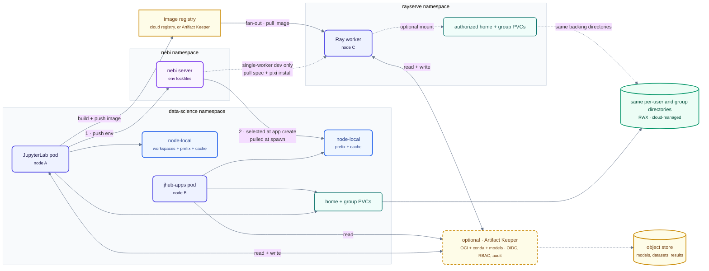

# Storage

**Status:** Proposed in [ADR-0019](../../adr/0019-storage-strategy/). This document describes the target design. Clusters today still use Longhorn as the default StorageClass on AWS; see [ADR-0002](../../adr/0002-longhorn-distributed-block-storage-for-aws.md) and [Longhorn Node Maintenance](../operations/longhorn-node-maintenance.md).

This document describes where Nebari keeps each kind of data, how pods reach it, and what a software pack can rely on from the platform's storage layer. ADR-0019 holds the options considered and the evidence behind the choice; this document holds the design itself.

## Scope

The design applies to clusters whose provider offers a **cloud-managed RWX filesystem**: a network filesystem the cloud operates, which every node in the region can mount read-write at the same time. It does not depend on a particular service. On AWS, EFS and FSx for OpenZFS both qualify, and ADR-0019 compares them without selecting one. Azure Files and Google Cloud Filestore are the analogous services on Azure and GCP; neither has been evaluated for this design.

Where no managed filesystem exists, as on Hetzner and on-premises clusters, Longhorn supplies RWX under the same [contract](#storage-contract).

## Storage patterns

Four storage patterns solve different problems. This design uses all four and gives each a distinct role; RWO block storage remains only under platform databases, which CloudNativePG (CNPG) manages with its own HA and backup, and under single-writer datastores that packs bring without an operator behind them, which the platform protects with volume snapshots (see [Block volumes outside CNPG](#block-volumes-outside-cnpg)).

| Pattern | Shape | Good at | Bad at |
| --- | --- | --- | --- |
| **RWO block** | one volume attached to one node at a time | low latency, metadata-heavy work | sharing: every consumer is forced onto one node |
| **RWX filesystem** | one volume, many nodes, POSIX over NFS | concurrent access from anywhere | metadata latency: small-file work ran 26-57x slower than block on the services tested |
| **Object store** | HTTP API, no POSIX | bulk data, durability, cheap at scale | not a filesystem: no mount, no partial writes |
| **Artifact store** | immutable, versioned, content-addressed | reproducing an exact thing elsewhere | mutable working files |

**RWO versus RWX** is the distinction that drives the scheduling design. `ReadWriteOnce` means a volume can attach to only one node at a time, so every pod that mounts it must run on that node; that is what causes today's per-user node pin. `ReadWriteMany` removes the constraint by serving the filesystem over the network, at the cost of an extra round trip for metadata operations such as `stat` and `create`.

**Object and artifact stores are not filesystem substitutes.** Object storage is the bulk-data path, not a home directory. Artifact stores move reproducible inputs between pods that share no storage: Nebi server holds environment specifications, and a container registry can hold production-oriented images built from them. Mutable files stay on filesystems; reproducible environments move as artifacts.

## Design overview



The design has four data paths with distinct responsibilities:

- **Mutable files.** Each user gets an RWX home, mounted by that user's lab and jhub-apps pods even when they run on different nodes. Group directories under `/shared` use RWX for the same reason. Neither path has a single-node attachment constraint.
- **Application environments.** The lab pushes an environment specification to Nebi server. An app selects a workspace when it is created and pulls the current specification when it starts, then materializes the environment on node-local storage, keeping `pixi install` off the network filesystem.
- **Ray workloads.** Workers can mount the initiating user's RWX home through an authorized claim in the `rayserve` namespace when live file access is useful. Environment delivery stays separate, and anything that fans out uses a prebuilt image: the user builds once with Docker, another OCI-compatible builder, or the Nebi OCI workspace format, and every worker pulls it. Pulling and materializing a Nebi workspace per worker is a development convenience for small jobs, not the production path.
- **Bulk data.** Models, datasets, and job results live in object storage. Pods reach them through credentials rather than filesystem mounts.

Platform databases (Keycloak, Nebi server) run on CNPG over block storage, with replication and backup at the database layer rather than the volume layer.

Object storage is the common exchange point for the lab, apps, and Ray. Homes hold authored files that users edit interactively; large or immutable inputs and job-produced outputs belong in object storage. An authorized home mount can carry small mutable files and interactive results, but it does not replace object storage as Ray's bulk-data path.

The dashed layer in front of object storage is optional. Without it, pods access the bucket directly and inherit the permissions of their workload credential. A Ray worker carries its workload identity rather than the initiating user's, so direct access cannot enforce that user's permissions. Supplying a Nebi token to the worker may be straightforward, but that service-specific authentication does not by itself authorize object-storage data or home mounts. A governed artifact layer could add per-user authorization, versioning, and audit history.

[Artifact Keeper](https://artifactkeeper.com) is one candidate for that layer and could also serve as the image registry. It is an MIT-licensed, self-hosted service that supports OCI and Helm alongside conda, PyPI, and Hugging Face artifacts, with OIDC, fine-grained RBAC, audit logging, signing, and vulnerability scanning. One service could therefore hold Ray images, environment packages, and published models behind one identity model. The tradeoff is operating another stateful service and its PostgreSQL database.

## Files: one RWX home per user, no affinity

Each user receives an RWX home claim. The user's lab and jhub-apps pods mount that claim regardless of which nodes they run on, so DSP can remove the affinity rule that currently pins those pods together.

The per-user workspace PVC also goes away. Nebi server becomes the durable source for workspace specifications; a pod keeps only a disposable local copy and its materialized environment. With no user-mounted block volumes, neither node attachment nor AZ binding constrains placement. User pods can schedule anywhere in the cluster, and operators have one fewer persistent volume per user to provision and protect.

JupyterHub routinely culls idle lab servers, so rebuilding this disposable state must not create visible recovery work for the user. Authored project files, lockfiles, and Pixi configuration stay in the home. On spawn, the lab re-fetches Nebi's workspace index and specifications but does not materialize every environment. Each specification is only kilobytes, whereas building every workspace would grow more expensive as the user creates more of them. The lab builds an environment lazily when the user opens its project; an app builds only the one environment selected for it.

The remaining tradeoffs are narrow. Keeping the workspace PVC gives a faster spawn and stays usable while Nebi server is unavailable, and the current two-PVC split lets an operator resize a user's home and environment storage independently. Collapsing them means one quota covers authored files only, with environment size bounded by node-local capacity instead. Against that, disposable node-local state removes the AZ constraint and one persistent volume per user.

Files do not need a publish step. If a user edits `~/apps/hello.py` in the lab, the app reads the same file from the shared home when it reloads.

## What persists and what does not

Collapsing the workspace PVC leaves the home as the only durable per-user filesystem. Everything else a pod writes is disposable, and the lifetimes differ:

| Path | Durability | Destroyed when |
| --- | --- | --- |
| `$HOME` (per-user RWX) | persistent, backed up | the user's account is removed, or the user deletes the files |
| `/shared` group directories (RWX) | persistent, backed up | the group is removed |
| Workspace specifications in Nebi server | persistent, backed up with CNPG | the user deletes the workspace |
| Objects in object storage | persistent, versioned by the bucket policy | the user or a lifecycle rule deletes them |
| Node-local prefix and package cache (`/tmp/pixi-*`) | disposable | the pod stops: cull, restart, eviction, node drain, or upgrade |
| Node-local materialized app environment (`/tmp/nebi-env`) | disposable | the app pod stops, for any of the same reasons |
| `/var/lib/nebi/workspaces` | **persistent today, disposable under this design** | the pod stops: cull, restart, eviction, node drain, or upgrade |
| Everything else in the container filesystem | disposable, as it is today | the pod stops, for any of the same reasons |

The second-to-last row is the whole behavior change, and it is narrower than "writes stop persisting". Today a user pod mounts exactly two persistent volumes: the home at `/home/jovyan`, and the per-user workspace PVC at `/var/lib/nebi/workspaces` (DSP's `config/jupyterhub/01-spawner.py`). A write to any other path, such as `/data`, `/tmp`, or the container root, is already lost when the pod stops. Collapsing the workspace PVC removes one of those two paths; it does not make a previously stateful container ephemeral.

For the environment itself that loss is free, which is the point of the change. The prefix and cache rebuild from the lockfile in seconds on node-local storage, and the workspace index re-fetches from Nebi server, so a cull costs a slower first action after respawn rather than lost work. Apps already work this way: the spawner gives an app an `emptyDir` at `/tmp/nebi-env` and materializes into it at start.

The risk is confined to **user data written under `/var/lib/nebi/workspaces` that is not part of the environment**, such as a notebook or dashboard saving output next to the workspace it runs from. That path persists today and will not; the platform cannot tell those files apart from rebuildable environment state; and the triggers are ordinary and mostly not user-initiated: an idle-server cull, an app restart to pick up a new environment, a node drain during an upgrade, eviction under pressure. Code that does this has to change to write to the home or to object storage before this ships, and the change has to be documented for users rather than left as an implication of the architecture.

## Environments: the project stays in the home, the build does not

A Pixi project in the home is small: primarily `pixi.toml` and `pixi.lock`. Its materialized prefix is about 400 MB across roughly 10,000 files, and writing that small-file tree to a network filesystem is what makes `pixi add` take minutes. Two settings move the prefix and package cache to node-local storage:

```
pixi config set --global detached-environments /tmp/pixi-envs   # the prefix
PIXI_CACHE_DIR=/tmp/pixi-cache                                  # the package cache
```

For the same environment in a lab pod on an EFS-backed home, the operation completed in **406 ms** with both paths node-local; the home-based run exceeded two minutes and was aborted. The cache location dominates: a cold node-local cache completed in 1.78 seconds, five times faster than a fully warm cache on EFS at 9.0 seconds. Cold node-local storage was 56 times faster than cold EFS, consistent with the 26-57x RWX write penalty measured in ADR-0019. Persisting the cache offers little: a local cache miss costs under two seconds, while a cache in the home consumes 0.4-1.6 GB of the user's quota.

DSP should set both paths by default rather than require each user to configure them. `PIXI_CONFIG_FILE` is honored, while `PIXI_CACHE_DETACHED_ENVIRONMENTS_DIR` is not, so DSP can use `singleuser.extraFiles` to write the configuration from a Secret and point `PIXI_CONFIG_FILE` at it. That configuration has to be scoped to the lab, because an app pod mounts the same home and inherits any global Pixi configuration in it. A `detached-environments` setting that is correct for the lab makes an app ignore the environment its init container prepared and re-solve it during the readiness window, so the init container pins `detached-environments = false` in the workspace it pulls, where workspace configuration takes precedence over global.

## Environments: the lockfile is what crosses

`nebi push demo` uploads the workspace specification (`pixi.toml` and `pixi.lock`), not the materialized environment. Each push receives a content-addressed identifier and updates `latest`. The hub obtains the user's token through a Keycloak exchange when the pod starts, so users do not run `nebi login`.

When a user creates an app, a picker lists Nebi workspaces in the `ready` state. The app pod receives a private node-local directory at `/tmp/nebi-env`, and an init container runs `nebi pull` and `pixi install` into it. Two pods do not need to share a materialized environment: installing from the same lockfile gives them the same resolved environment.

A lockfile pins an exact resolution but does not hold the packages themselves, so it reproduces an environment only while every pinned package is still fetchable from its upstream registry. Rebuilding on every spawn also puts the platform's package pulls on those upstreams and their rate limits. Both are addressed by holding the packages closer: a caching artifact service such as Artifact Keeper, or the Nebi OCI workspace format carrying a fully solved package set rather than a specification alone. Neither is required for this design to work, and each is a straightforward addition to it.

Files and environments therefore have deliberately different update semantics:

| Change | Effect |
| --- | --- |
| Edit a file in the home | Visible in the app immediately: same mount, nothing to publish |
| `pixi add` + `nebi push` | Running app is unchanged; a push does not reach a materialized pod |
| Restart the app | The init container re-pulls `latest` and materializes it; no app reconfiguration is needed |

The remaining friction is remembering to run `nebi push` after changing an environment. A file watcher on `pixi.toml` and `pixi.lock` could push automatically, the way Tilt reconciles local edits into a running Kubernetes workload. That is a developer-experience improvement rather than part of the storage design, and no one owns it yet.

## Ray: optional home access, prebuilt images for fan-out

PVCs are namespace-scoped, so a worker in `rayserve` cannot reference the home claim in `data-science` directly. With an RWX backend, however, the `rayserve` namespace can have its own PV and PVC pointing at the same underlying directory, as described under [Sharing data across namespaces](#sharing-data-across-namespaces). Ray pods can then mount the user's live home across nodes. This needs rayserve-pack to expose or inject `volumes` and `volumeMounts`, plus a launch-time authorization path that resolves the initiating user's home ([rayserve-pack #30](https://github.com/nebari-dev/rayserve-pack/issues/30), blocked on [NIC #597](https://github.com/nebari-dev/nebari-infrastructure-core/issues/597)). It is feasible storage plumbing, not a limitation of RWX.

The current environment substitute is `runtime_env={"working_dir": "~/demo"}`: Ray ships the code with the job and resolves the environment again on the worker, and that second resolution can produce a different environment. Mounting the home makes the project files available but does not make a materialized environment portable, so environment delivery remains a separate choice.

The design replaces that implicit re-resolution with an explicit, reproducible one. **Anything that fans out uses a prebuilt image.** The user builds a container image from the project with Docker, another OCI-compatible builder, or the Nebi OCI workspace format, and pushes it to the cloud's container registry, an existing registry, or Artifact Keeper. Workers pull that image and start with the environment already in place.

Per-worker materialization scales the wrong way. Every worker resolves and installs the same environment independently, so the work, the registry traffic, and the startup latency all multiply by the worker count while the result is identical each time. Building once and pulling many times matches the workload.

A single-worker or small development job may instead select a Nebi workspace and run `nebi pull` plus `pixi install` on node-local storage, if that is the faster loop for the user. It is a convenience for iteration, not a second supported production path; a job large enough to care about worker startup should run an image. Nebi authentication for workers is expected to be straightforward to supply and is not an architectural blocker either way.

Tenancy is the unresolved design problem. A long-lived shared RayCluster can serve jobs from many users, while a home and a Nebi workspace belong to one user, so mounting one user's home globally into that cluster would be wrong. Either the launch path carries the initiating user's identity, authorized home, and selected workspace into the job, or the platform creates a per-user or per-job Ray cluster. This is separate from the mechanics of authenticating to Nebi or mounting RWX storage.

## Nebi's own state

Nebi local mode keeps a SQLite database in the home. Its write-ahead log (WAL) assumes that every process accessing the database runs on the same host, which a network filesystem cannot guarantee, so Nebi local mode is incompatible with an RWX home.

Nebi server mode resolves the conflict by making the server the durable workspace authority. Its database runs on CNPG like the platform's other databases, with replication and backup handled at the database layer. A pod keeps only a local index; losing it costs a re-fetch after respawn, not workspace data. The materialized environment prefix is disposable for the same reason.

## Storage contract

What a Nebari software pack can rely on from the platform's storage layer, stated as observable behavior rather than as a product. Each provider supplies an implementation; a pack chart names a claim and nothing else.

### What a pack can rely on

- **Claims, not products.** A pack references a PVC by name in its own namespace. It does not name filesystems, access points, StorageClass parameters, or provider APIs, which is what keeps pack charts provider-agnostic.
- **Access mode per workload.** A pack requests the access mode its workload needs. RWX is a capability a claim asks for, not the cluster's default StorageClass, so a claim that does not need RWX does not pay network-filesystem latency.
- **POSIX behavior on RWX claims.** Concurrent reads and writes, locking, atomic rename, ownership, permissions, setgid propagation, and `subPath` behave as a local filesystem would. Each implementation has to demonstrate this against the acceptance gates in ADR-0019 before it ships.
- **Durability.** Every persistent claim the platform provisions is covered by backup, with a tested restore into a new cluster. Disposable paths (node-local directories, `emptyDir`) are not, and are documented as such.
- **Shared directories when the case calls for it.** Where two namespaces need the same data, the platform binds a claim in each namespace to the same backing directory, as described below.

Not yet specified: per-claim size limits, performance tiers, and the object-storage half of the contract (the stanza a pack declares and the Secret keys it reads back).

### Sharing data across namespaces

**Reach for object storage first.** A shared POSIX filesystem is the fallback here, not the default. Object storage is the recommended path for data moving between packs, such as bulk inputs, models, datasets, and job results, matching the [design overview](#design-overview), where object storage is the common exchange point for the lab, apps, and Ray. A shared filesystem earns its place only when a workload needs POSIX semantics object storage cannot give: in-place partial writes, file locking, or an unmodified library that only knows how to open a path. A shared bucket also carries access control a shared filesystem cannot: one policy grants a pack read-only access to a prefix, another grants read-write, and either is revoked per pack without touching the others. On a shared filesystem every pack sees one directory tree with only POSIX uid and gid between them, so read-only access for one consumer is not expressible.

**Both paths are manual today.** A shared filesystem needs a PV/PVC pair created by hand per namespace, and object storage needs its bucket and access credentials configured by hand. Automating either is unowned. The closest existing pattern is the one [ADR-0007](../../adr/0007-cloudnativepg-managed-databases.md) uses for databases, where a pack asks through the `NebariApp` CRD and the operator creates the resource; [ADR-0012](../../adr/0012-crossplane-pack-infrastructure.md) rejects Crossplane for this kind of provisioning.

**Mechanism.** A PV binds to exactly one PVC, so one shared filesystem serving N namespaces needs N PV/PVC pairs over the same backing directory. N is the number of namespaces, which the platform creates, not the number of users, so the object count stays bounded.

`volumeHandle` must be unique per PV. Kubernetes keys mounts on (driver, volumeHandle) per node, so if two pods on one node use PVs that share a handle, the second is silently left unmounted ([kubernetes#91556](https://github.com/kubernetes/kubernetes/issues/91556)). Each provider implementation therefore needs a way to give every PV a distinct handle over the same directory, and a way to pin POSIX ownership.

Every such PV uses `persistentVolumeReclaimPolicy: Retain`, so one namespace's teardown cannot destroy data other namespaces depend on; `storageClassName: ""` on both the PV and the PVC, so the default class cannot provision a new volume instead; and a `claimRef` that pre-binds the PV, so an unrelated claim cannot take it. PVs are cluster-scoped and the PVCs are platform-created, so both stay outside pack charts.

**Not covered.** Per-user homes across namespaces. Sharing a home into another namespace needs the launch path to resolve the requesting user's identity and stamp the mount, the same Keycloak-role-gated pattern the data-science pack already uses for `/shared/<group>`, applied to a second launch path. Until that exists for Ray, use object storage for data (the recommended path for bulk data regardless) or `/shared` for group collaboration, noting that its scope is the group, not the user.

### Provider implementations

#### AWS: EFS

EFS is the implementation tested in [NIC #597](https://github.com/nebari-dev/nebari-infrastructure-core/issues/597). FSx for OpenZFS would follow the same PV-per-namespace pattern over a child volume's NFS export; that variant is untested.

There are two ways to keep handles distinct on EFS:

| | Handle | POSIX identity | Use when |
| --- | --- | --- | --- |
| **Per-pack subtree** | `fs-<id>:/shared/<pack>` | consuming pod's `runAsUser`; directory chowned at creation | each pack needs durable RWX space, not each other's files |
| **One common directory** | `efs:fs-<id>::fsap-<per-namespace>` | pinned by the access point's `PosixUser` | packs genuinely share files |

Access points are free, and several may share one `RootDirectory.Path`, which is what lets the handles differ while the directory stays common. They also pin uid and gid kernel-side, so a pack chart cannot get ownership wrong. `fsGroup` does not apply on EFS, because the driver reports `fsGroupPolicy: ReadWriteOnceWithFSType`, so without an access point `runAsUser` is the only lever.

```yaml
apiVersion: v1
kind: PersistentVolume
metadata:
  name: shared-rayserve
spec:
  capacity: {storage: 10Gi}          # ignored by EFS, required by the API
  accessModes: [ReadWriteMany]
  persistentVolumeReclaimPolicy: Retain
  storageClassName: ""
  claimRef: {namespace: rayserve, name: shared-storage}
  csi:
    driver: efs.csi.aws.com
    volumeHandle: efs:fs-<id>::fsap-<per-namespace>
---
apiVersion: v1
kind: PersistentVolumeClaim
metadata: {name: shared-storage, namespace: rayserve}
spec:
  accessModes: [ReadWriteMany]
  storageClassName: ""
  volumeName: shared-rayserve
  resources: {requests: {storage: 10Gi}}
```

The filesystem id is already a Tofu output (`efs_id`), the StorageClass is created in `pkg/providers/cluster/aws/efs.go`, and cluster-scoped storage manifests live under `pkg/argocd/templates/manifests/storage/`.

#### Longhorn

Longhorn provides RWX claims through its share-manager pod on Hetzner and on-premises clusters. The cross-namespace pattern above has not been worked out for it.

## Migration and backup

Moving homes off Longhorn also removes NIC's only implemented backup path, so this design needs a replacement for the filesystem volumes: homes and `/shared`. Platform databases are not part of that problem, because CNPG brings replication and its own backup path at the database layer. The main options for the filesystems are:

- **the cloud's backup service** (AWS Backup on AWS), at whole-filesystem granularity;
- **Velero with Kopia**, which reads files directly, protects individual PVCs, restores in place, and offers the same workflow on every provider; and
- **filesystem snapshots**, where the service offers them. FSx for OpenZFS snapshots are per volume and behave most like Longhorn snapshots; EFS has no native snapshots, so an EFS deployment needs the backup service, Velero with Kopia, or both.

Velero can also perform the migration, because Kopia copies files rather than blocks: it can back up a user's home from a block volume and restore it to managed RWX, and rollback is the same process in reverse. Cloud backup services and filesystem snapshots restore only within their own service, so choosing either for backup still needs a separate per-user copy for migration. In every case, migration runs one user at a time while that user's server is stopped, not as an online background copy.

### Block volumes outside CNPG

Some packs bring a single-writer datastore that has no replicating operator: FiftyOne's MongoDB is the first, on a plain StatefulSet with one RWO claim. CNPG's database-layer backup does not reach these, and moving them off Longhorn removes the only volume-level backup they had. The platform covers them with CSI volume snapshots, which keep the whole path inside Kubernetes and in Git:

| Piece | What it does | On AWS |
| --- | --- | --- |
| A CSI block StorageClass | Provisions claims through the CSI driver. Snapshots are not supported for in-tree volumes, including in-tree volumes migrated to CSI, so EKS's `gp2` class does not qualify | `gp3` on `ebs.csi.aws.com`, encrypted, `allowVolumeExpansion: true`, `WaitForFirstConsumer`; not the cluster default |
| Snapshot CRDs and `snapshot-controller` | Turn `VolumeSnapshot` objects into driver calls. Not part of Kubernetes itself | EKS add-on `snapshot-controller`, or the upstream `kubernetes-csi/external-snapshotter` manifests through ArgoCD; the EBS CSI controller already runs the `csi-snapshotter` sidecar |
| A `VolumeSnapshotClass` | Names the driver and the deletion policy | `deletionPolicy: Delete`, so pruning a `VolumeSnapshot` also deletes its EBS snapshot and retention actually bounds storage |
| A schedule | Creates a snapshot on a cadence and prunes by count or age. Kubernetes has no built-in scheduler for this | [snapscheduler](https://github.com/backube/snapscheduler): a `SnapshotSchedule` per namespace, the equivalent of a Longhorn `RecurringJob` |

A pack opts in by labelling its claims and shipping a `SnapshotSchedule`; the default is daily with `retention.expires: 720h` (30 days), matching the daily backup schedule in NIC's [Longhorn backup guide](../../longhorn-backups.md). A restore is a new claim with `dataSource` pointing at the snapshot, provisioned in whichever AZ the consuming pod lands in, because EBS snapshots are regional.

Three limits apply. `Delete` ties a snapshot's lifetime to its `VolumeSnapshot` object, so deleting the pack's namespace deletes its snapshots too; a namespace deletion is therefore not recoverable from this path, and a pack that needs that protection adds its own off-cluster dump. `Retain` would survive it, but pruning would then leave every expired EBS snapshot behind, and bounding them would need a sweeper the platform would have to maintain. Snapshots are crash-consistent, not application-consistent: a database restored from one recovers as it would after a power loss, which MongoDB and PostgreSQL both handle, and a pack that needs more adds its own dump (`mongodump`, `pg_dump`) alongside. And snapshots live in the cluster's account and region, so they cover deletion, corruption, and loss of a volume or AZ, but not loss of the account or region; a cross-region copy is a separate policy, not part of this contract.

Cluster teardown is the one path `Delete` does not cover. `nic destroy` removes the EKS cluster without deleting its `VolumeSnapshot` objects, so their EBS snapshots stay in the account and keep billing. Destroy therefore has to either delete them before teardown or report them as retained resources, the way it treats a retained Longhorn backup bucket under `retain_on_destroy`; which of the two is not yet decided.

The same CRDs and controller also let Longhorn's CSI driver take `VolumeSnapshot`s on providers where Longhorn stays.

### Migrating an existing cluster

The move is incremental rather than a cutover: a cluster runs both backends for a period, and existing users move in batches.

1. **Enable the managed RWX StorageClass and point DSP's home claims at it.** New users get a managed RWX home from that point on. The class does not become the cluster default (see the [contract](#what-a-pack-can-rely-on)). Nothing existing is touched, and this step is reversible on its own.
2. **Provision a new home for each existing user with a script.** The script creates the user's directory and claim with the ownership, and where the service supports one the quota, of the user's current home.
3. **Copy with the user's server stopped.** One user at a time: stop the server, copy the old home to the new one, and leave the old volume in place.
4. **Validate before switching.** Compare file counts, total size, and checksums, and confirm ownership and permissions survived the copy. Only then repoint the user's claim at the new home and let them start again.
5. **Keep the old volume through a defined window**, so a rollback means repointing the claim rather than restoring from backup. Reclaim the old volumes at the end of the window.

One deployment detail affects step 3: ArgoCD prunes resources that leave the manifest, so the old and new PVCs cannot both exist unless pruning is disabled for that path during the migration, or the copy runs as a one-off job outside the ArgoCD-managed manifests. That choice has to be made before the first batch, because the copy depends on both volumes existing at once.

This procedure has to be proven on a cluster with real data before it runs anywhere users depend on. Nothing here ships to a cluster that is onboarding users without it.

### The storage user guide

This document is a design reference. It is not what a platform user or a pack author should have to read, and the terms it depends on (read-write-once, read-write-many, access modes, claims) mean little to most of the people who make storage choices. A separate storage user guide will cover the storage story in plain language:

- what each place to put data is for, led by concrete examples rather than access modes: a notebook, a dashboard's output, a model, a dataset, a job result;
- which paths persist and which do not, and exactly when the disposable ones disappear;
- what is backed up, how far back, how a user or an operator restores it, and what is not covered;
- what a user has to change about how they work, with the data-loss case stated first and unambiguously; and
- worked examples for the workflows the team actually runs, so the guide can be tested against them.

## What this means for users

**Better**

- A user's pods stop competing for capacity on one node. The lab and its apps schedule independently.
- That freedom costs nothing on files: an app still shows your **live files**, not a snapshot from a publish step. Edit a notebook in the lab, refresh the app, and it's there.
- Environment builds stay **fast**: `pixi install` runs on node-local storage, so the shared filesystem's small-file penalty stays out of the build path.

**Worse**

- Home file operations slow down noticeably. On the services tested, `git checkout` on a large repo goes from under a second to roughly 18 seconds. Anything touching thousands of small files, such as cloning, untarring, or `pip install -e` into the home, feels sluggish.
- **Files you save under `/var/lib/nebi/workspaces` no longer survive a restart.** That path holds your environments today and persists; under this design it is rebuilt from the lockfile each time the pod starts. Your home and group directories are unaffected, and paths that were already temporary (`/tmp`, `/data`, anywhere else outside your home) behave exactly as they do now. But if a notebook or dashboard writes results, models, or logs next to its workspace, those writes are lost on the next cull, restart, or cluster upgrade, with no warning and nothing to restore. Change them to write to your home or to object storage.
- The two costs differ in kind. Slower home operations are a nuisance you notice immediately; the second is silent data loss on a path that used to be safe, which is why it is documented first and separately for users rather than left as an implication of the design.

**Different**

- An app uses the workspace selected when the app was created. To update its environment, push from the lab and restart the app; the restart pulls the newest version with no further configuration.
- Ray can mount your live home when the job is launched with an authorized RWX claim. The environment is still delivered separately, and any job that spreads across several workers starts from an image you build once and every worker pulls. Materializing your Nebi workspace on the worker stays available for small development jobs, where an image build per change would slow the loop down more than it saves.

## Open questions

### Can Data Science Pack depend on Nebi?

This design makes Nebi server the durable authority for workspace specifications, so Data Science Pack takes a hard runtime dependency on Nebi. The understanding to date has been that it cannot, because packs are meant to be independently deployable. Nobody has confirmed or refuted that, and it needs an answer before the rest of the design is worth building.

If the dependency is allowed, most of the awkwardness here disappears: the workspace PVC goes away, environments become artifacts rather than files, and there is one authority for what a workspace is. If it is not allowed, the design needs another durable home for workspace specifications. The most likely candidate is a lockfile directory in the user's RWX home with Nebi kept in local mode, which the SQLite WAL problem rules out, so that fallback needs its own design work.

**This is the first thing to settle.** Everything above assumes the answer is yes.

The remaining open decisions, including which managed service each cloud uses, are tracked in [ADR-0019](../../adr/0019-storage-strategy/README.md#open-questions).
