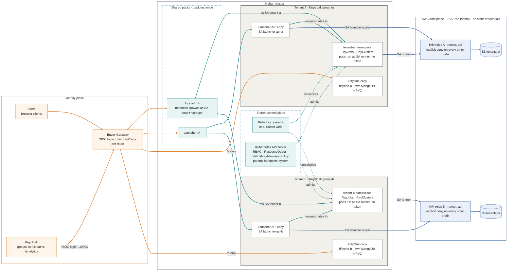
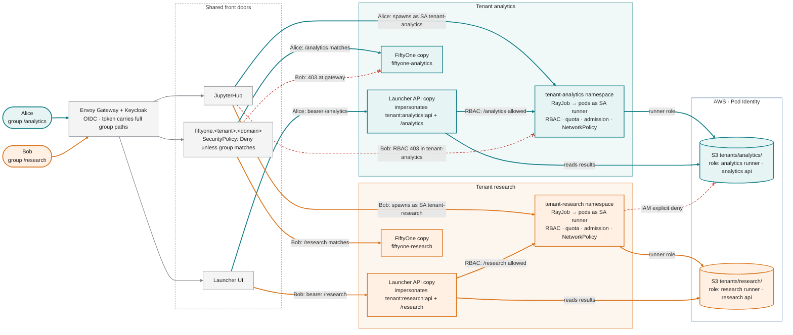

# Nebari multi-tenancy design

The design is the **tenant**: a security perimeter inside a Nebari cluster, drawn as one Kubernetes namespace and owned by one Keycloak group. Not every group is a tenant; a tenant is a group that has been given a namespace. Members of the group share the tenant's pool of resources: a compute quota, the Ray clusters and jobs that run inside it, and cloud data such as an S3 prefix that only the tenant's own ServiceAccounts hold IAM permission to reach. Everything a tenant does stays inside its namespace, and everything that keeps it there is a Kubernetes or IAM control rather than code of ours. None of it is specific to Ray or to any one tool; it is a Nebari concept that any software pack can use.

A pack takes part in the perimeter in one of two ways.

- **Shared.** The pack is deployed once for the cluster and tenants request from it inside their own namespace. Ray works this way: one cluster-wide KubeRay operator, and each tenant namespace creates quota'd RayJobs and RayClusters that the operator runs there. It is one Ray, not many copies of the Ray pack with different images, nodes and files.
- **Copied.** The pack deploys one copy of itself per tenant, each with its own data and its own access. FiftyOne (a dataset browser with no user model) and the launcher API (a web front end that runs batch jobs on a user's behalf) work this way. This is the compensating control for a tool that is useful but does not ship with enough of an authorization model to scope itself to a group: the tenant perimeter supplies the boundary the tool lacks.

**Shared is the pattern and a copy per tenant is the fallback.** Which one a component gets follows from what the component is, not from preference. The rest of this document is that decision and the controls behind it, and the checklist at the end is what a cluster has to show before a tenant on it is called isolated.

The planes and what lives in each. Orange is identity, teal is control (objects created through the API server), blue is data (Pod Identity to IAM to S3). The two tenants are one chart rendered twice; the FiftyOne and launcher API copies are the parts that repeat, and everything in the shared band is deployed once.



Two members traced. Alice is in `/analytics` and Bob in `/research`. The same three front doors take each of them to their own tenant's namespace, application copies and S3 prefix. The dashed red edges are Bob reaching for the analytics tenant's resources, refused once at each layer: the gateway, RBAC and IAM.



Terms: a **pack** is a Nebari software pack, an application deployed through ArgoCD and fronted by the nebari-operator; a **NebariApp** is that operator's CRD, which provisions a Keycloak client, an HTTPRoute and a gateway SecurityPolicy for the app; **NIC** is nebari-infrastructure-core, which builds the EKS cluster; **Pod Identity** is EKS Pod Identity, which maps one Kubernetes ServiceAccount to one IAM role; the **launcher** is this document's example of a pack that gives users a point-and-click way to run batch compute: a web UI where a user picks a workload and its inputs, and an API behind it that verifies who the user is, creates a RayJob for them in their tenant's namespace, follows it to completion and reads the results back from S3 to show in the UI. The user never touches Kubernetes or a notebook. Any pack that verifies a caller's token and creates objects on their behalf has the same shape; **`tenants-system`** is the chart's own namespace, holding the admission parameters, the RayJob reaper and the webhook, where no tenant identity has any right.

## Preconditions

Three things hold on a cluster before any of the controls below mean anything.

1. **NetworkPolicy is enforced.** The VPC CNI addon runs with `enableNetworkPolicy: true`, so the `aws-eks-nodeagent` container in `aws-node` enforces rather than records. NIC does not set this; it is turned on per cluster and confirmed with `aws eks describe-addon --addon-name vpc-cni --query 'addon.configurationValues'`. While it is off, every Ray head's Jobs API on 8265 and every copied pack's Service answer any pod in the cluster with no authentication, and a job submitted to a head that way runs as that tenant's `runner` with that tenant's IAM role. That is a cross-tenant escape, not a missing hardening, and nothing else in this document isolates anything until the flag is on.
2. **The network values come from the live VPC before the flag flips.** Four things break or stay open otherwise. Egress to `169.254.170.23/32` on 80 is the Pod Identity agent; without it no pod in a tenant namespace gets AWS credentials, which reads as broken IAM. `https.except` carries the VPC CIDR, because pods hold VPC addresses under the VPC CNI and a wide 443 rule would otherwise let one tenant reach another; `https.also` puts back the Interface-endpoint ENIs (STS, eks-auth) that private DNS resolves to addresses inside that excluded range. The API server is listed as the `kubernetes` ClusterIP and each control-plane ENI, because whether the policy agent evaluates egress before or after kube-proxy's DNAT is not something to bet a default-deny on. Operator ingress names the namespace KubeRay actually runs in.
3. **The cluster runs the current chart.** The rules named below (per-rule operator exemption, mandatory `submitterPodTemplate`, autoscaling and token automount refused, parameters in `tenants-system`, per-tenant impersonation) are all in the current chart. An older cut of the chart has a blanket operator exemption and no submitter rule, and a tenant on it is not isolated in the sense this document means.

## Three shapes, decided by the component

| Shape | The tenant namespace holds | Why |
|---|---|---|
| CRD + controller (KubeRay) | The tenant's RayJobs, RayClusters, RayServices and pods, across a job namespace and a serving namespace. The operator is deployed once and shared | The controller is multi-tenant by construction: it reconciles objects wherever they appear, and Kubernetes already provides per-namespace RBAC, quota and admission |
| Monolithic app with no identity model (FiftyOne) | A copy of the application, with its own database and storage | It has no users and no authorization, so there is nothing to scope. Another copy is the only boundary available |
| Has an identity model, but needs one cloud role per pod (the launcher API) | A copy of the application | Not because it cannot tell users apart; it verifies tokens and impersonates. Because Pod Identity gives one IAM role per ServiceAccount, and a pod has one ServiceAccount |

Anything with a real controller is shared for free: no code of ours, one operator, and the boundary is the API server's own RBAC, ResourceQuota and admission. Rows two and three draw identically on an architecture diagram and mean different things. FiftyOne's copies compensate for an application that cannot tell anyone apart; the launcher's copies carry an AWS credential boundary that the application can see across perfectly well but must not. Treating them as the same pattern is how a future pack ends up with copies it does not need.

## Ray: one shared operator

### One operator, many namespaces

KubeRay is **one cluster-scoped operator** watching every namespace. It is shared infrastructure in the same sense the API server is: tenants never talk to it. They create `RayJob` and `RayCluster` objects in their own `tenant-<group>` namespace, and the operator reconciles them and creates the pods there. There is no scheduler, broker or control plane of ours between the user and the object.

Two front doors produce the same object. A notebook in the hub namespace carries the ServiceAccount `tenant-<group>` and creates a RayJob or RayCluster directly; the spawn hook chooses that ServiceAccount from the user's group claim by comparing each group to `/<tenant>` exactly, never by its last path segment. The launcher UI goes through its API, which creates the RayJob in the caller's namespace by impersonating a per-tenant identity in the caller's group. Same kind, same namespace, same rules: one byte-identical manifest is admitted, and refused when broken, identically under both identities.

### What enforces the boundary

Four independent Kubernetes enforcement points, rendered per tenant from one Helm chart (adding a tenant is one line in the cluster's tenants values), plus one in the AWS plane.

| Control | Object | What it decides |
|---|---|---|
| RBAC | Role `tenant-member` in `tenant-<group>`, bound to Kubernetes Group `/<group>` and to ServiceAccount `<hub>/tenant-<group>` | Who may create, watch and delete `rayjobs`, `rayclusters` and `jobs`; read pods, logs, events and services; and get, create and delete ConfigMaps, which carry the run payload. No `update` or `patch` on anything, no cluster-wide grant to any tenant identity, and nothing the admission policy reads lives in this namespace |
| ResourceQuota | `tenant-quota` | `requests.cpu`, `requests.memory`, `pods`, `requests.nvidia.com/gpu`, and concurrency through `count/rayjobs.ray.io` and `count/jobs.batch`. Per namespace, so group quota falls out of the namespace choice |
| Admission | ValidatingAdmissionPolicy `tenant-workloads`: one cluster-scoped policy, bound per namespace with a `paramRef` to `tenants-system/tenant-params-<group>` | Pod shape: image prefix allow-list, worker `maxReplicas` cap, mandatory `shutdownAfterJobFinishes` and a TTL ceiling, `activeDeadlineSeconds` on Jobs, no `hostPath`/`hostNetwork`/`privileged`, `serviceAccountName` pinned to `runner`, toleration keys allow-listed, per-container GPU ceiling, a mandatory `submitterPodTemplate` in `K8sJobMode` so the submitter cannot run as `default`, and no worker template may set `automountServiceAccountToken: true`. Autoscaling is admitted on the conditions below |
| NetworkPolicy | `default-deny`, `allow-intra-namespace`, `allow-hub-ingress`, `allow-operator-ingress`, DNS, external 443, API-server and Pod Identity egress | Nothing reaches the namespace except hub pods carrying the tenant label on 8265 and 10001 and the operator's namespace on 8265; nothing leaves except DNS, TLS to addresses outside the VPC and the listed endpoint ENIs, the API server, and the Pod Identity agent |
| Pod Identity | ServiceAccount `runner` (no token mounted, bound to no Role) mapped to `<cluster>-tenant-<group>-runner` | Which S3 prefix the job may write. The role's policy carries an explicit deny on every other tenant's prefix |

A tenant cannot loosen any of this. The ConfigMap the policy reads lives in `tenants-system`, where no tenant identity holds any verb, so the ConfigMap rights `tenant-member` does hold (create and delete, for the run payload in its own namespace) cannot reach it; a params ConfigMap in the tenant namespace would be one `delete` and one `create` away from a member's own limits, and ArgoCD's selfHeal is a race, not a control. Both bindings carry `parameterNotFoundAction: Deny`, so a missing ConfigMap stops admission rather than opening it.

### The API creates nothing as itself

The launcher API verifies the caller's Keycloak bearer token against the realm JWKS (signature, `iss`, `aud`, `azp`, `exp` and a freshness bound) and answers 401 without one; its cookie-reading identity path serves the UI's `/me` and touches nothing that creates objects. It then creates the RayJob and its payload ConfigMap **impersonating a fixed per-tenant identity in the caller's group**, and carries the human as an impersonation extra:

```
Impersonate-User: tenant:analytics:api
Impersonate-Group: /analytics
Impersonate-Extra-caller: alice@example.com
```

The RoleBinding on the Keycloak Group decides; the synthetic user is bound to nothing, so the group header is the whole grant, and a request that drops it has no rights at all. The human is an audit annotation, never an authorization input. The EKS audit record carries all three under `impersonatedUser`, with the RBAC reason:

```
"impersonatedUser": {"username": "tenant:analytics:api", "groups": ["/analytics", "system:authenticated"], "extra": {"caller": ["alice@example.com"]}},
"reason": "RBAC: allowed by RoleBinding \"tenant-member-group/tenant-analytics\" of Role \"tenant-member\" to Group \"/analytics\""
```

Impersonation rights are **one ClusterRole and one ClusterRoleBinding per tenant**, bound to that tenant's API ServiceAccount only: `impersonate` on `users` fenced by `resourceNames` to that tenant's synthetic name, on `groups` fenced to that tenant's group, and on `userextras/caller` unfenced, because extras are inert for authorization and cannot be enumerated. ServiceAccount impersonation is never granted. An unfenced `users` grant is cluster-admin on any Kubernetes cluster and is never written: the bootstrap policy binds the ClusterRole `system:kube-controller-manager` to a `User` of that name, which holds `list` and `watch` on every resource in every API group and `create` on `serviceaccounts/token`, and EKS binds `eks:addon-manager` the same way with `create` on `clusterrolebindings`. One header would be every Secret in the cluster or a self-granted `cluster-admin`. No synthetic name starts with `system:`.

The API's own identity is read-only inside its own tenant: `launcher-api-read` grants `get`/`list`/`watch` on rayjobs, rayclusters, pods and logs for the follow loop, because an impersonated watch dies with the user's token, and it is bound per tenant to that tenant's ServiceAccount, so one tenant's API cannot read another's RayJobs or pod logs.

The group claim's canonical form is the **absolute Keycloak path with a leading slash**, `/analytics`. The realm mapper sets `full.path: true`, the RoleBinding subject is `Group: /analytics`, the per-tenant ClusterRole's `resourceNames` spell it the same way, the spawn hook compares the claim to `/<tenant>` exactly, and the FiftyOne gateway policy matches the path form only. A stripped `analytics` is refused by the impersonation fence and matches no RoleBinding, and neither failure names its cause, so the submitter asserts the form at every boundary rather than repairing it. A match on the last path segment is a repair: Keycloak group names are unique only among siblings, so `/anything/analytics` is a different group whose members would inherit analytics's ServiceAccount, its `runner` and its role.

### The operator is one layer removed

The tenancy policy sees the RayJob a user creates. The pods come from the RayCluster and the submitter Job that **the operator** derives from it, under its own identity, so they arrive one step removed from anything the policy validated. Three consequences:

- The admission policy exempts the operator identity **per rule**, not with a blanket `matchConditions` skip. The submitter Job cannot carry a TTL, so only the TTL rules and the ServiceAccount pin on batch Jobs are relaxed for it; operator-created RayClusters still face the image, host, toleration and GPU rules, and Pod Security `baseline` on the namespace refuses `privileged`, `hostNetwork`, `hostPath` and `hostPort` even for the operator.
- Autoscaling is admitted on conditions rather than refused, and the conditions generalise past Ray. A controller that reacts to load usually wants two things a tenant namespace will not give away: an API grant so it can resize what it manages, and a container of its own alongside the workload. Neither has to land on the workload identity. The grant goes to a ServiceAccount the tenant chart defines and scopes to its own namespace, the workload identity stays rights-free, the injected container faces the same image allow-list as every other container, and its credential is mounted into that container alone rather than into the pod. What makes this tolerable is the size of the grant and not the strength of the controls: it is namespace-scoped, over objects `tenant-member` can already create and delete, so the worst case is a tenant disturbing its own workloads. The hard bound stays in the replica caps at admission and the ResourceQuota behind them, which the controller cannot argue with. KubeRay's in-tree autoscaler is the worked example; the mechanics are in the Ray tenancy notes.
- CEL cannot read another object, so nothing in the policy verifies that the derived RayCluster is a faithful copy of the RayJob's `rayClusterSpec`. A validating webhook that does exactly that is built and tested against a real captured derivation (KubeRay adds no `spec` fields) and ships disabled in `tenants-system`, staged with `failurePolicy: Ignore` before `Fail`: the control plane has to reach it, and a webhook that fails open is worse than none.

Lifecycle has the same shape. `ttlSecondsAfterFinished` removes the RayCluster only; the RayJob object and its submitter Job keep holding `count/rayjobs.ray.io` and `count/jobs.batch` until the reaper in `tenants-system` collects them, so the quota slot returns in two stages.

### Measured, 16 and 17 September

On live EKS: seven RayJobs through `tenant-analytics` from the UI path and the notebook path on `tenant-research`. The data boundary holds on the RayJob shape: a head pod assumes its tenant's own role through Pod Identity with no credentials anywhere in the pod, writes `tenants/analytics/results/`, and is refused `tenants/research/` with an explicit deny in an identity-based policy. Five admission rules refuse the production object with one field changed and admit it unchanged. The same human in `/research` is 403 in `tenant-analytics` and allowed in `tenant-research`, and the refusal names the caller. One image trap: stock `rayproject/ray` images ship botocore older than 1.32 and cannot use Pod Identity at all, and the failure reads as broken IAM; pin `botocore>=1.32` in every driver image or `runtime_env`.

## Packs: a copy per group

### Why FiftyOne gets copies

Community FiftyOne has no users, no login and no authorization. Whoever reaches a copy sees, edits and deletes every dataset in it. There is nothing inside the application to scope to a group, so the only boundary available is the copy, and one FiftyOne per tenant is how the boundary is drawn. The copies compensate for the application.

### What a copy is

| | Namespace | Hostname | Allows |
|---|---|---|---|
| analytics | `fiftyone-analytics` | `fiftyone.analytics.<domain>` | `/analytics` |
| research | `fiftyone-research` | `fiftyone.research.<domain>` | `/research` |

Each copy is a namespace, a FiftyOne Deployment, its own MongoDB and its own media PVC, a NebariApp, a hand-written SecurityPolicy, a NetworkPolicy and a BackendTrafficPolicy (the operator's HTTPRoute sets no timeouts and Envoy's 15 s default cuts FiftyOne's WebSocket). Authorization reuses the tenancy groups rather than new FiftyOne-specific ones, so whoever can run compute in a tenant can open its FiftyOne, and a user in both groups sees both copies. A hostname label may be shortened from the group name, but the group, namespace and tenant id keep the full name: the group is the string RoleBindings and `resourceNames` bind to, so it is the one that must not be shortened. Subdomains at this depth need no DNS or PKI work; the wildcard covers the subtree and cert-manager issues per host over HTTP01 through the gateway.

### The gateway authorization policy

The operator's generated SecurityPolicy **authenticates and stops there**: `oidc` only, no `jwt` provider, no `authorization` block, so every authenticated realm user reaches every app URL. That is [nebari-operator#153](https://github.com/nebari-dev/nebari-operator/issues/153). The fix is a hand-written SecurityPolicy, the same shape the CVAT pack already runs. The NebariApp sets `auth.enforceAtGateway: false` so the operator attaches nothing of its own to the route, and `securitypolicy.yaml` targets the operator's `fiftyone-route` with:

- `oidc` against the realm with `forwardAccessToken: true`, without which the token stays in the gateway's session cookie and the JWT filter cannot read it;
- a `jwt` provider for the same issuer whose `remoteJWKS` is Keycloak's in-cluster Service, so key fetches do not hairpin through the NLB, with `audiences` set to the app's own client id so a token minted for another client is not a credential here;
- `authorization.defaultAction: Deny` with one `Allow` rule on the `groups` claim matching `/analytics`, the path form only. The realm bootstrap reconciles every group-membership mapper in the realm to `full.path: true`, the client-level mapper the operator writes included, so the claim has one form. Accepting the bare name as well would accept `/x/analytics` from anywhere in the tree;
- the `Authorization` header removed before the request reaches the upstream, once the jwt filter has read it. FiftyOne has no auth model and no use for the token, and a copied pack must never hold tokens that other services on the cluster accept, so a compromise of the copy yields its datasets and nothing else. A request-header filter on the route does this; if the operator-owned route cannot carry one, the jwt provider reads the access token from the gateway's cookie instead and `forwardAccessToken` stays off;
- `denyRedirect` on `X-Requested-With: XMLHttpRequest`, so the SPA's parallel requests get 401 instead of racing each other through the OAuth flow.

A gateway policy governs only traffic that arrives through the gateway. Any pod on the cluster can otherwise reach `fiftyone-app:5151` directly and skip Keycloak, so `networkpolicy.yaml` admits ingress to the app from `envoy-gateway-system` only and to MongoDB from the app pods only. MongoDB additionally requires root credentials from an out-of-band Secret, so the data store is closed even where the policy is not enforced; the app is not. NetworkPolicy enforcement is a **cluster property** (precondition 1), and on a cluster where it is off the policy is a comment.

### The `auth.groups` trap

`spec.auth.groups` on a NebariApp looks like an access restriction and is not. In nebari-operator v0.1.0 it is a **provisioning list**: the operator creates each named group in the realm and syncs members into it. Pointing it at `/analytics` would either create a second group literally named `/analytics` or let the operator write to the group the whole tenancy design binds RBAC to. Both FiftyOne copies set it to `[]`; the landing-page tile is shown to everyone, and the SecurityPolicy is the control.

### The launcher API: the same shape, a different reason

The launcher is the front door for users who want to run compute without a notebook. Its UI is one shared deployment behind the gateway, like JupyterHub. Its API is the part that matters for tenancy: it acts on behalf of a human, so it has to place work only where that human is allowed, and it reads results back from S3 with credentials of its own. The API runs one Deployment per tenant, for a different reason than FiftyOne's. It has an identity model: it verifies the bearer token, derives the tenant from the caller's groups, refuses a mismatch before creating anything, and impersonates so that RBAC decides placement. What it cannot do in one pod is hold two AWS identities. It reads results back from the tenant's S3 prefix as **itself**, through Pod Identity, and Pod Identity gives one IAM role per ServiceAccount while a pod has one ServiceAccount. So there is a `launcher/launcher-api-<tenant>` ServiceAccount, a `<cluster>-tenant-<tenant>-launcher` role and an API Deployment per tenant. The copies carry a credential boundary, and the Kubernetes grants follow it: each copy's ServiceAccount is the subject of its own tenant's impersonation ClusterRoleBinding and `launcher-api-read` binding and of nothing else, so the Kubernetes blast radius of a copy and its IAM blast radius are the same tenant.

The result manifest the API reads is written by the tenant's own job, so its parser is an input surface owned by the tenant. That is the reason the API's Kubernetes rights are bounded to one tenant rather than merely audited: a bug in that parser reaches one tenant, not the cluster.

One thing is open. The launcher UI proxies to a fixed Service, so a second tenant's reads through the public host are refused by RBAC and by IAM. That fails closed, which is the right failure and a broken product. Two fixes close it, and they differ in what each tenant gets a copy of. Group-aware routing at the gateway keeps the per-tenant API copies and sends each caller to their own. A per-tenant credential broker keeps one shared API instead, and gives each tenant only a small pod that holds its Pod Identity and reads its prefix. Where the API carries a database or a programmatic surface of its own, the broker is the better trade, because copying the API duplicates all of that in order to move one IAM role.

## Deciding for the next pack

Ask these in order and stop at the first yes.

1. **Does it ship a controller that reconciles CRDs?** Share it. Add its kinds to `tenant-member` and the admission policy, add any object counts to the quota, add the ports its clients need to the NetworkPolicy, and condition at admission any field that makes the controller bind RBAC to the workload identity or inject containers the policy does not see, so the grant lands on an identity the chart defines and the container faces the allow-list (KubeRay's autoscaling is the model). Refuse it only where no such identity can be drawn. Do not deploy a second copy of the controller.
2. **Does it have no user model of its own?** A copy per tenant. Gate each at the gateway with the hand-written SecurityPolicy on the tenant group, close the in-cluster bypass with a NetworkPolicy, give it its own data store, and set `auth.groups: []`. Ask whether its data can live in S3 under Pod Identity, which makes its boundary the same IAM refusal Ray's is.
3. **Does it have a user model but read or write cloud resources as itself, scoped per tenant?** Two answers, and the size of the application decides which. A copy per tenant is the direct one: keep authorization in Kubernetes through impersonation or a verified token, bind each copy's Kubernetes rights to its own tenant only, and budget for routing callers to their copy. But the copy exists for the credential alone, and a credential is a smaller thing than an application. Where the application carries a database beside it, state worth sharing, or a programmatic surface of its own, a copy duplicates all of that to move one role. Put one shared application in front of a small per-tenant broker instead: a pod holding that tenant's Pod Identity, speaking a narrow read or write protocol, holding no Kubernetes rights, and reachable only from the shared application. The shared component then holds no tenant's cloud credential at all, so compromising it reaches no tenant's data directly and compromising a broker reaches one tenant's. What the broker adds is an authorization step between application and broker — a NetworkPolicy admitting the application's pods and a token the broker verifies — and what it removes is a copy of everything that is not the credential. A third shape, one shared component holding a role that can assume every tenant's, is refused: it puts the boundary back inside application code, which is what every row of this table exists to avoid.
4. **Does it have a user model and consume OIDC groups itself, with no per-tenant cloud role?** One shared copy. The gateway authenticates and the application authorizes from the forwarded token. Community CVAT sits between this row and row two: it has local users but no SSO, so it is gated on `cvat-users` at the gateway and keeps a second notion of identity behind it; per-tenant CVAT is the FiftyOne shape when it is wanted.

For every copied pack the checklist is FiftyOne's: `nebariapp.yaml` with `enforceAtGateway: false` and `groups: []`; `securitypolicy.yaml` with `forwardAccessToken`, a `jwt` provider carrying `audiences`, `defaultAction: Deny`, a path-form-only group match and the `Authorization` header stripped before the upstream; `networkpolicy.yaml` admitting `envoy-gateway-system` only; storage inside the namespace with its own credentials; a `tenant.nebari.dev/group` label; the hostname as `<app>.<tenant>.<domain>`; and a README that says what the boundary is and is not.

## Limits

- **No per-user boundary inside a tenant.** Same group means shared quota, and on Ray any member can list and delete another member's RayJob and reach their head on 8265 and 10001 while it is up (`pods/exec` is denied, so nobody shells in). In FiftyOne every member sees, edits and deletes the same datasets; per-user FiftyOne is FiftyOne Enterprise. Notebook-path audit records name the ServiceAccount, not the person: UI runs are attributable per human through the impersonation extra, notebook runs are not.
- **Notebook-path revocation lags.** The impersonation path reads the group from the caller's token on every request, so removing someone from a tenant group takes effect at once. The notebook path chooses the ServiceAccount at spawn, so a removed member keeps `tenant-<group>` rights until their pod is culled. The culler's max age is the revocation bound for notebook users and is set with that in mind.
- **FiftyOne's data boundary is the volume, not an IAM refusal.** Two copies cannot see each other's data because they are different pods with different MongoDBs and different PVCs, not because anything denied them. Media on per-tenant S3 prefixes through Pod Identity is the follow-on that gives it the same boundary the RayJob path has.
- **Copies scale with tenant count, not usage.** Each tenant costs a namespace, a Deployment, a MongoDB, a PVC and a Keycloak client, plus an API Deployment for the launcher and whatever that API keeps beside it, a database included. Fine for a handful of teams; wrong if a tenant is ever a project — which is the case row 3's broker is for, since it is the credential and not the application that has to be per tenant.
- **A compromised API pod reaches one tenant.** It can act as any member of its own tenant: the API server takes the API's word for the group, and inside the tenant that is accepted. It cannot name another tenant's group, another username or a ServiceAccount, because each grant is fenced by name to its own tenant, and the human it claims to act for is an audit annotation. Impersonation stays; replacing it with EKS trusting Keycloak as an OIDC identity provider needs a publicly trusted certificate on the issuer, which production Keycloak will not have.
- **A pod that shares space with an autoscaling controller is a pod with an API identity near it.** Where a controller injects its own container beside the workload, the credential is in the same pod as tenant code, and the controls keeping them apart are a mount the workload's container does not receive and a scheduler with no reason to place work there. Neither is a kernel boundary. The design accepts this because the grant is namespace-scoped over objects the tenant can already create and delete, so the worst case is a tenant disturbing its own workloads rather than reaching another tenant, `tenants-system`, or an AWS identity that was not already theirs. A tenant unwilling to accept it runs without autoscaling and pays a fixed-size cluster.
- **The operator is a trusted identity.** Its submitter Job is exempt from the TTL rules and the ServiceAccount pin, and the derived-RayCluster faithfulness check stays disabled until the webhook is reachable.
- **Long-lived workloads need their own budget, and keep a floor in it.** Every bound in this design is a termination bound: a TTL, a deadline, a reaper returning the quota slot. A workload meant to stay up, a served model being the case in hand, answers to none of them, so quota is the only thing holding it and a burst of jobs must not be able to starve it. That means a second namespace with its own quota rather than a second workload in the same one, because ResourceQuota is per namespace. Autoscaling reclaims most of the idle cost but never all of it: something stays up to receive the request that starts the rest, its object count is consumed whether or not it is serving, and the first request after an idle period pays the cold start. Capacity freed in one namespace does not return to the other, which is the point of separating them.
- **The gateway strips the caller's identity before the model sees it.** `Authorization` is removed before the upstream, which is what keeps a token out of an application with no user model, and it means a served model cannot authorize per caller or attribute a request to a person. Group membership evaluated at the gateway is the whole boundary: every member of the tenant is the same caller as far as the model is concerned. Per-caller authorization inside a served model needs an identity model the model does not have.
- **Ray outside a tenant namespace is outside the perimeter.** Ray that a pack deploys in its own namespace (a self-serve cluster, a pack's internal RayCluster, a serving pack's RayService) runs under none of these controls, and a notebook NetworkPolicy that opens 8265 and 10001 to it is an unauthenticated code-execution path into a shared namespace for every notebook user. Such deployments stay outside the perimeter until each is retired or brought under the model. While they exist, none of them may carry an AWS identity and none may reach a tenant namespace; the tenant default-deny sees to the second, and the first is a rule on every cluster.
- **A user in two tenants works at the platform layer and not yet above it.** The API refuses a caller whose groups map to more than one project because the request has no tenant field, and the notebook spawn hook picks one group deterministically. A tenant selector on the request and one group-gated JupyterHub profile per tenant are the fixes.

## Security posture

This is **soft multi-tenancy**, namespace-as-a-tenant in the sense Kubernetes SIG-multitenancy uses the term. The adversary it is built against is a member of one tenant with arbitrary code execution inside it, malicious or running something compromised, trying to reach another tenant's data, compute or identity. Against that adversary every cross-tenant path has a named control: the boundary table above for Ray, the gateway policy and NetworkPolicy for copied packs, IAM for the data plane. The checklist at the end is how a cluster shows those controls hold, and a tenant is called isolated only after it does.

It is not **hard multi-tenancy**. The residual trust is the usual set for this tier, and it is accepted rather than closed:

- **Shared nodes.** Tenants' pods share kernels. A container escape reaches every pod on that node, including other tenants' projected Pod Identity tokens. Pod Security `baseline` shrinks the surface; `restricted` would shrink it further, and Ray images can meet it.
- **The KubeRay operator.** One cluster-wide identity parses tenant-controlled specs and creates pods in every tenant namespace. A bug in it is cross-tenant by construction; the per-rule admission exemption and the webhook bound what it can be tricked into, they do not remove the trust.
- **Keycloak realm administration.** Group membership is the tenant boundary, so whoever manages groups is inside every tenant, and a subgroup or a mapper change is a tenancy change.
- **The image allow-list governs provenance, not capability.** Ray runs arbitrary user code as `runner` whatever the image, so the list says where images come from and nothing about what they can do.
- **Inside a tenant is open.** Members share quota and can read, cancel and act as each other's work, and the notebook path names the ServiceAccount rather than the person.

For separate teams inside one organisation this is the right tier and these are its known costs. For mutually hostile tenants, or data where one team's kernel exploit must never reach another team's data, the shape changes: per-tenant node groups, with `nodeSelector` and tolerations pinned by admission, keep every object above the same and change only where pods land; a cluster per tenant is a different design. Either is a decision for Scaling up.

## Scaling up

A tenant today is one line in a values file. The chart renders it into the namespace and its controls, its params ConfigMap in `tenants-system` and its impersonation ClusterRole; the IAM role, its Pod Identity association and any pack copies sit outside the chart and are added beside it. That is the right size for a handful of teams. If the tenant count grows, or a tenant becomes a user, the logical next step is a Tenant CRD and a small operator of our own: one object per tenant, reconciled into everything the chart renders now plus the IAM role, the Pod Identity association and the pack copies, and created from Keycloak group membership rather than from an edited list. It produces the same objects the chart does, so nothing above changes shape. What it does not change is the cost of a copy: at tenant-per-user, FiftyOne still wants the shared shape or FiftyOne Enterprise, and the operator only keeps the count honest.

## Checklist before a tenant is called isolated

Each line is something to show on the cluster, not something to read in a file.

1. `aws eks describe-addon --addon-name vpc-cni` shows `enableNetworkPolicy: true`, and a pod outside the tenant namespace times out against a tenant head's 8265 and against a FiftyOne copy's 5151.
2. With enforcement on, a RayJob head still assumes its tenant role through Pod Identity and writes its own prefix: the `169.254.170.23/32:80` egress, the VPC `except` and the endpoint `also` list are the live VPC's.
3. `kubectl get clusterrole tenant-impersonator-<tenant> -o yaml` shows `users` fenced to `tenant:<tenant>:api`, `groups` fenced to `/<tenant>`, `userextras/caller` and nothing else, and its binding's only subject is `launcher/launcher-api-<tenant>`. No ClusterRole grants `impersonate` on `users` without `resourceNames`.
4. A request to the API with no bearer is 401, and a RayJob created through it carries `impersonatedUser.extra.caller` in the audit log.
5. `kubectl get validatingadmissionpolicybinding tenant-workloads-<tenant> -o yaml` shows `paramRef.namespace: tenants-system`, and `tenant-member` holds no verb in that namespace.
6. A RayJob in `K8sJobMode` without `submitterPodTemplate` is refused; one enabling autoscaling without the conditions that keep the grant and the credential off the workload identity is refused, and the same manifest carrying them is admitted; one whose worker template sets `automountServiceAccountToken: true` is refused; an operator-created RayCluster with a disallowed image, `autoscalerOptions.image` included, is refused.
7. A user whose only group is `/x/<tenant>` spawns a notebook with no tenant ServiceAccount and no tenant label, and is denied at the FiftyOne gateway.
8. A request to a FiftyOne copy's upstream, captured at the pod, carries no `Authorization` header.
